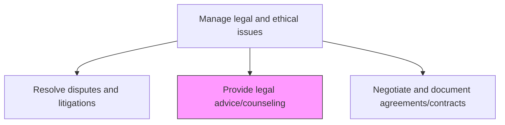
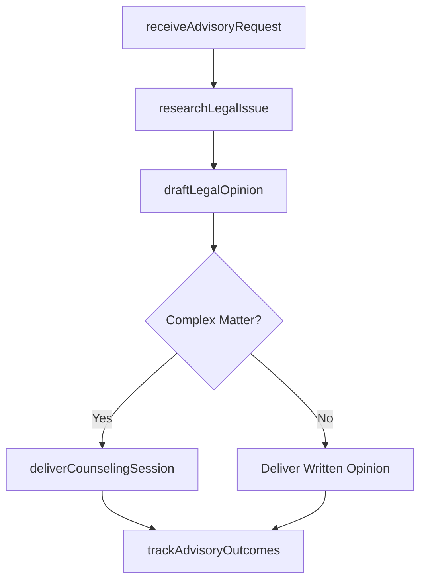

# Provide legal advice/counseling

> Business-as-Code definition for delivering in-house legal counsel and advisory services to business units, enabling informed decision-making on regulatory, contractual, and operational legal matters.

## Overview

Providing legal advice concerning the substance or procedure of a law in relation to a particular situation.

## Process Hierarchy



## GraphDL

```yaml
provide:
  object: Legal Advice/counseling
  actor: LegalCounsel
  result: LegalAdvisoryOpinion
```

## Actions

| Action | Description |
|--------|-------------|
| receiveAdvisoryRequest | Accept and triage incoming requests for legal guidance from business units |
| researchLegalIssue | Analyze applicable laws, regulations, and precedents relevant to the matter |
| draftLegalOpinion | Prepare a written legal opinion or advisory memorandum with recommendations |
| deliverCounselingSession | Conduct advisory meetings with stakeholders to explain legal implications |
| trackAdvisoryOutcomes | Monitor how legal advice was applied and its impact on business outcomes |

## Events

| Event | Description |
|-------|-------------|
| advisoryRequestReceived | Legal guidance request received and triaged |
| legalIssueResearched | Applicable laws and precedents analyzed for the matter |
| legalOpinionDrafted | Written legal opinion or advisory memorandum completed |
| counselingSessionDelivered | Advisory meeting with stakeholders conducted |
| advisoryOutcomesTracked | Legal advice application and impact assessed |

## Searches

| Search | Description |
|--------|-------------|
| getAdvisoryRequests | Retrieve legal advisory requests by department, topic, or status |
| getLegalOpinions | Query legal opinions by subject area, date, or requesting department |
| getAdvisoryMetrics | Retrieve advisory workload and outcome data by period or practice area |

## Process Flow



## RACI Matrix

| Activity | Responsible | Accountable | Consulted | Informed |
|----------|-------------|-------------|-----------|----------|
| receiveAdvisoryRequest | LegalCounsel | GeneralCounsel | BusinessUnits | LegalOperationsManager |
| researchLegalIssue | LegalCounsel | GeneralCounsel | OutsideCounsel | Compliance |
| draftLegalOpinion | LegalCounsel | GeneralCounsel | SubjectMatterExpert | BusinessUnits |
| deliverCounselingSession | LegalCounsel | GeneralCounsel | BusinessLeaders | Compliance |

## Related Processes

| Process | Relationship |
|---------|-------------|
| 12.4.9 Resolve disputes and litigations | Downstream - legal advice may identify matters requiring dispute resolution |
| 12.4.11 Negotiate and document agreements/contracts | Parallel - contract review is a key advisory service |
| 12.4.6 Develop legal policies and procedures | Upstream - legal policies inform advisory guidance |

## Related Departments

| Department | Role |
|-----------|------|
| Legal | Provides legal advisory services across the organization |
| Business Units | Request legal guidance for operational decisions |
| Compliance | Collaborates on regulatory interpretation and guidance |
| Human Resources | Requests employment law and workplace advisory support |

## Related Occupations

| Occupation | Involvement |
|-----------|-------------|
| Legal Counsel | Researches issues and delivers legal opinions and advice |
| General Counsel | Oversees advisory practice and handles critical matters |
| Paralegal | Supports legal research and document preparation |

## KPIs

| KPI | Description | Unit |
|-----|-------------|------|
| Advisory Response Time | Average days from request receipt to initial legal guidance delivery | Days |
| Advisory Volume | Total number of legal advisory requests handled per quarter | Count |
| Client Satisfaction Score | Average satisfaction rating from internal stakeholders receiving legal advice | Score (1-5) |
| Issue Escalation Rate | Percentage of advisory matters that escalate to disputes or litigation | % |

## Usage

```typescript
import { provideLegalAdviceCounseling } from '@headlessly/provide-legal-advice-counseling'

const legalAdvice = provideLegalAdviceCounseling()

// Receive and triage an advisory request
const request = await legalAdvice.receiveAdvisoryRequest({
  department: 'product-development',
  topic: 'AI-regulation',
  urgency: 'medium',
  jurisdictions: ['EU', 'US-California'],
  description: 'Compliance requirements for AI-powered features under EU AI Act'
})

// Draft a legal opinion on the matter
const opinion = await legalAdvice.draftLegalOpinion({
  requestId: request.id,
  practiceArea: 'technology-regulation',
  recommendations: ['classification-assessment', 'conformity-requirements', 'documentation-obligations'],
  confidentiality: 'attorney-client-privileged'
})
```
