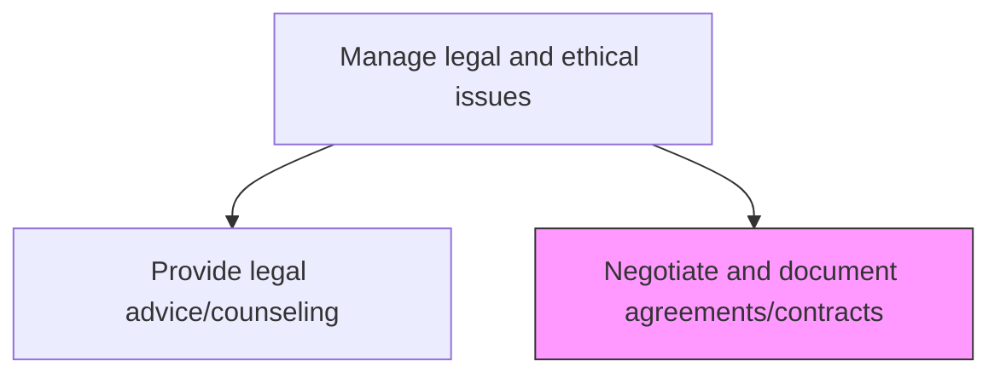
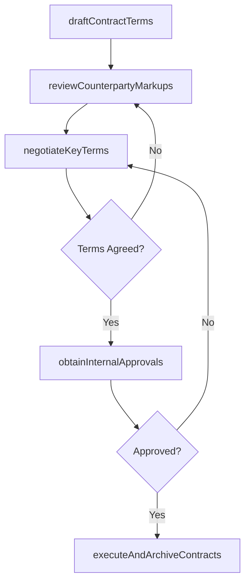

# Negotiate and document agreements/contracts

> Business-as-Code definition for drafting, negotiating, reviewing, and executing commercial agreements and contracts that protect organizational interests while enabling business relationships.

## Overview

Negotiating terms to reach a final draft of a contract that is acceptable to all parties.

## Process Hierarchy



## GraphDL

```yaml
negotiate:
  object: And Document Agreements/contracts
  actor: ContractManager
  result: ExecutedAgreement
```

## Actions

| Action | Description |
|--------|-------------|
| draftContractTerms | Prepare initial contract terms using approved templates and business requirements |
| reviewCounterpartyMarkups | Analyze and respond to counterparty redlines and proposed modifications |
| negotiateKeyTerms | Conduct negotiations on material terms including pricing, liability, and IP provisions |
| obtainInternalApprovals | Route contracts through internal approval workflows based on value and risk thresholds |
| executeAndArchiveContracts | Finalize contract execution, distribute signed copies, and archive in the contract repository |

## Events

| Event | Description |
|-------|-------------|
| contractTermsDrafted | Initial contract terms prepared from templates and requirements |
| counterpartyMarkupsReviewed | Counterparty redlines analyzed and response prepared |
| keyTermsNegotiated | Material contract terms agreed upon by all parties |
| internalApprovalsObtained | Contract approved through internal review and approval workflow |
| contractsExecutedAndArchived | Contract signed, distributed, and stored in repository |

## Searches

| Search | Description |
|--------|-------------|
| findContracts | List contracts by counterparty, type, status, or value |
| getContractDetails | Retrieve contract terms, obligations, and key dates for a specific agreement |
| getExpiringContracts | Query contracts approaching expiration or renewal within a specified timeframe |

## Process Flow



## RACI Matrix

| Activity | Responsible | Accountable | Consulted | Informed |
|----------|-------------|-------------|-----------|----------|
| draftContractTerms | ContractManager | LegalCounsel | BusinessUnits | Procurement |
| negotiateKeyTerms | LegalCounsel | GeneralCounsel | BusinessLeaders | Finance |
| obtainInternalApprovals | ContractManager | GeneralCounsel | Finance | Compliance |
| executeAndArchiveContracts | ContractManager | LegalCounsel | IT | BusinessUnits |

## Related Processes

| Process | Relationship |
|---------|-------------|
| 12.4.10 Provide legal advice/counseling | Upstream - legal counsel advises on contract risk and terms |
| 12.4.8 Protect intellectual property | Parallel - IP clauses embedded in commercial agreements |
| 12.4.6 Develop legal policies and procedures | Upstream - contract policies and templates established by legal |

## Related Departments

| Department | Role |
|-----------|------|
| Legal | Drafts, reviews, and negotiates contract terms |
| Procurement | Initiates vendor contracts and provides commercial requirements |
| Business Units | Define business requirements and approve commercial terms |
| Finance | Reviews financial terms and approves commitments above thresholds |

## Related Occupations

| Occupation | Involvement |
|-----------|-------------|
| Contract Manager | Manages contract lifecycle from drafting through execution |
| Legal Counsel | Reviews and negotiates contract terms and risk provisions |
| Procurement Manager | Drives commercial negotiations and vendor relationship terms |

## KPIs

| KPI | Description | Unit |
|-----|-------------|------|
| Contract Cycle Time | Average days from initial draft to executed contract | Days |
| Negotiation Round Count | Average number of negotiation rounds per contract | Count |
| Template Utilization Rate | Percentage of contracts drafted from approved templates | % |
| Contract Compliance Rate | Percentage of active contracts with all obligations being met | % |

## Usage

```typescript
import { negotiateAndDocumentAgreementsContracts } from '@headlessly/negotiate-and-document-agreements-contracts'

const contracts = negotiateAndDocumentAgreementsContracts()

// Draft contract terms for a new vendor agreement
const draft = await contracts.draftContractTerms({
  contractType: 'master-services-agreement',
  counterparty: 'cloud-provider-inc',
  template: 'vendor-msa-v4',
  businessRequirements: ['SLA-99.9', 'data-residency-EU', 'unlimited-liability-data-breach']
})

// Negotiate key terms after receiving counterparty markup
const negotiation = await contracts.negotiateKeyTerms({
  contractId: draft.id,
  disputedTerms: ['liability-cap', 'termination-for-convenience', 'IP-ownership'],
  fallbackPositions: { liabilityCap: '2x-annual-fees', terminationNotice: '90-days' }
})
```
