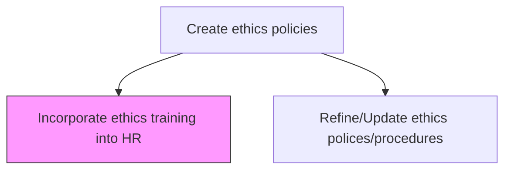
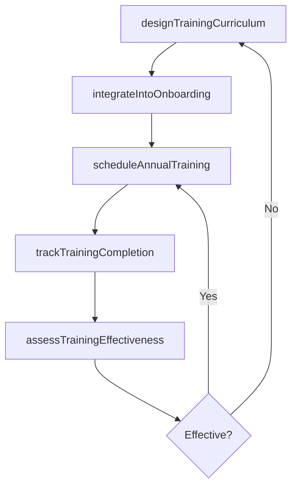

# Incorporate ethics training into HR

> Business-as-Code definition for embedding ethics policies and conduct standards into HR onboarding, training curricula, and performance management systems to ensure organization-wide awareness and compliance.

## Overview

Embedding ethics policies and conduct standards into HR onboarding, training curricula, and performance management processes. Ensure all employees receive regular ethics education and understand organizational expectations for ethical behavior.

## Process Hierarchy



## GraphDL

```yaml
incorporate:
  object: Ethics Training Into HR
  actor: HRTrainingManager
  result: EthicsTrainingProgram
```

## Actions

| Action | Description |
|--------|-------------|
| designTrainingCurriculum | Develop ethics training content aligned with current policies and regulatory requirements |
| integrateIntoOnboarding | Embed ethics modules into new-hire orientation programs |
| scheduleAnnualTraining | Plan and execute mandatory annual ethics refresher courses for all employees |
| trackTrainingCompletion | Monitor employee completion rates and follow up on non-compliance |
| assessTrainingEffectiveness | Evaluate training impact through assessments and post-training surveys |

## Events

| Event | Description |
|-------|-------------|
| trainingCurriculumDesigned | Ethics training content developed and approved for deployment |
| onboardingIntegrated | Ethics training modules embedded in new-hire orientation |
| annualTrainingScheduled | Annual ethics refresher training calendar published and launched |
| trainingCompletionTracked | Employee training completion data updated for reporting period |
| trainingEffectivenessAssessed | Training impact assessment completed with improvement recommendations |

## Searches

| Search | Description |
|--------|-------------|
| getTrainingModules | Retrieve ethics training modules by topic, format, or version |
| getCompletionRates | Query training completion rates by department, role, or period |
| getAssessmentResults | Retrieve post-training assessment scores by module or employee group |

## Process Flow



## RACI Matrix

| Activity | Responsible | Accountable | Consulted | Informed |
|----------|-------------|-------------|-----------|----------|
| designTrainingCurriculum | HRTrainingManager | CHRO | EthicsOfficer | Legal |
| integrateIntoOnboarding | HRTrainingManager | CHRO | Recruiting | AllStaff |
| scheduleAnnualTraining | HRTrainingManager | CHRO | EthicsOfficer | DepartmentHeads |
| trackTrainingCompletion | HRAnalyst | HRTrainingManager | IT | Compliance |

## Related Processes

| Process | Relationship |
|---------|-------------|
| 12.4.2.2 Refine/Update ethics polices/procedures | Upstream - policy updates trigger training curriculum revisions |
| 12.4.1 Manage ethics policies and procedures | Parallel - training supports ethics policy enforcement |
| 9.3.3 Manage employee development | Parallel - ethics training is a component of broader employee development |

## Related Departments

| Department | Role |
|-----------|------|
| Human Resources | Designs and delivers ethics training programs |
| Ethics and Compliance | Provides ethics content and policy guidance for training |
| IT | Supports learning management system administration |
| Legal | Reviews training content for legal adequacy |

## Related Occupations

| Occupation | Involvement |
|-----------|-------------|
| HR Training Manager | Leads ethics training program design and delivery |
| Ethics Officer | Provides subject matter expertise for training content |
| Learning Management Specialist | Administers training delivery platform and completion tracking |

## KPIs

| KPI | Description | Unit |
|-----|-------------|------|
| Training Completion Rate | Percentage of employees completing mandatory ethics training on time | % |
| New-Hire Training Coverage | Percentage of new hires completing ethics onboarding within first 30 days | % |
| Post-Training Assessment Score | Average score on ethics training knowledge assessments | Score (0-100) |
| Training Satisfaction Rating | Employee satisfaction with ethics training quality and relevance | Score (1-5) |

## Usage

```typescript
import { incorporateEthicsTrainingIntoHr } from '@headlessly/incorporate-ethics-training-into-hr'

const ethicsTraining = incorporateEthicsTrainingIntoHr()

// Design a new ethics training curriculum
const curriculum = await ethicsTraining.designTrainingCurriculum({
  topics: ['anti-corruption', 'conflicts-of-interest', 'data-privacy'],
  format: 'e-learning',
  duration: '45-minutes',
  assessmentIncluded: true
})

// Track training completion rates
const completion = await ethicsTraining.trackTrainingCompletion({
  period: 'Q1-2025',
  departments: ['all'],
  escalateNonCompliant: true,
  deadlineDays: 30
})
```
