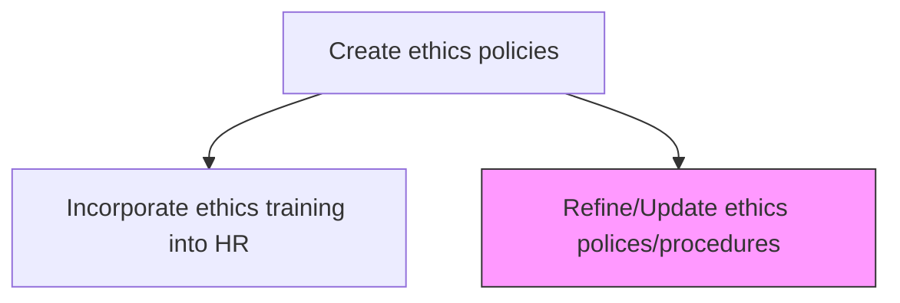
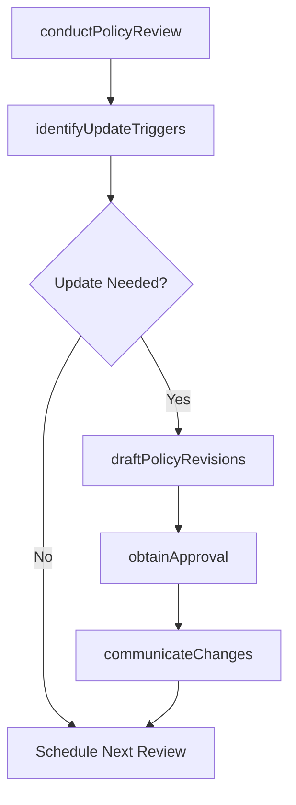

# Refine/Update ethics polices/procedures

> Business-as-Code definition for reviewing, updating, and improving existing ethics policies and procedures based on regulatory changes, investigation learnings, and evolving organizational needs.

## Overview

Reviewing and updating existing ethics policies based on regulatory changes, incident learnings, stakeholder feedback, and evolving industry best practices. Ensure policies remain current, relevant, and aligned with the organization's ethical standards.

## Process Hierarchy



## GraphDL

```yaml
refine/update:
  object: Ethics Polices/procedures
  actor: EthicsOfficer
  result: UpdatedEthicsPolicy
```

## Actions

| Action | Description |
|--------|-------------|
| conductPolicyReview | Systematically review existing ethics policies for currency and completeness |
| identifyUpdateTriggers | Monitor regulatory changes, incident reports, and industry trends requiring policy updates |
| draftPolicyRevisions | Prepare updated policy language addressing identified gaps or changes |
| obtainApproval | Submit revised policies for legal review and executive approval |
| communicateChanges | Distribute updated policies and highlight material changes to all stakeholders |

## Events

| Event | Description |
|-------|-------------|
| policyReviewConducted | Existing ethics policy review completed with findings documented |
| updateTriggersIdentified | Regulatory or operational triggers requiring policy updates documented |
| policyRevisionsDrafted | Updated policy language prepared for review and approval |
| approvalObtained | Revised ethics policies approved by legal and executive leadership |
| changesCommunicated | Policy updates distributed to all employees and stakeholders |

## Searches

| Search | Description |
|--------|-------------|
| getPoliciesForReview | List ethics policies due for scheduled review or requiring update |
| getUpdateTriggers | Retrieve regulatory changes or incidents triggering policy updates |
| getPolicyVersionHistory | Query version history and change logs for specific ethics policies |

## Process Flow



## RACI Matrix

| Activity | Responsible | Accountable | Consulted | Informed |
|----------|-------------|-------------|-----------|----------|
| conductPolicyReview | EthicsOfficer | GeneralCounsel | Compliance | HR |
| identifyUpdateTriggers | EthicsOfficer | GeneralCounsel | Legal | RegulatoryAffairs |
| draftPolicyRevisions | EthicsOfficer | GeneralCounsel | HR | DepartmentHeads |
| communicateChanges | EthicsOfficer | GeneralCounsel | HR | AllStaff |

## Related Processes

| Process | Relationship |
|---------|-------------|
| 12.4.2.1 Incorporate ethics training into HR | Downstream - policy updates require training curriculum updates |
| 12.4.1 Manage ethics policies and procedures | Upstream - policy lifecycle management triggers refinement cycles |
| 12.4.5 Ensure compliance | Parallel - compliance audit findings may trigger policy updates |

## Related Departments

| Department | Role |
|-----------|------|
| Ethics and Compliance | Leads policy review and revision process |
| Legal | Reviews revised policies for legal sufficiency |
| Human Resources | Supports communication and training updates for revised policies |
| Internal Audit | Provides findings that may trigger policy revisions |

## Related Occupations

| Occupation | Involvement |
|-----------|-------------|
| Ethics Officer | Conducts policy reviews and drafts revisions |
| General Counsel | Approves final policy language |
| Compliance Analyst | Monitors regulatory changes triggering policy updates |

## KPIs

| KPI | Description | Unit |
|-----|-------------|------|
| Policy Review Timeliness | Percentage of policies reviewed within their scheduled review cycle | % |
| Revision Cycle Time | Average days from update trigger identification to policy publication | Days |
| Policy Currency Rate | Percentage of ethics policies updated within the last 24 months | % |
| Change Communication Coverage | Percentage of employees notified of policy changes within 30 days of publication | % |

## Usage

```typescript
import { refineUpdateEthicsPoliciesProcedures } from '@headlessly/refine-update-ethics-policies-procedures'

const policyRefinement = refineUpdateEthicsPoliciesProcedures()

// Conduct scheduled policy review
const review = await policyRefinement.conductPolicyReview({
  policies: ['anti-corruption', 'conflicts-of-interest', 'whistleblower-protection'],
  reviewDate: '2025-06-30',
  includeRegulatoryChanges: true
})

// Draft revisions based on identified triggers
const revision = await policyRefinement.draftPolicyRevisions({
  policyId: 'ETH-POL-001',
  triggers: ['new-EU-whistleblower-directive', 'investigation-learnings-Q1'],
  targetEffectiveDate: '2025-09-01'
})
```
