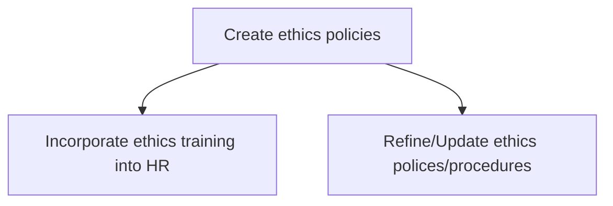
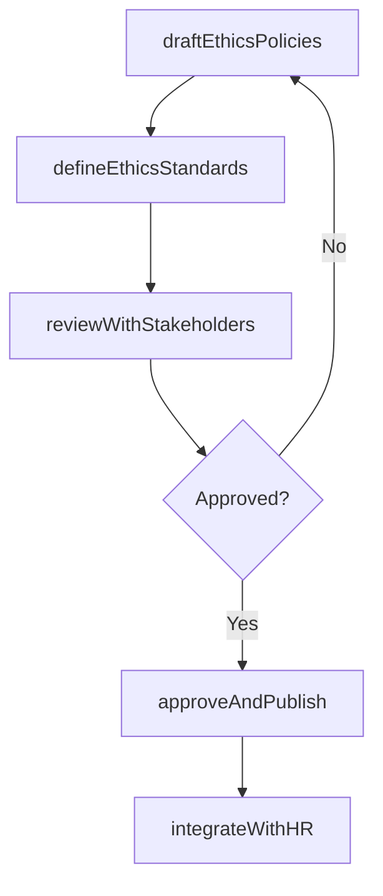

# Create ethics policies

> Business-as-Code definition for developing and codifying the organization's ethics policies, incorporating ethics training into HR programs, and maintaining policies through iterative refinement.

## Overview

Creating a code of ethics that communicate the organization's philosophy to employees, vendors, customers, clients, and the public.

## Process Hierarchy



## GraphDL

```yaml
create:
  object: Ethics Policies
  actor: EthicsOfficer
  result: EthicsPolicyDocument
```

## Actions

| Action | Description |
|--------|-------------|
| draftEthicsPolicies | Author ethics policy documents covering key conduct areas |
| defineEthicsStandards | Establish measurable standards for ethical behavior across the organization |
| reviewWithStakeholders | Circulate draft policies for feedback from legal, HR, and business leadership |
| approveAndPublish | Obtain executive and board approval and disseminate finalized policies |
| integrateWithHR | Embed ethics policies into onboarding, training, and performance management |

## Events

| Event | Description |
|-------|-------------|
| ethicsPoliciesDrafted | Initial ethics policy documents authored and ready for review |
| ethicsStandardsDefined | Measurable ethical conduct standards established |
| stakeholderReviewCompleted | Ethics policy feedback collected and incorporated |
| policiesApprovedAndPublished | Final ethics policies approved and distributed organization-wide |
| hrIntegrationCompleted | Ethics policies embedded into HR programs |

## Searches

| Search | Description |
|--------|-------------|
| getEthicsPolicies | Retrieve ethics policies by topic, version, or status |
| getPolicyDrafts | List ethics policy drafts pending review or approval |
| getStakeholderFeedback | Query stakeholder review comments by policy section |

## Process Flow



## RACI Matrix

| Activity | Responsible | Accountable | Consulted | Informed |
|----------|-------------|-------------|-----------|----------|
| draftEthicsPolicies | EthicsOfficer | GeneralCounsel | HR | Board |
| defineEthicsStandards | EthicsOfficer | GeneralCounsel | Compliance | AllStaff |
| reviewWithStakeholders | EthicsOfficer | GeneralCounsel | BusinessLeaders | Legal |
| integrateWithHR | HRDirector | CHRO | EthicsOfficer | AllStaff |

## Sub-Processes

| ID | Name | Description |
|----|------|-------------|
| 12.4.2.1 | Incorporate ethics training into HR | Embedding ethics policies and conduct standards into HR onboarding, training curricula, and performa |
| 12.4.2.2 | Refine/Update ethics polices/procedures | Reviewing and updating existing ethics policies based on regulatory changes, incident learnings, and |

## Related Processes

| Process | Relationship |
|---------|-------------|
| 12.4.1 Manage ethics policies and procedures | Downstream - created policies are managed through their lifecycle |
| 12.4.3 Manage corporate governance policies | Parallel - ethics and governance policies are often developed together |
| 9.3.3 Manage employee development | Parallel - ethics training is a component of employee development |

## Related Departments

| Department | Role |
|-----------|------|
| Ethics and Compliance | Authors and maintains ethics policy content |
| Legal | Reviews policies for legal sufficiency and regulatory alignment |
| Human Resources | Integrates ethics policies into training and onboarding programs |
| Executive Leadership | Approves and champions organizational ethics commitments |

## Related Occupations

| Occupation | Involvement |
|-----------|-------------|
| Ethics Officer | Drafts ethics policies and coordinates stakeholder review |
| General Counsel | Provides legal review and final approval |
| HR Training Manager | Integrates ethics content into employee development programs |

## KPIs

| KPI | Description | Unit |
|-----|-------------|------|
| Policy Development Cycle Time | Average days from policy draft to approval and publication | Days |
| Policy Coverage | Percentage of key ethics topics addressed by current policies | % |
| Employee Training Completion Rate | Percentage of employees completing ethics training within required timeframe | % |
| Policy Review Currency | Percentage of policies reviewed within the last 12 months | % |

## Usage

```typescript
import { createEthicsPolicies } from '@headlessly/create-ethics-policies'

const ethicsPolicies = createEthicsPolicies()

// Draft a new ethics policy
const draft = await ethicsPolicies.draftEthicsPolicies({
  topic: 'anti-corruption',
  scope: 'global',
  referenceFrameworks: ['FCPA', 'UK-Bribery-Act'],
  draftAuthor: 'ethics-officer'
})

// Approve and publish finalized policy
const publication = await ethicsPolicies.approveAndPublish({
  policyId: 'ETH-POL-2025-003',
  approver: 'general-counsel',
  effectiveDate: '2025-04-01',
  distributionChannels: ['intranet', 'email', 'LMS']
})
```
