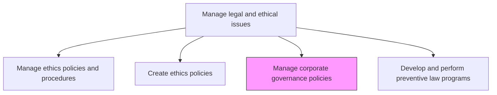
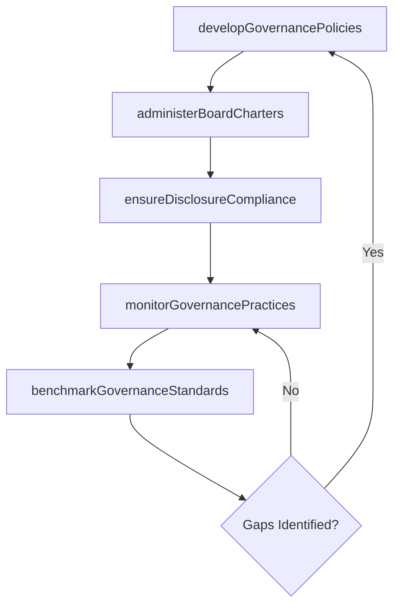

# Manage corporate governance policies

> Business-as-Code definition for administering the governance framework of rules, practices, and processes through which the organization is directed and controlled, balancing stakeholder interests and ensuring accountability.

## Overview

Administering the system of rules, practices, and processes through which a company is directed and controlled. Balance stakeholder interests including shareholders, management, customers, suppliers, financiers, government, and the community. Outline a strategy for achieving organizational goals, from action plans and internal controls to performance measurement and corporate disclosure.

## Process Hierarchy



## GraphDL

```yaml
manage:
  object: Corporate Governance Policies
  actor: CorporateSecretary
  result: GovernanceFramework
```

## Actions

| Action | Description |
|--------|-------------|
| developGovernancePolicies | Draft and maintain corporate governance guidelines, charters, and bylaws |
| administerBoardCharters | Manage committee charters for audit, compensation, nominating, and governance committees |
| ensureDisclosureCompliance | Verify corporate disclosures meet regulatory and governance standards |
| monitorGovernancePractices | Assess adherence to governance policies and identify improvement opportunities |
| benchmarkGovernanceStandards | Compare governance practices against industry best practices and proxy advisory standards |

## Events

| Event | Description |
|-------|-------------|
| governancePoliciesDeveloped | Corporate governance guidelines or bylaws updated and approved |
| boardChartersAdministered | Committee charters reviewed and approved by the board |
| disclosureComplianceEnsured | Corporate disclosure compliance assessment completed |
| governancePracticesMonitored | Governance adherence review completed with recommendations |
| governanceStandardsBenchmarked | Governance practices compared against industry benchmarks |

## Searches

| Search | Description |
|--------|-------------|
| getGovernancePolicies | Retrieve governance policies by type, version, or effective date |
| getBoardCharters | List committee charters by committee or review status |
| getGovernanceAssessments | Query governance practice assessments by period or topic |
| getBenchmarkResults | Retrieve governance benchmarking data against peer companies |

## Process Flow



## RACI Matrix

| Activity | Responsible | Accountable | Consulted | Informed |
|----------|-------------|-------------|-----------|----------|
| developGovernancePolicies | CorporateSecretary | GeneralCounsel | GovernanceCommittee | Board |
| administerBoardCharters | CorporateSecretary | BoardChair | GeneralCounsel | CommitteeChairs |
| ensureDisclosureCompliance | CorporateSecretary | GeneralCounsel | CFO | InvestorRelations |
| benchmarkGovernanceStandards | CorporateSecretary | GeneralCounsel | Strategy | Board |

## Related Processes

| Process | Relationship |
|---------|-------------|
| 12.4.1 Manage ethics policies and procedures | Parallel - ethics and governance policies are interdependent |
| 12.3 Manage relations with board of directors | Downstream - governance policies guide board relations |
| 12.4.5 Ensure compliance | Parallel - compliance programs support governance objectives |

## Related Departments

| Department | Role |
|-----------|------|
| Corporate Secretary | Develops and administers governance policies and board charters |
| Legal | Reviews governance policies for legal adequacy |
| Internal Audit | Assesses governance control effectiveness |
| Investor Relations | Communicates governance practices to investors and proxy advisors |

## Related Occupations

| Occupation | Involvement |
|-----------|-------------|
| Corporate Secretary | Leads governance policy development and board charter administration |
| General Counsel | Provides legal oversight of governance framework |
| Governance Advisor | Benchmarks practices and recommends governance improvements |

## KPIs

| KPI | Description | Unit |
|-----|-------------|------|
| Governance Policy Currency | Percentage of governance policies reviewed within the last 12 months | % |
| Board Charter Compliance | Percentage of committee charters with completed annual reviews | % |
| Proxy Advisory Score | Governance rating from leading proxy advisory firms | Score |
| Disclosure Timeliness | Percentage of governance disclosures published on schedule | % |

## Usage

```typescript
import { manageCorporateGovernancePolicies } from '@headlessly/manage-corporate-governance-policies'

const governance = manageCorporateGovernancePolicies()

// Develop updated governance policies
const policies = await governance.developGovernancePolicies({
  policyType: 'board-guidelines',
  updates: ['director-independence-criteria', 'meeting-frequency', 'executive-sessions'],
  effectiveDate: '2025-07-01'
})

// Benchmark governance practices
const benchmark = await governance.benchmarkGovernanceStandards({
  peerGroup: 'SP500-technology',
  areas: ['board-composition', 'executive-compensation', 'shareholder-rights'],
  proxyAdvisors: ['ISS', 'Glass-Lewis']
})
```
