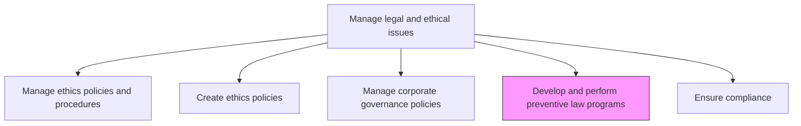
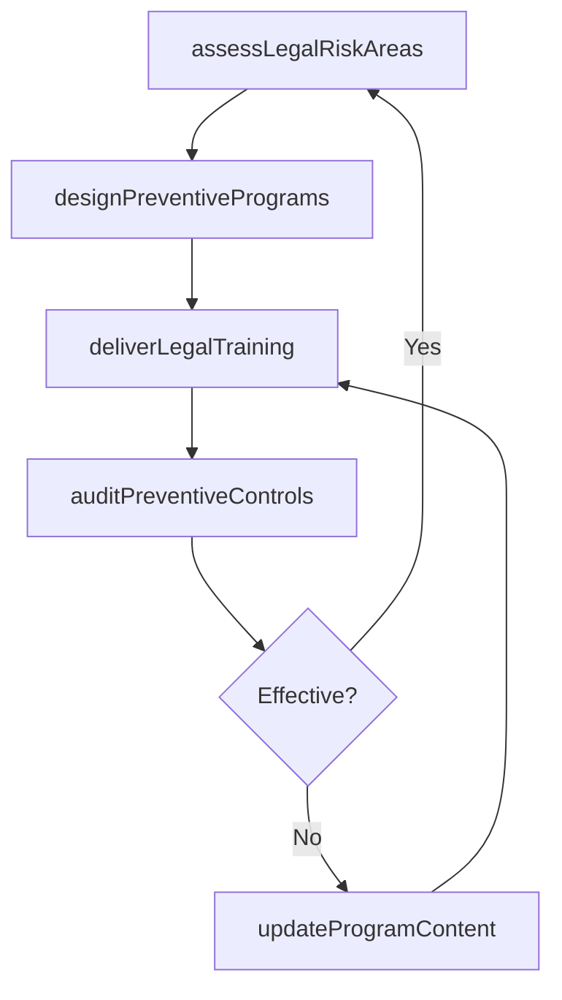

# Develop and perform preventive law programs

> Business-as-Code definition for creating and executing proactive legal programs that prevent violations in areas such as environmental law, employment discrimination, data privacy, and corporate compliance.

## Overview

Creating and applying programs and activities. Encourage the adherence preventive laws, such as environmental law, sex discrimination, computer law, estate planning, corporate compliance, business planning, and property transactions.

## Process Hierarchy



## GraphDL

```yaml
develop:
  object: And Perform Preventive Law Programs
  actor: PreventiveLawCounsel
  result: PreventiveLawProgramRecord
```

## Actions

| Action | Description |
|--------|-------------|
| assessLegalRiskAreas | Identify operational areas with elevated legal risk requiring preventive programs |
| designPreventivePrograms | Create training programs, guidelines, and controls for high-risk legal areas |
| deliverLegalTraining | Conduct training sessions on preventive law topics for relevant employee groups |
| auditPreventiveControls | Evaluate the effectiveness of preventive law controls and programs |
| updateProgramContent | Revise preventive law program content based on regulatory changes and audit findings |

## Events

| Event | Description |
|-------|-------------|
| legalRiskAreasAssessed | Operational legal risk assessment completed and priorities identified |
| preventiveProgramsDesigned | Preventive law program content and controls developed |
| legalTrainingDelivered | Preventive law training session completed for target audience |
| preventiveControlsAudited | Preventive law program effectiveness audit completed |
| programContentUpdated | Program materials revised to reflect regulatory or operational changes |

## Searches

| Search | Description |
|--------|-------------|
| findPreventivePrograms | List preventive law programs by legal topic, department, or status |
| getLegalRiskAssessments | Retrieve risk assessments by area or severity rating |
| getTrainingHistory | Query training delivery records by topic, audience, or date |
| getAuditResults | Retrieve preventive law program audit findings by period |

## Process Flow



## RACI Matrix

| Activity | Responsible | Accountable | Consulted | Informed |
|----------|-------------|-------------|-----------|----------|
| assessLegalRiskAreas | PreventiveLawCounsel | GeneralCounsel | Compliance | BusinessUnits |
| designPreventivePrograms | PreventiveLawCounsel | GeneralCounsel | HR | Legal |
| deliverLegalTraining | LegalTrainingSpecialist | PreventiveLawCounsel | HR | DepartmentHeads |
| auditPreventiveControls | InternalAuditManager | GeneralCounsel | Compliance | Legal |

## Related Processes

| Process | Relationship |
|---------|-------------|
| 12.4.5 Ensure compliance | Parallel - preventive law programs support broader compliance efforts |
| 12.4.1 Manage ethics policies and procedures | Parallel - ethics and legal prevention programs are complementary |
| 11.2 Manage compliance | Upstream - compliance requirements drive preventive law program topics |

## Related Departments

| Department | Role |
|-----------|------|
| Legal | Designs and oversees preventive law programs |
| Compliance | Supports program execution and monitoring |
| Human Resources | Delivers training and tracks employee participation |
| Internal Audit | Evaluates effectiveness of preventive law controls |

## Related Occupations

| Occupation | Involvement |
|-----------|-------------|
| Preventive Law Counsel | Designs preventive programs and assesses legal risk areas |
| Legal Training Specialist | Delivers preventive law training to employees |
| Compliance Manager | Monitors program adherence and reports on effectiveness |

## KPIs

| KPI | Description | Unit |
|-----|-------------|------|
| Legal Risk Coverage | Percentage of identified high-risk areas with active preventive programs | % |
| Training Completion Rate | Percentage of targeted employees completing preventive law training | % |
| Legal Incident Reduction | Year-over-year change in legal incidents in covered areas | % |
| Program Audit Pass Rate | Percentage of preventive law program audits with satisfactory ratings | % |

## Usage

```typescript
import { developAndPerformPreventiveLawPrograms } from '@headlessly/develop-and-perform-preventive-law-programs'

const preventiveLaw = developAndPerformPreventiveLawPrograms()

// Assess legal risk areas for preventive program development
const risks = await preventiveLaw.assessLegalRiskAreas({
  domains: ['environmental', 'employment-discrimination', 'data-privacy', 'anti-corruption'],
  assessmentPeriod: '2025',
  includeRegulatory: true
})

// Deliver preventive law training
const training = await preventiveLaw.deliverLegalTraining({
  topic: 'anti-harassment',
  audience: 'all-managers',
  format: 'interactive-workshop',
  duration: '2-hours'
})
```
