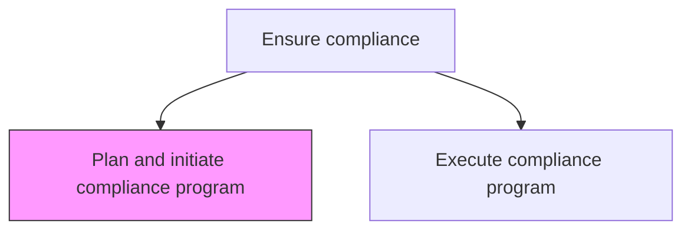
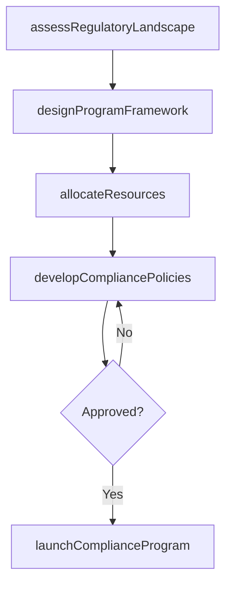

# Plan and initiate compliance program

> Business-as-Code definition for designing and launching compliance programs that identify, assess, and mitigate regulatory risks while establishing a culture of compliance across the organization.

## Overview

Employing an internal system or process to identify and reduce the risk of breaching the Competition and Consumer Act 2010. Remedy any breach. Create a culture of compliance. Design compliance programs.

## Process Hierarchy



## GraphDL

```yaml
plan:
  object: And Initiate Compliance Program
  actor: ComplianceOfficer
  result: ComplianceProgramPlan
```

## Actions

| Action | Description |
|--------|-------------|
| assessRegulatoryLandscape | Identify applicable laws, regulations, and standards the organization must comply with |
| designProgramFramework | Establish compliance program structure including policies, controls, and reporting |
| allocateResources | Determine staffing, technology, and budget requirements for the compliance program |
| developCompliancePolicies | Draft policies and procedures that operationalize regulatory requirements |
| launchComplianceProgram | Formally initiate the compliance program with communication and training |

## Events

| Event | Description |
|-------|-------------|
| regulatoryLandscapeAssessed | Applicable regulatory requirements identified and documented |
| programFrameworkDesigned | Compliance program structure and governance model approved |
| resourcesAllocated | Compliance program budget and staffing plan finalized |
| compliancePoliciesDeveloped | Compliance policies and procedures approved for deployment |
| complianceProgramLaunched | Compliance program formally initiated with organization notified |

## Searches

| Search | Description |
|--------|-------------|
| getRegulatoryRequirements | Retrieve applicable regulatory requirements by domain or jurisdiction |
| getProgramDesign | Query compliance program framework and governance structure |
| getResourceAllocations | Retrieve compliance program resource allocations by category |

## Process Flow



## RACI Matrix

| Activity | Responsible | Accountable | Consulted | Informed |
|----------|-------------|-------------|-----------|----------|
| assessRegulatoryLandscape | ComplianceOfficer | GeneralCounsel | RegulatoryAffairs | BusinessUnits |
| designProgramFramework | ComplianceOfficer | GeneralCounsel | InternalAudit | CEO |
| allocateResources | ComplianceOfficer | CFO | Finance | HR |
| launchComplianceProgram | ComplianceManager | ComplianceOfficer | HR | AllStaff |

## Related Processes

| Process | Relationship |
|---------|-------------|
| 12.4.5.2 Execute compliance program | Downstream - program plan is implemented through execution |
| 12.4.4 Develop and perform preventive law programs | Parallel - preventive programs complement compliance initiatives |
| 11.2 Manage compliance | Upstream - enterprise compliance strategy guides program planning |

## Related Departments

| Department | Role |
|-----------|------|
| Compliance | Designs and plans compliance program structure |
| Legal | Advises on regulatory requirements and legal obligations |
| Finance | Allocates budget for compliance program resources |
| Human Resources | Supports compliance training and culture initiatives |

## Related Occupations

| Occupation | Involvement |
|-----------|-------------|
| Compliance Officer | Leads compliance program design and launch |
| Regulatory Affairs Specialist | Identifies applicable regulations for program scope |
| Compliance Analyst | Supports program framework development and documentation |

## KPIs

| KPI | Description | Unit |
|-----|-------------|------|
| Program Launch Timeliness | Days from planning initiation to program launch | Days |
| Regulatory Coverage | Percentage of applicable regulations addressed by the program | % |
| Resource Utilization | Percentage of allocated compliance budget utilized effectively | % |
| Policy Deployment Rate | Percentage of compliance policies deployed within target timeline | % |

## Usage

```typescript
import { planAndInitiateComplianceProgram } from '@headlessly/plan-and-initiate-compliance-program'

const compliancePlanning = planAndInitiateComplianceProgram()

// Assess the regulatory landscape
const landscape = await compliancePlanning.assessRegulatoryLandscape({
  jurisdictions: ['US-Federal', 'EU', 'UK'],
  domains: ['financial-services', 'data-privacy', 'anti-corruption'],
  includeUpcoming: true
})

// Design the compliance program framework
const framework = await compliancePlanning.designProgramFramework({
  regulations: landscape.applicableRegulations,
  governanceModel: 'three-lines-of-defense',
  reportingCadence: 'quarterly'
})
```
