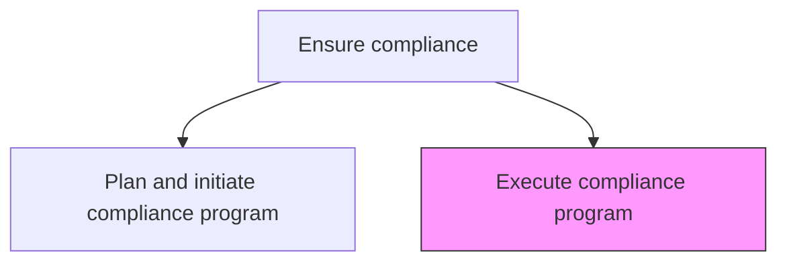
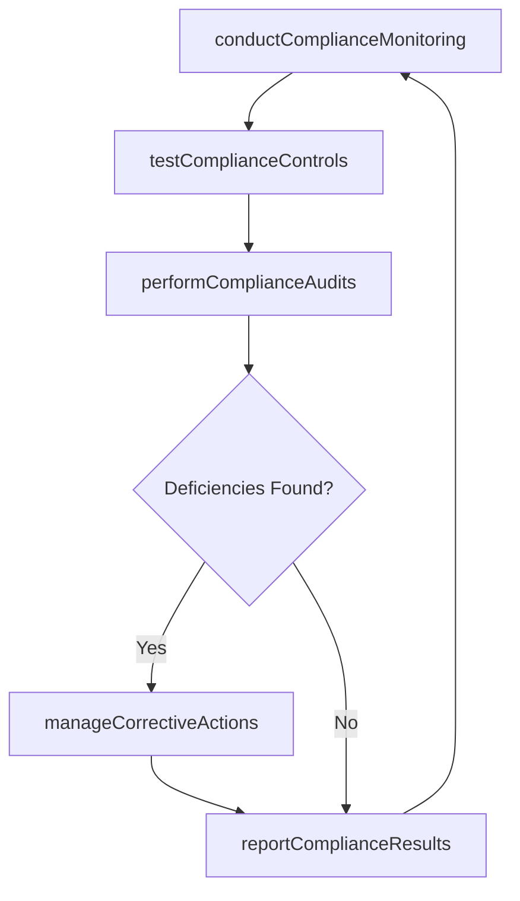

# Execute compliance program

> Business-as-Code definition for implementing and operating the established compliance program including monitoring activities, testing controls, conducting audits, and remediating identified deficiencies.

## Overview

Implementing the established compliance program in order to meet the government laws and regulations. Create a compliance team that scrutinizes the rules set out by government bodies such as the Securities and Exchange Commission.

## Process Hierarchy



## GraphDL

```yaml
execute:
  object: Compliance Program
  actor: ComplianceManager
  result: ComplianceExecutionReport
```

## Actions

| Action | Description |
|--------|-------------|
| conductComplianceMonitoring | Perform ongoing monitoring of business activities against regulatory requirements |
| testComplianceControls | Execute periodic testing of compliance controls for design and operating effectiveness |
| performComplianceAudits | Conduct risk-based compliance audits across business units |
| manageCorrectiveActions | Track and execute remediation plans for identified compliance deficiencies |
| reportComplianceResults | Compile and distribute compliance monitoring and testing results to stakeholders |

## Events

| Event | Description |
|-------|-------------|
| complianceMonitoringConducted | Compliance monitoring activities completed for reporting period |
| complianceControlsTested | Compliance control testing results documented |
| complianceAuditsPerformed | Compliance audit completed with findings reported |
| correctiveActionsManaged | Remediation status for compliance deficiencies updated |
| complianceResultsReported | Compliance monitoring and testing results distributed to stakeholders |

## Searches

| Search | Description |
|--------|-------------|
| getMonitoringResults | Retrieve compliance monitoring findings by domain or period |
| getControlTestResults | Query compliance control testing results by control or rating |
| findOpenDeficiencies | List open compliance deficiencies by severity or deadline |
| getAuditReports | Retrieve compliance audit reports by business unit or period |

## Process Flow



## RACI Matrix

| Activity | Responsible | Accountable | Consulted | Informed |
|----------|-------------|-------------|-----------|----------|
| conductComplianceMonitoring | ComplianceAnalyst | ComplianceManager | BusinessUnits | ComplianceOfficer |
| testComplianceControls | ComplianceAnalyst | ComplianceManager | InternalAudit | Legal |
| performComplianceAudits | ComplianceManager | ComplianceOfficer | InternalAudit | CEO |
| manageCorrectiveActions | ProcessOwners | ComplianceManager | Legal | ComplianceOfficer |

## Related Processes

| Process | Relationship |
|---------|-------------|
| 12.4.5.1 Plan and initiate compliance program | Upstream - program design defines execution scope and approach |
| 12.3.2 Report audit findings | Downstream - compliance audit findings reported to the board |
| 12.4.6.2 Ensure compliance with legal policies and procedures | Parallel - legal policy compliance is a component of program execution |

## Related Departments

| Department | Role |
|-----------|------|
| Compliance | Executes monitoring, testing, and audit activities |
| Internal Audit | Provides independent assurance on compliance program effectiveness |
| Business Units | Implement controls and remediate identified deficiencies |
| Legal | Advises on regulatory interpretation and remediation approaches |

## Related Occupations

| Occupation | Involvement |
|-----------|-------------|
| Compliance Manager | Manages day-to-day compliance program execution |
| Compliance Analyst | Conducts monitoring, testing, and documentation |
| Process Owner | Implements corrective actions within their area of responsibility |

## KPIs

| KPI | Description | Unit |
|-----|-------------|------|
| Control Effectiveness Rate | Percentage of compliance controls rated as effective | % |
| Deficiency Remediation Rate | Percentage of compliance deficiencies remediated within target timeline | % |
| Monitoring Coverage | Percentage of regulatory requirements actively monitored | % |
| Audit Finding Severity | Average severity rating of compliance audit findings | Score (1-5) |

## Usage

```typescript
import { executeComplianceProgram } from '@headlessly/execute-compliance-program'

const complianceExecution = executeComplianceProgram()

// Conduct compliance monitoring activities
const monitoring = await complianceExecution.conductComplianceMonitoring({
  domain: 'data-privacy',
  regulations: ['GDPR', 'CCPA'],
  period: 'Q1-2025',
  samplingMethod: 'risk-based'
})

// Manage corrective actions for identified deficiencies
const remediation = await complianceExecution.manageCorrectiveActions({
  deficiencyId: 'COMP-DEF-2025-008',
  assignee: 'data-governance-manager',
  targetDate: '2025-06-30',
  escalateIfOverdue: true
})
```
