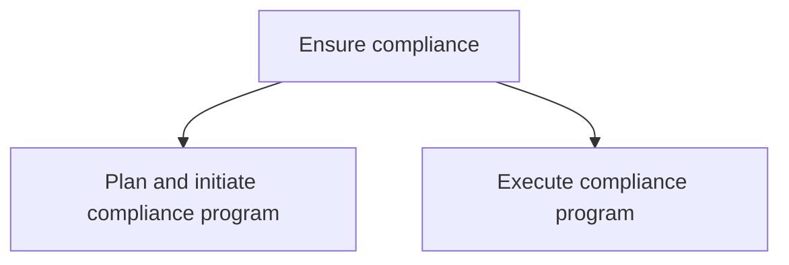
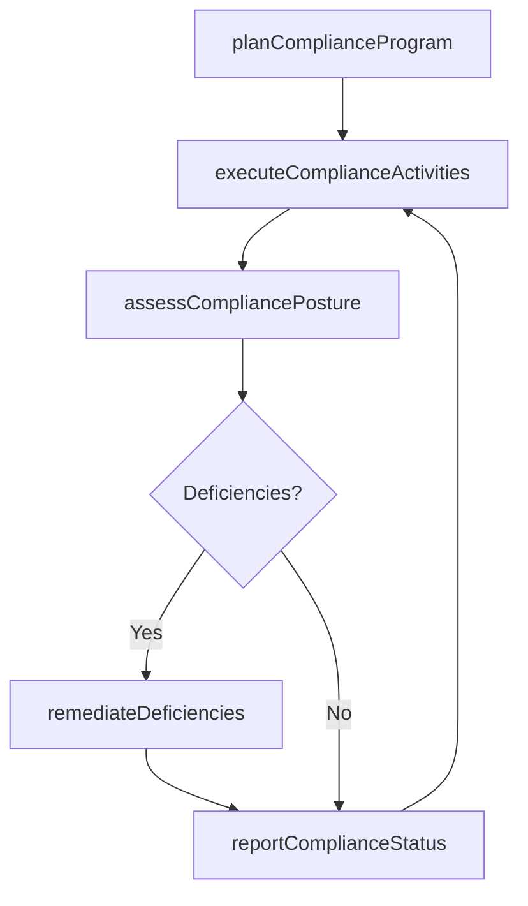

# Ensure compliance

> Business-as-Code definition for planning, implementing, and monitoring compliance programs that ensure adherence to statutes, regulatory directives, and legal principles across the organization.

## Overview

Ensuring the organization's compliance position. Validate compliance with different statutes, regulatory directions, and legal principles (using Establish compliance framework and policies [17468]). Coordinate with compliance and risk management personnel.

## Process Hierarchy



## GraphDL

```yaml
ensure:
  object: Compliance
  actor: ComplianceOfficer
  result: CompliancePostureReport
```

## Actions

| Action | Description |
|--------|-------------|
| planComplianceProgram | Design compliance program structure, scope, and resource requirements |
| executeComplianceActivities | Implement compliance monitoring, testing, and remediation activities |
| assessCompliancePosture | Evaluate overall organizational compliance against regulatory requirements |
| reportComplianceStatus | Produce compliance status reports for leadership and regulatory bodies |
| remediateDeficiencies | Address identified compliance gaps through corrective actions |

## Events

| Event | Description |
|-------|-------------|
| complianceProgramPlanned | Compliance program design and resource plan approved |
| complianceActivitiesExecuted | Compliance monitoring and testing activities completed for period |
| compliancePostureAssessed | Overall compliance assessment completed |
| complianceStatusReported | Compliance status report delivered to stakeholders |
| deficienciesRemediated | Compliance gaps addressed through corrective actions |

## Searches

| Search | Description |
|--------|-------------|
| getCompliancePrograms | Retrieve compliance programs by regulatory domain or status |
| findComplianceDeficiencies | List identified compliance gaps by severity or department |
| getComplianceReports | Query compliance status reports by period or domain |
| getRemediationStatus | Retrieve corrective action status by deficiency or deadline |

## Process Flow



## RACI Matrix

| Activity | Responsible | Accountable | Consulted | Informed |
|----------|-------------|-------------|-----------|----------|
| planComplianceProgram | ComplianceOfficer | GeneralCounsel | InternalAudit | CEO |
| executeComplianceActivities | ComplianceManager | ComplianceOfficer | BusinessUnits | Legal |
| assessCompliancePosture | ComplianceOfficer | GeneralCounsel | InternalAudit | Board |
| remediateDeficiencies | ProcessOwners | ComplianceOfficer | Legal | InternalAudit |

## Sub-Processes

| ID | Name | Description |
|----|------|-------------|
| 12.4.5.1 | Plan and initiate compliance program | Employing an internal system or process to identify and reduce the risk of breaching the Competition |
| 12.4.5.2 | Execute compliance program | Implementing the established compliance program in order to meet the government laws and regulations |

## Related Processes

| Process | Relationship |
|---------|-------------|
| 12.4.4 Develop and perform preventive law programs | Parallel - preventive law programs support compliance objectives |
| 12.4.1 Manage ethics policies and procedures | Parallel - ethics program compliance is a component |
| 11.2 Manage compliance | Upstream - enterprise compliance framework guides program design |

## Related Departments

| Department | Role |
|-----------|------|
| Compliance | Designs and executes compliance programs and monitoring activities |
| Legal | Provides regulatory guidance and reviews compliance posture |
| Internal Audit | Independently evaluates compliance program effectiveness |
| Business Units | Implement compliance controls within their operations |

## Related Occupations

| Occupation | Involvement |
|-----------|-------------|
| Compliance Officer | Leads compliance program planning and execution |
| Compliance Manager | Manages day-to-day compliance monitoring and testing |
| Internal Audit Director | Evaluates compliance program effectiveness independently |

## KPIs

| KPI | Description | Unit |
|-----|-------------|------|
| Compliance Program Coverage | Percentage of regulatory domains covered by active compliance programs | % |
| Deficiency Rate | Number of compliance deficiencies identified per audit cycle | Count |
| Remediation Timeliness | Percentage of compliance gaps remediated within target timeline | % |
| Regulatory Examination Results | Number of adverse findings from regulatory examinations | Count |

## Usage

```typescript
import { ensureCompliance } from '@headlessly/ensure-compliance'

const compliance = ensureCompliance()

// Plan a new compliance program
const program = await compliance.planComplianceProgram({
  domain: 'data-privacy',
  regulations: ['GDPR', 'CCPA', 'LGPD'],
  scope: 'global-operations',
  budget: 750000
})

// Assess overall compliance posture
const assessment = await compliance.assessCompliancePosture({
  period: 'Q4-2024',
  domains: ['financial', 'data-privacy', 'environmental'],
  includeRemediationPlan: true
})
```
