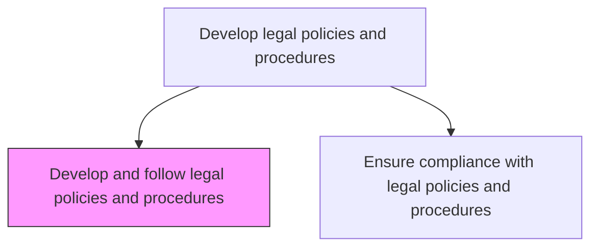
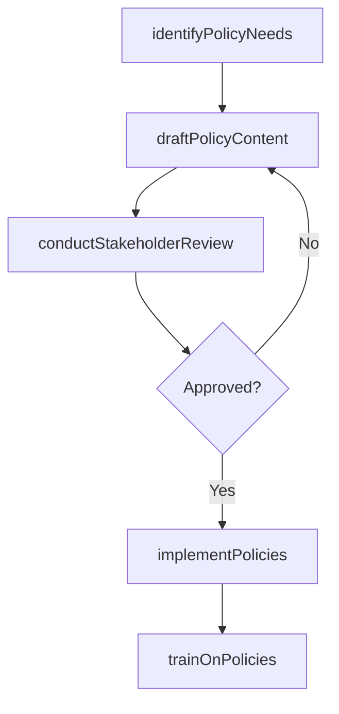

# Develop and follow legal policies and procedures

> Business-as-Code definition for creating legal policy documents, establishing operational procedures, and embedding them into organizational workflows to ensure consistent legal conduct.

## Overview

Creating legal policy documents, establishing operational procedures, and embedding them into organizational workflows. Ensure all business units understand and follow the legal policies governing their operations, contracts, and regulatory obligations.

## Process Hierarchy



## GraphDL

```yaml
develop:
  object: And Follow Legal Policies And Procedures
  actor: LegalCounsel
  result: LegalPolicyDocument
```

## Actions

| Action | Description |
|--------|-------------|
| identifyPolicyNeeds | Assess organizational gaps requiring new or updated legal policies |
| draftPolicyContent | Author legal policy language with supporting procedures and examples |
| conductStakeholderReview | Circulate draft policies for input from legal, business, and compliance teams |
| implementPolicies | Embed approved policies into business processes and systems |
| trainOnPolicies | Deliver training to affected personnel on new or updated legal policies |

## Events

| Event | Description |
|-------|-------------|
| policyNeedsIdentified | Legal policy gaps assessed and new policy requirements documented |
| policyContentDrafted | Legal policy language and procedures authored |
| stakeholderReviewCompleted | Policy draft reviewed and feedback incorporated |
| policiesImplemented | Legal policies embedded into business processes |
| policyTrainingDelivered | Personnel training on legal policies completed |

## Searches

| Search | Description |
|--------|-------------|
| findPolicyGaps | List identified legal policy gaps by risk area or department |
| getPolicyDrafts | Retrieve legal policy drafts by status or topic |
| getTrainingRecords | Query policy training completion records by department or employee |

## Process Flow



## RACI Matrix

| Activity | Responsible | Accountable | Consulted | Informed |
|----------|-------------|-------------|-----------|----------|
| identifyPolicyNeeds | LegalCounsel | GeneralCounsel | Compliance | BusinessUnits |
| draftPolicyContent | LegalCounsel | GeneralCounsel | BusinessLeaders | HR |
| implementPolicies | LegalOperationsManager | GeneralCounsel | IT | ProcessOwners |
| trainOnPolicies | LegalOperationsManager | GeneralCounsel | HR | AllStaff |

## Related Processes

| Process | Relationship |
|---------|-------------|
| 12.4.6.2 Ensure compliance with legal policies and procedures | Downstream - developed policies become the basis for compliance monitoring |
| 12.4.2 Create ethics policies | Parallel - ethics and legal policies are developed collaboratively |
| 12.4.4 Develop and perform preventive law programs | Parallel - legal policies support preventive law program objectives |

## Related Departments

| Department | Role |
|-----------|------|
| Legal | Authors and maintains legal policy content |
| Compliance | Supports policy implementation and adherence monitoring |
| Human Resources | Delivers policy training and manages acknowledgment tracking |
| IT | Supports policy deployment through technology systems |

## Related Occupations

| Occupation | Involvement |
|-----------|-------------|
| Legal Counsel | Drafts legal policies and conducts stakeholder review |
| Legal Operations Manager | Coordinates policy implementation and training |
| General Counsel | Approves final policy documents |

## KPIs

| KPI | Description | Unit |
|-----|-------------|------|
| Policy Development Cycle Time | Average days from need identification to policy implementation | Days |
| Stakeholder Review Turnaround | Average days to complete stakeholder policy review | Days |
| Training Completion Rate | Percentage of affected personnel trained on new policies within 60 days | % |
| Policy Implementation Coverage | Percentage of approved policies fully embedded in business processes | % |

## Usage

```typescript
import { developAndFollowLegalPoliciesAndProcedures } from '@headlessly/develop-and-follow-legal-policies-and-procedures'

const legalPolicyDev = developAndFollowLegalPoliciesAndProcedures()

// Identify policy needs from regulatory gap analysis
const needs = await legalPolicyDev.identifyPolicyNeeds({
  riskAreas: ['AI-governance', 'supply-chain-due-diligence'],
  regulatoryTriggers: ['EU-AI-Act', 'CSDDD'],
  priorityLevel: 'high'
})

// Implement an approved policy
const implementation = await legalPolicyDev.implementPolicies({
  policyId: 'LEG-POL-2025-005',
  departments: ['engineering', 'product', 'procurement'],
  integrationSystems: ['contract-management', 'vendor-portal']
})
```
