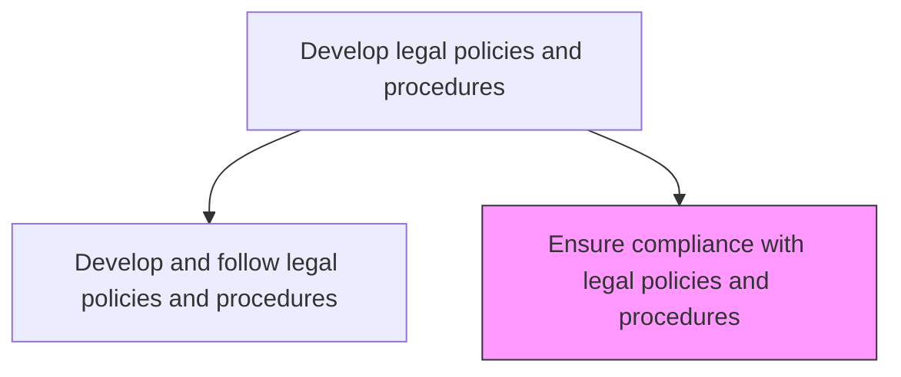
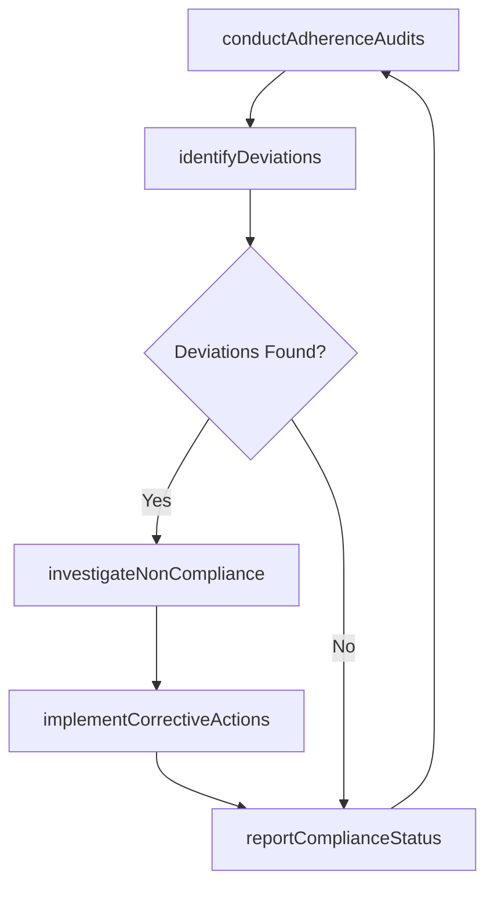

# Ensure compliance with legal policies and procedures

> Business-as-Code definition for monitoring, auditing, and enforcing adherence to established legal policies and procedures across the organization, including corrective action management.

## Overview

Monitoring, auditing, and enforcing adherence to established legal policies and procedures across the organization. Conduct periodic assessments, identify deviations, and implement corrective measures to maintain consistent legal compliance.

## Process Hierarchy



## GraphDL

```yaml
ensure:
  object: Compliance With Legal Policies And Procedures
  actor: ComplianceManager
  result: PolicyComplianceAssessment
```

## Actions

| Action | Description |
|--------|-------------|
| conductAdherenceAudits | Perform periodic audits of business unit adherence to legal policies |
| identifyDeviations | Detect and document instances of non-compliance with legal policies |
| investigateNonCompliance | Conduct root cause analysis for identified policy deviations |
| implementCorrectiveActions | Execute remediation measures to address policy non-compliance |
| reportComplianceStatus | Produce policy adherence reports for legal and executive leadership |

## Events

| Event | Description |
|-------|-------------|
| adherenceAuditsConducted | Legal policy adherence audit completed for review period |
| deviationsIdentified | Policy non-compliance instances detected and documented |
| nonComplianceInvestigated | Root cause analysis for policy deviation completed |
| correctiveActionsImplemented | Remediation measures for policy non-compliance executed |
| complianceStatusReported | Policy adherence report delivered to stakeholders |

## Searches

| Search | Description |
|--------|-------------|
| findDeviations | List policy non-compliance instances by department, policy, or severity |
| getAuditResults | Retrieve policy adherence audit results by period or department |
| getCorrectiveActionStatus | Query remediation status for identified policy deviations |

## Process Flow



## RACI Matrix

| Activity | Responsible | Accountable | Consulted | Informed |
|----------|-------------|-------------|-----------|----------|
| conductAdherenceAudits | ComplianceAnalyst | ComplianceManager | InternalAudit | Legal |
| identifyDeviations | ComplianceAnalyst | ComplianceManager | ProcessOwners | GeneralCounsel |
| implementCorrectiveActions | ProcessOwners | ComplianceManager | Legal | InternalAudit |
| reportComplianceStatus | ComplianceManager | GeneralCounsel | InternalAudit | CEO |

## Related Processes

| Process | Relationship |
|---------|-------------|
| 12.4.6.1 Develop and follow legal policies and procedures | Upstream - developed policies define the compliance monitoring scope |
| 12.4.5 Ensure compliance | Parallel - legal policy compliance is a subset of overall compliance |
| 12.3.2 Report audit findings | Downstream - policy compliance findings reported to audit committee |

## Related Departments

| Department | Role |
|-----------|------|
| Compliance | Conducts adherence audits and manages corrective actions |
| Legal | Provides guidance on policy interpretation and enforcement |
| Internal Audit | Independently assesses policy compliance effectiveness |
| Business Units | Implement corrective actions within their operations |

## Related Occupations

| Occupation | Involvement |
|-----------|-------------|
| Compliance Manager | Leads policy adherence monitoring and enforcement |
| Compliance Analyst | Conducts audits and documents deviations |
| Internal Auditor | Provides independent assessment of policy compliance |

## KPIs

| KPI | Description | Unit |
|-----|-------------|------|
| Policy Adherence Rate | Percentage of audited areas in full compliance with legal policies | % |
| Deviation Resolution Time | Average days from deviation identification to corrective action completion | Days |
| Repeat Deviation Rate | Percentage of policy deviations that recur within 12 months | % |
| Audit Coverage | Percentage of departments audited for legal policy compliance per year | % |

## Usage

```typescript
import { ensureComplianceWithLegalPoliciesAndProcedures } from '@headlessly/ensure-compliance-with-legal-policies-and-procedures'

const policyCompliance = ensureComplianceWithLegalPoliciesAndProcedures()

// Conduct adherence audit for a department
const audit = await policyCompliance.conductAdherenceAudits({
  department: 'procurement',
  policies: ['contract-approval', 'vendor-due-diligence', 'data-protection'],
  period: 'Q1-2025'
})

// Implement corrective actions for identified deviations
const corrective = await policyCompliance.implementCorrectiveActions({
  deviationId: 'DEV-2025-014',
  rootCause: 'training-gap',
  action: 'deploy-targeted-training',
  targetDate: '2025-04-15'
})
```
