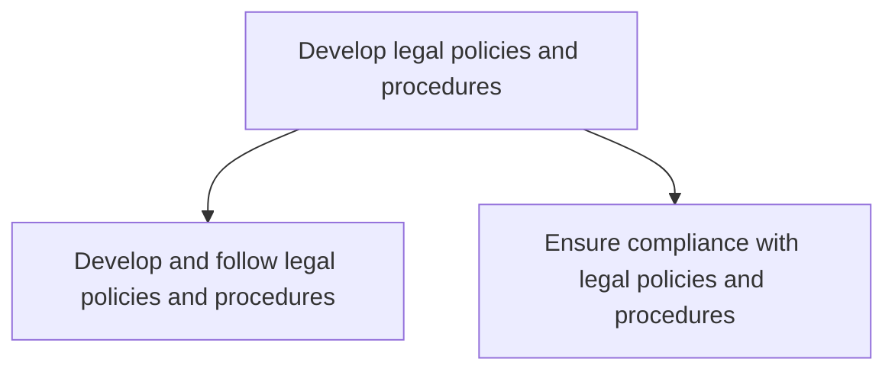
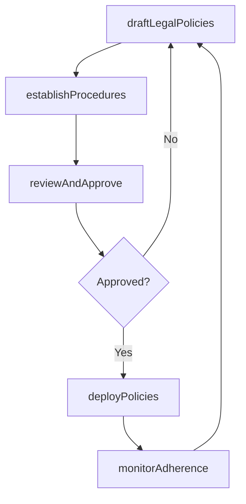

# Develop legal policies and procedures

> Business-as-Code definition for establishing, documenting, and maintaining legal policies and procedures that guide organizational conduct and ensure adherence to applicable laws and regulations.

## Overview

Establishing, documenting, and maintaining legal policies and procedures that guide organizational conduct, ensure compliance with applicable laws and regulations, and provide clear operational guidance for legal matters across the enterprise.

## Process Hierarchy



## GraphDL

```yaml
develop:
  object: Legal Policies And Procedures
  actor: GeneralCounsel
  result: LegalPolicyFramework
```

## Actions

| Action | Description |
|--------|-------------|
| draftLegalPolicies | Author legal policies covering contract management, litigation, data privacy, and other areas |
| establishProcedures | Define operational procedures that implement legal policy requirements |
| reviewAndApprove | Circulate policies for legal review, business stakeholder feedback, and executive approval |
| deployPolicies | Distribute approved policies through communication channels and training programs |
| monitorAdherence | Track organizational adherence to legal policies and procedures |

## Events

| Event | Description |
|-------|-------------|
| legalPoliciesDrafted | Legal policy documents authored and ready for review |
| proceduresEstablished | Operational procedures defined for legal policy implementation |
| policiesReviewedAndApproved | Legal policies approved by executive leadership |
| policiesDeployed | Approved legal policies distributed organization-wide |
| adherenceMonitored | Legal policy adherence assessment completed |

## Searches

| Search | Description |
|--------|-------------|
| getLegalPolicies | Retrieve legal policies by topic, status, or effective date |
| getProcedures | Query operational procedures by legal policy or department |
| getAdherenceReports | Retrieve policy adherence monitoring reports by period |

## Process Flow



## RACI Matrix

| Activity | Responsible | Accountable | Consulted | Informed |
|----------|-------------|-------------|-----------|----------|
| draftLegalPolicies | LegalCounsel | GeneralCounsel | Compliance | BusinessUnits |
| establishProcedures | LegalOperationsManager | GeneralCounsel | ProcessOwners | Compliance |
| reviewAndApprove | GeneralCounsel | CEO | Legal | Board |
| monitorAdherence | ComplianceManager | GeneralCounsel | InternalAudit | Legal |

## Sub-Processes

| ID | Name | Description |
|----|------|-------------|
| 12.4.6.1 | Develop and follow legal policies and procedures | Creating legal policy documents, establishing operational procedures, and embedding them into organi |
| 12.4.6.2 | Ensure compliance with legal policies and procedures | Monitoring, auditing, and enforcing adherence to established legal policies and procedures across th |

## Related Processes

| Process | Relationship |
|---------|-------------|
| 12.4.5 Ensure compliance | Parallel - legal policies are a foundation for compliance programs |
| 12.4.2 Create ethics policies | Parallel - ethics and legal policies are often developed together |
| 12.4.11 Negotiate and document agreements/contracts | Consumer - contract policies guide negotiation and documentation |

## Related Departments

| Department | Role |
|-----------|------|
| Legal | Drafts, reviews, and maintains legal policies and procedures |
| Compliance | Monitors adherence and supports policy enforcement |
| Business Units | Implement legal procedures within their operations |
| Internal Audit | Provides independent assessment of policy adherence |

## Related Occupations

| Occupation | Involvement |
|-----------|-------------|
| General Counsel | Oversees legal policy development and approval |
| Legal Operations Manager | Coordinates policy procedure development and deployment |
| Compliance Manager | Monitors adherence to legal policies across the organization |

## KPIs

| KPI | Description | Unit |
|-----|-------------|------|
| Policy Currency Rate | Percentage of legal policies reviewed and updated within 12 months | % |
| Procedure Documentation Coverage | Percentage of legal policies with documented operational procedures | % |
| Policy Adherence Rate | Percentage of departments in compliance with legal policies | % |
| Policy Deployment Timeliness | Average days from policy approval to organization-wide deployment | Days |

## Usage

```typescript
import { developLegalPoliciesAndProcedures } from '@headlessly/develop-legal-policies-and-procedures'

const legalPolicies = developLegalPoliciesAndProcedures()

// Draft a new legal policy
const policy = await legalPolicies.draftLegalPolicies({
  topic: 'data-retention',
  jurisdiction: 'global',
  referenceRegulations: ['GDPR-Article-5', 'CCPA-Section-1798'],
  author: 'privacy-counsel'
})

// Monitor adherence to legal policies
const adherence = await legalPolicies.monitorAdherence({
  policies: ['data-retention', 'contract-approval', 'litigation-hold'],
  period: 'Q1-2025',
  includeRemediation: true
})
```
