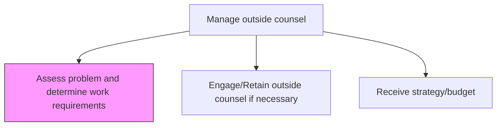
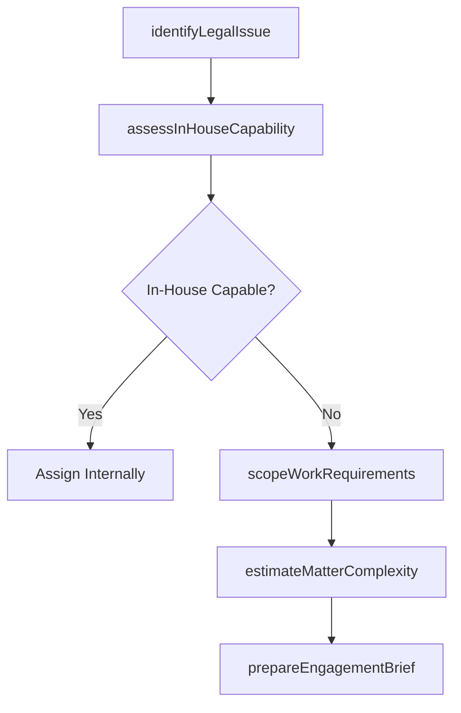

# Assess problem and determine work requirements

> Business-as-Code definition for analyzing legal issues, scoping work requirements, and determining whether external legal expertise is needed to address specific matters.

## Overview

Examining the problems and deciding the action requirements for engaging outside counsel. This process element calls upon the organization to internally analyze the issues for which assistance from external counsel is needed. Additionally, the organization needs to break-down the issue, identifying the tasks and exercises where outside counsel can help.

## Process Hierarchy



## GraphDL

```yaml
assess:
  object: Problem And Determine Work Requirements
  actor: LegalOperationsManager
  result: LegalWorkRequirementsAssessment
```

## Actions

| Action | Description |
|--------|-------------|
| identifyLegalIssue | Document the legal matter and categorize by practice area and urgency |
| assessInHouseCapability | Evaluate whether internal legal resources can handle the matter |
| scopeWorkRequirements | Define the tasks, expertise, and timeline required for the legal matter |
| estimateMatterComplexity | Rate matter complexity to inform counsel selection and budgeting |
| prepareEngagementBrief | Create a work requirements brief for potential outside counsel |

## Events

| Event | Description |
|-------|-------------|
| legalIssueIdentified | Legal matter documented and categorized for assessment |
| inHouseCapabilityAssessed | Internal legal resource evaluation completed |
| workRequirementsScoped | Task, expertise, and timeline requirements defined |
| matterComplexityEstimated | Complexity rating assigned to inform counsel selection |
| engagementBriefPrepared | Work requirements brief ready for outside counsel distribution |

## Searches

| Search | Description |
|--------|-------------|
| findLegalMatters | List legal matters by practice area, urgency, or complexity rating |
| getCapabilityAssessment | Retrieve in-house capability evaluation for a specific matter type |
| getEngagementBriefs | Query work requirements briefs by status or practice area |

## Process Flow



## RACI Matrix

| Activity | Responsible | Accountable | Consulted | Informed |
|----------|-------------|-------------|-----------|----------|
| identifyLegalIssue | LegalCounsel | GeneralCounsel | BusinessUnits | LegalOperationsManager |
| assessInHouseCapability | LegalOperationsManager | GeneralCounsel | LegalCounsel | HR |
| scopeWorkRequirements | LegalOperationsManager | GeneralCounsel | SubjectMatterExpert | Finance |
| prepareEngagementBrief | LegalOperationsManager | GeneralCounsel | LegalCounsel | Procurement |

## Related Processes

| Process | Relationship |
|---------|-------------|
| 12.4.7.2 Engage/Retain outside counsel if necessary | Downstream - assessment determines whether to engage counsel |
| 12.4.9 Resolve disputes and litigations | Upstream - disputes trigger legal matter assessment |
| 12.4.10 Provide legal advice/counseling | Parallel - internal counsel assesses in-house capability |

## Related Departments

| Department | Role |
|-----------|------|
| Legal | Identifies legal issues and assesses in-house capability |
| Business Units | Reports legal matters and provides context for assessment |
| Finance | Provides budget context for engagement decisions |

## Related Occupations

| Occupation | Involvement |
|-----------|-------------|
| Legal Operations Manager | Leads work requirements scoping and engagement brief preparation |
| General Counsel | Approves assessments and authorizes outside counsel engagement |
| Legal Counsel | Provides subject matter expertise for capability assessment |

## KPIs

| KPI | Description | Unit |
|-----|-------------|------|
| Assessment Turnaround Time | Average days from matter identification to completed requirements assessment | Days |
| External Referral Rate | Percentage of legal matters referred to outside counsel vs. handled internally | % |
| Scope Accuracy | Percentage of engagements where actual work aligned with initial scope | % |
| Brief Completion Rate | Percentage of outside counsel engagements with formal requirements briefs | % |

## Usage

```typescript
import { assessProblemAndDetermineWorkRequirements } from '@headlessly/assess-problem-and-determine-work-requirements'

const assessment = assessProblemAndDetermineWorkRequirements()

// Identify and categorize a legal issue
const issue = await assessment.identifyLegalIssue({
  matterType: 'employment-dispute',
  department: 'human-resources',
  urgency: 'high',
  jurisdictions: ['California', 'New York']
})

// Scope work requirements for outside counsel
const requirements = await assessment.scopeWorkRequirements({
  matterId: issue.id,
  requiredExpertise: ['employment-law', 'class-action-defense'],
  estimatedDuration: '6-months',
  deliverables: ['legal-strategy', 'motion-practice', 'settlement-negotiations']
})
```
