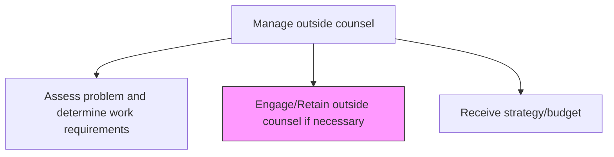
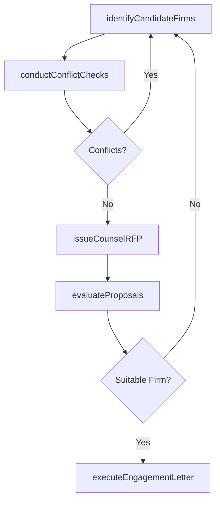

# Engage/Retain outside counsel if necessary

> Business-as-Code definition for selecting, vetting, and formally retaining external legal counsel through RFP processes, due diligence, and engagement letter negotiation.

## Overview

Recruiting the assistance of outside counsel for any legal and/or ethical concerns. Engage and/or retain any external counsel sought from subject matter experts and professionals.

## Process Hierarchy



## GraphDL

```yaml
engage/retain:
  object: Outside Counsel If Necessary
  actor: GeneralCounsel
  result: CounselEngagementAgreement
```

## Actions

| Action | Description |
|--------|-------------|
| identifyCandidateFirms | Research and shortlist law firms with relevant expertise and experience |
| conductConflictChecks | Verify candidate firms have no conflicts of interest with the organization |
| issueCounselRFP | Distribute request for proposal to shortlisted outside counsel firms |
| evaluateProposals | Assess counsel proposals on expertise, approach, staffing, and cost |
| executeEngagementLetter | Finalize and sign the engagement agreement with selected counsel |

## Events

| Event | Description |
|-------|-------------|
| candidateFirmsIdentified | Shortlist of qualified outside counsel firms compiled |
| conflictChecksCompleted | Conflict of interest verification completed for candidate firms |
| counselRFPIssued | Request for proposal distributed to shortlisted counsel |
| proposalsEvaluated | Counsel proposals assessed and ranked |
| engagementLetterExecuted | Engagement agreement signed with selected outside counsel |

## Searches

| Search | Description |
|--------|-------------|
| findCandidateFirms | List candidate law firms by practice area, jurisdiction, or diversity credentials |
| getRFPResponses | Retrieve counsel RFP responses by matter, firm, or evaluation score |
| getEngagementLetters | Query executed engagement agreements by firm, matter type, or date |

## Process Flow



## RACI Matrix

| Activity | Responsible | Accountable | Consulted | Informed |
|----------|-------------|-------------|-----------|----------|
| identifyCandidateFirms | LegalOperationsManager | GeneralCounsel | LegalCounsel | Procurement |
| conductConflictChecks | LegalOperationsManager | GeneralCounsel | Compliance | LegalCounsel |
| evaluateProposals | GeneralCounsel | CEO | LegalCounsel | Finance |
| executeEngagementLetter | GeneralCounsel | CEO | Procurement | Finance |

## Related Processes

| Process | Relationship |
|---------|-------------|
| 12.4.7.1 Assess problem and determine work requirements | Upstream - assessment drives counsel selection criteria |
| 12.4.7.3 Receive strategy/budget | Downstream - engaged counsel provides strategy and budget |
| 12.4.11 Negotiate and document agreements/contracts | Parallel - engagement letters follow contract negotiation standards |

## Related Departments

| Department | Role |
|-----------|------|
| Legal | Evaluates counsel expertise and manages selection process |
| Procurement | Supports RFP distribution and contract negotiation |
| Finance | Reviews proposed fee structures and budget implications |
| Compliance | Conducts conflict of interest and due diligence checks |

## Related Occupations

| Occupation | Involvement |
|-----------|-------------|
| General Counsel | Approves counsel selection and signs engagement letters |
| Legal Operations Manager | Manages RFP process and proposal evaluation |
| Procurement Manager | Negotiates commercial terms and fee arrangements |

## KPIs

| KPI | Description | Unit |
|-----|-------------|------|
| Engagement Cycle Time | Average days from work requirements brief to signed engagement letter | Days |
| Panel Utilization Rate | Percentage of engagements sourced from approved counsel panel | % |
| Diversity Spend | Percentage of outside counsel spend directed to diverse-owned firms | % |
| Conflict Resolution Time | Average days to complete conflict checks for candidate firms | Days |

## Usage

```typescript
import { engageRetainOutsideCounselIfNecessary } from '@headlessly/engage-retain-outside-counsel-if-necessary'

const engagement = engageRetainOutsideCounselIfNecessary()

// Identify candidate firms for a patent matter
const candidates = await engagement.identifyCandidateFirms({
  practiceArea: 'patent-litigation',
  jurisdiction: 'US-Federal-EDTX',
  firmSize: 'AmLaw-200',
  diversityRequirement: true
})

// Execute engagement letter with selected firm
const letter = await engagement.executeEngagementLetter({
  firmId: candidates[0].id,
  matterId: 'MAT-2025-042',
  feeArrangement: 'blended-rate',
  budgetCap: 500000,
  billingGuidelines: 'standard-v3'
})
```
