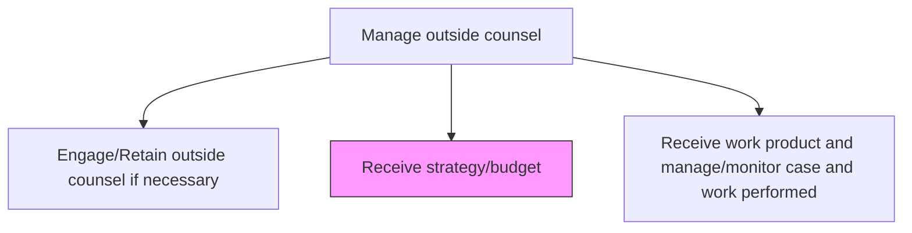
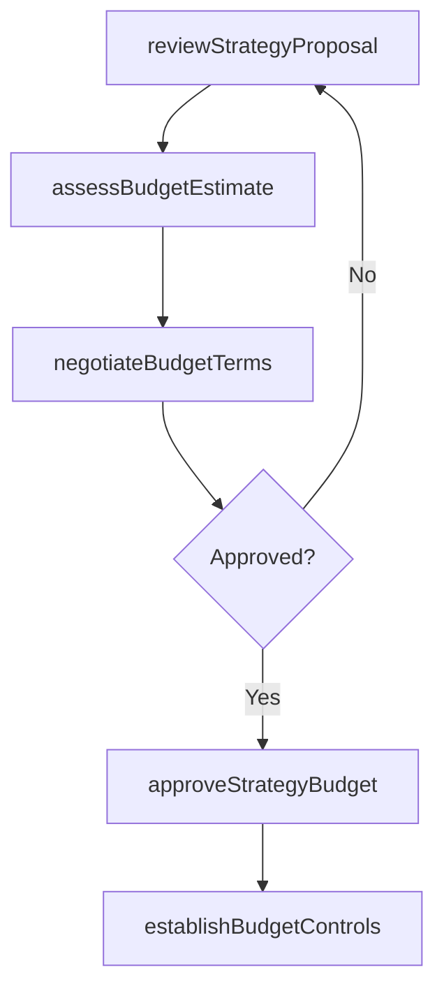

# Receive strategy/budget

> Business-as-Code definition for receiving, reviewing, and approving legal strategy proposals and budget plans submitted by outside counsel for assigned matters.

## Overview

Making a financial plan. This strategy sets out, using figures, an organization's expected future results. Enlist the finance function to support work generated by other business functions in order to build and secure their support for the budget.

## Process Hierarchy



## GraphDL

```yaml
receive:
  object: Strategy/budget
  actor: GeneralCounsel
  result: ApprovedLegalStrategyBudget
```

## Actions

| Action | Description |
|--------|-------------|
| reviewStrategyProposal | Evaluate the legal strategy submitted by outside counsel for alignment with business objectives |
| assessBudgetEstimate | Analyze the proposed budget against matter complexity and historical benchmarks |
| negotiateBudgetTerms | Discuss and adjust budget allocations, phasing, and fee arrangements with counsel |
| approveStrategyBudget | Formally approve the legal strategy and budget for matter execution |
| establishBudgetControls | Set spending thresholds, approval gates, and variance reporting requirements |

## Events

| Event | Description |
|-------|-------------|
| strategyProposalReviewed | Outside counsel legal strategy evaluated and feedback provided |
| budgetEstimateAssessed | Proposed budget analyzed against benchmarks and historical data |
| budgetTermsNegotiated | Budget allocations and fee arrangements finalized with counsel |
| strategyBudgetApproved | Legal strategy and budget formally approved for execution |
| budgetControlsEstablished | Spending thresholds and variance reporting requirements set |

## Searches

| Search | Description |
|--------|-------------|
| getStrategyProposals | Retrieve strategy proposals by matter, counsel firm, or approval status |
| getBudgetComparisons | Query budget estimates against historical benchmarks by matter type |
| getBudgetApprovals | List approved budgets by matter, period, or spending threshold |

## Process Flow



## RACI Matrix

| Activity | Responsible | Accountable | Consulted | Informed |
|----------|-------------|-------------|-----------|----------|
| reviewStrategyProposal | LegalCounsel | GeneralCounsel | BusinessUnits | LegalOperationsManager |
| assessBudgetEstimate | LegalOperationsManager | GeneralCounsel | Finance | CFO |
| negotiateBudgetTerms | GeneralCounsel | CFO | LegalOperationsManager | Finance |
| approveStrategyBudget | GeneralCounsel | CEO | CFO | LegalOperationsManager |

## Related Processes

| Process | Relationship |
|---------|-------------|
| 12.4.7.2 Engage/Retain outside counsel if necessary | Upstream - engagement terms frame strategy and budget discussions |
| 12.4.7.4 Receive work product and manage/monitor case and work performed | Downstream - approved budget governs work product monitoring |
| 9.3.3 Manage budgets | Parallel - legal budgets integrated into enterprise budget management |

## Related Departments

| Department | Role |
|-----------|------|
| Legal | Reviews strategy proposals and negotiates budget terms with outside counsel |
| Finance | Validates budget estimates and tracks legal spending against forecasts |
| Business Units | Provide input on business objectives that inform legal strategy |

## Related Occupations

| Occupation | Involvement |
|-----------|-------------|
| General Counsel | Approves legal strategy and budget for each matter |
| Legal Operations Manager | Benchmarks budgets and establishes spending controls |
| Financial Analyst | Validates budget estimates against historical legal spend data |

## KPIs

| KPI | Description | Unit |
|-----|-------------|------|
| Budget Approval Cycle Time | Average days from strategy submission to formal budget approval | Days |
| Budget Variance Rate | Percentage deviation between approved and actual legal spend per matter | % |
| Strategy Alignment Score | Percentage of approved strategies aligned with stated business objectives | % |
| Budget Revision Frequency | Average number of budget revisions per matter engagement | Count |

## Usage

```typescript
import { receiveStrategyBudget } from '@headlessly/receive-strategy-budget'

const strategyBudget = receiveStrategyBudget()

// Review a strategy proposal from outside counsel
const review = await strategyBudget.reviewStrategyProposal({
  matterId: 'MAT-2025-042',
  firmId: 'FIRM-2025-003',
  strategyType: 'litigation-defense',
  businessObjective: 'minimize-exposure'
})

// Approve the strategy and budget
const approval = await strategyBudget.approveStrategyBudget({
  matterId: 'MAT-2025-042',
  approvedBudget: 350000,
  phases: ['discovery', 'motion-practice', 'trial-preparation'],
  varianceThreshold: 15
})
```
