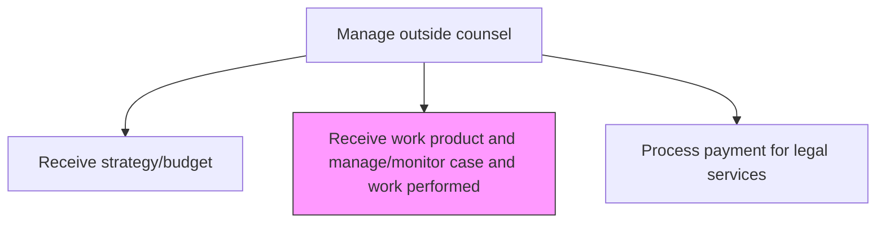
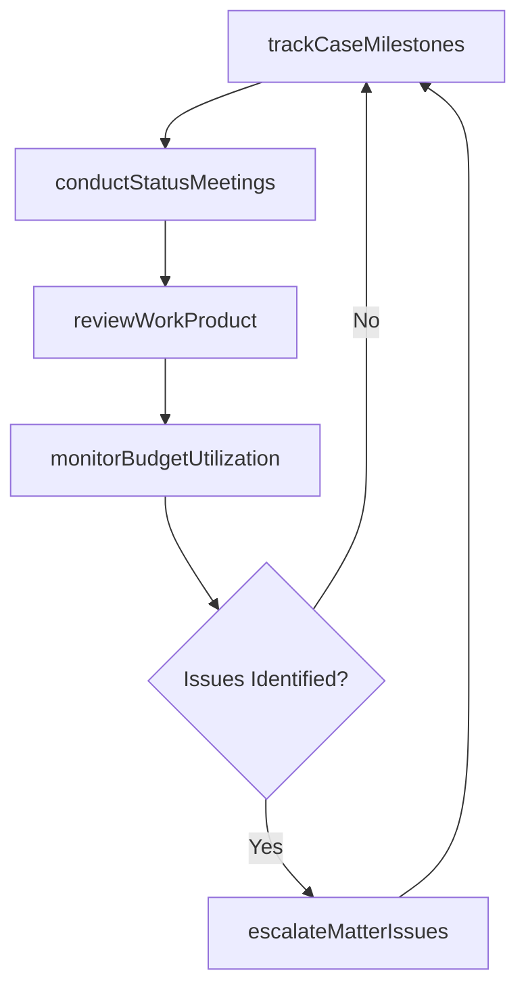

# Receive work product and manage/monitor case and work performed

> Business-as-Code definition for tracking outside counsel deliverables, monitoring case progress against milestones, and validating the quality and timeliness of legal work product.

## Overview

Receiving deliverables from outside counsel, and monitoring the efforts committed by them. Track the progress of, collect, and validate the required work product from the subject matter experts and professionals engaged as external counsel. Verify the amount of effort dedicated by these counsels to the issue at hand, in order to confirm their fees.

## Process Hierarchy



## GraphDL

```yaml
receive:
  object: Work Product And Manage/monitor Case And Work Performed
  actor: LegalOperationsManager
  result: CaseProgressReport
```

## Actions

| Action | Description |
|--------|-------------|
| trackCaseMilestones | Monitor case progress against agreed timeline and key milestones |
| reviewWorkProduct | Evaluate legal deliverables for quality, accuracy, and completeness |
| conductStatusMeetings | Hold periodic case status meetings with outside counsel |
| monitorBudgetUtilization | Track actual spend against approved budget and flag variances |
| escalateMatterIssues | Raise concerns about quality, timeliness, or budget overruns to leadership |

## Events

| Event | Description |
|-------|-------------|
| caseMilestonesTracked | Case progress reviewed and milestone status updated |
| workProductReviewed | Legal deliverables evaluated for quality and completeness |
| statusMeetingConducted | Case status meeting with outside counsel completed |
| budgetUtilizationMonitored | Actual spend tracked and variance analysis completed |
| matterIssuesEscalated | Quality, timeliness, or budget concerns raised to leadership |

## Searches

| Search | Description |
|--------|-------------|
| getCaseStatus | Retrieve case progress and milestone status by matter or counsel |
| getWorkProductLog | List received deliverables by matter, type, or review status |
| getBudgetVariance | Query budget utilization and variance data by matter or period |

## Process Flow



## RACI Matrix

| Activity | Responsible | Accountable | Consulted | Informed |
|----------|-------------|-------------|-----------|----------|
| trackCaseMilestones | LegalOperationsManager | GeneralCounsel | LegalCounsel | BusinessUnits |
| reviewWorkProduct | LegalCounsel | GeneralCounsel | SubjectMatterExpert | LegalOperationsManager |
| monitorBudgetUtilization | LegalOperationsManager | GeneralCounsel | Finance | CFO |
| escalateMatterIssues | GeneralCounsel | CEO | LegalCounsel | Board |

## Related Processes

| Process | Relationship |
|---------|-------------|
| 12.4.7.3 Receive strategy/budget | Upstream - approved strategy and budget define monitoring scope |
| 12.4.7.5 Process payment for legal services | Downstream - validated work product triggers invoice approval |
| 12.4.7.6 Track legal activity/performance | Parallel - case monitoring feeds performance tracking |

## Related Departments

| Department | Role |
|-----------|------|
| Legal | Reviews work product quality and manages case milestones |
| Finance | Monitors budget utilization and flags spending variances |
| Business Units | Provide matter context and validate work product relevance |

## Related Occupations

| Occupation | Involvement |
|-----------|-------------|
| Legal Operations Manager | Tracks milestones, conducts status meetings, and monitors budgets |
| Legal Counsel | Reviews work product for legal quality and strategic alignment |
| General Counsel | Escalates matter issues and approves scope changes |

## KPIs

| KPI | Description | Unit |
|-----|-------------|------|
| Milestone On-Time Rate | Percentage of case milestones achieved within agreed timelines | % |
| Work Product Quality Score | Average quality rating of deliverables received from outside counsel | Score (1-5) |
| Budget Utilization Rate | Actual spend as percentage of approved budget at each phase | % |
| Status Meeting Cadence Compliance | Percentage of scheduled status meetings held on time | % |

## Usage

```typescript
import { receiveWorkProductAndManageMonitorCaseAndWorkPerformed } from '@headlessly/receive-work-product-and-manage-monitor-case-and-work-performed'

const caseMonitor = receiveWorkProductAndManageMonitorCaseAndWorkPerformed()

// Track case milestones for a litigation matter
const milestones = await caseMonitor.trackCaseMilestones({
  matterId: 'MAT-2025-042',
  firmId: 'FIRM-2025-003',
  currentPhase: 'discovery',
  checkpoints: ['document-production', 'depositions', 'expert-reports']
})

// Review received work product
const review = await caseMonitor.reviewWorkProduct({
  matterId: 'MAT-2025-042',
  deliverableType: 'motion-to-dismiss',
  qualityCriteria: ['legal-accuracy', 'strategic-alignment', 'completeness'],
  deadline: '2025-05-01'
})
```
