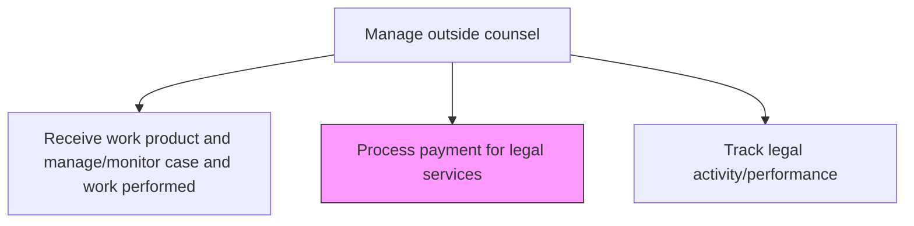
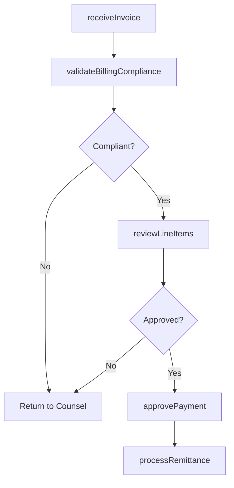

# Process payment for legal services

> Business-as-Code definition for reviewing, validating, and processing invoices from outside counsel, including billing guideline compliance, rate verification, and payment authorization.

## Overview

Making payments to legal advisers for their services. Payments include addressing issues or suits by customers, suppliers, competitors, bankers, government agencies, etc.

## Process Hierarchy



## GraphDL

```yaml
process:
  object: Payment For Legal Services
  actor: LegalOperationsManager
  result: ProcessedLegalPayment
```

## Actions

| Action | Description |
|--------|-------------|
| receiveInvoice | Receive and log legal service invoices from outside counsel |
| validateBillingCompliance | Check invoices against billing guidelines, approved rates, and engagement terms |
| reviewLineItems | Examine individual time entries and expenses for appropriateness and accuracy |
| approvePayment | Authorize invoice payment after validation and budget confirmation |
| processRemittance | Execute payment through accounts payable and record in legal spend system |

## Events

| Event | Description |
|-------|-------------|
| invoiceReceived | Legal service invoice received and logged in the system |
| billingComplianceValidated | Invoice checked against billing guidelines and engagement terms |
| lineItemsReviewed | Time entries and expenses examined for appropriateness |
| paymentApproved | Invoice payment authorized after validation and budget check |
| remittanceProcessed | Payment executed and recorded in legal spend tracking system |

## Searches

| Search | Description |
|--------|-------------|
| getInvoices | Retrieve legal invoices by firm, matter, status, or period |
| getBillingExceptions | List invoice line items flagged for billing guideline violations |
| getPaymentHistory | Query payment records by firm, matter, or date range |

## Process Flow



## RACI Matrix

| Activity | Responsible | Accountable | Consulted | Informed |
|----------|-------------|-------------|-----------|----------|
| receiveInvoice | LegalOperationsManager | GeneralCounsel | AccountsPayable | Finance |
| validateBillingCompliance | LegalOperationsManager | GeneralCounsel | LegalCounsel | AccountsPayable |
| approvePayment | GeneralCounsel | CFO | LegalOperationsManager | Finance |
| processRemittance | AccountsPayable | CFO | LegalOperationsManager | GeneralCounsel |

## Related Processes

| Process | Relationship |
|---------|-------------|
| 12.4.7.4 Receive work product and manage/monitor case and work performed | Upstream - validated work product triggers invoice approval |
| 12.4.7.6 Track legal activity/performance | Downstream - payment data feeds counsel performance tracking |
| 9.6.2 Process accounts payable | Parallel - legal invoices processed through enterprise AP system |

## Related Departments

| Department | Role |
|-----------|------|
| Legal | Validates invoices against billing guidelines and approves payments |
| Finance | Processes payments and tracks legal spend against budgets |
| Accounts Payable | Executes remittance and maintains payment records |

## Related Occupations

| Occupation | Involvement |
|-----------|-------------|
| Legal Operations Manager | Reviews invoices and validates billing guideline compliance |
| Accounts Payable Specialist | Processes approved invoice payments |
| General Counsel | Approves high-value invoices and resolves billing disputes |

## KPIs

| KPI | Description | Unit |
|-----|-------------|------|
| Invoice Processing Cycle Time | Average days from invoice receipt to payment execution | Days |
| Billing Guideline Compliance Rate | Percentage of invoices passing initial billing validation | % |
| Write-Down Rate | Percentage of billed amounts reduced through line-item review | % |
| Payment Timeliness | Percentage of approved invoices paid within agreed terms | % |

## Usage

```typescript
import { processPaymentForLegalServices } from '@headlessly/process-payment-for-legal-services'

const legalPayments = processPaymentForLegalServices()

// Validate an incoming invoice against billing guidelines
const validation = await legalPayments.validateBillingCompliance({
  invoiceId: 'INV-2025-1847',
  firmId: 'FIRM-2025-003',
  matterId: 'MAT-2025-042',
  billingGuidelines: 'standard-v3',
  checkRates: true
})

// Approve payment after validation
const approval = await legalPayments.approvePayment({
  invoiceId: 'INV-2025-1847',
  approvedAmount: 47500,
  adjustments: [{ lineItem: 'block-billing', reduction: 2500 }],
  paymentTerms: 'net-30'
})
```
