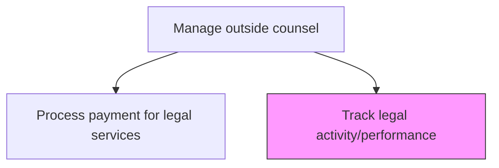
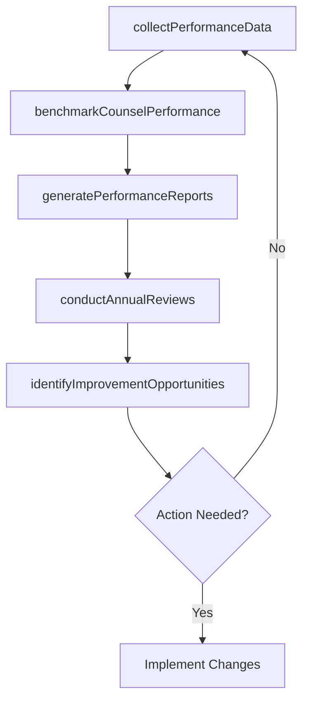

# Track legal activity/performance

> Business-as-Code definition for monitoring, measuring, and reporting on overall legal department activities and outside counsel performance to drive continuous improvement and cost optimization.

## Overview

Keeping track of the legal activities and performance of the organization.

## Process Hierarchy



## GraphDL

```yaml
track:
  object: Legal Activity/performance
  actor: LegalOperationsManager
  result: LegalPerformanceDashboard
```

## Actions

| Action | Description |
|--------|-------------|
| collectPerformanceData | Aggregate legal activity metrics from matter management and billing systems |
| benchmarkCounselPerformance | Compare outside counsel performance against industry benchmarks and peer firms |
| generatePerformanceReports | Produce dashboards and reports on legal spend, outcomes, and counsel effectiveness |
| conductAnnualReviews | Perform annual performance reviews of outside counsel relationships |
| identifyImprovementOpportunities | Analyze performance data to recommend process and cost optimization changes |

## Events

| Event | Description |
|-------|-------------|
| performanceDataCollected | Legal activity metrics aggregated from systems for analysis |
| counselPerformanceBenchmarked | Outside counsel performance compared against benchmarks |
| performanceReportsGenerated | Legal performance dashboards and reports produced |
| annualReviewsConducted | Annual outside counsel performance reviews completed |
| improvementOpportunitiesIdentified | Process and cost optimization recommendations documented |

## Searches

| Search | Description |
|--------|-------------|
| getPerformanceMetrics | Retrieve performance metrics by firm, matter type, or period |
| getBenchmarkData | Query industry benchmarks for legal spend and outcomes |
| getReviewHistory | List annual performance review records by firm or year |

## Process Flow



## RACI Matrix

| Activity | Responsible | Accountable | Consulted | Informed |
|----------|-------------|-------------|-----------|----------|
| collectPerformanceData | LegalOperationsManager | GeneralCounsel | IT | Finance |
| benchmarkCounselPerformance | LegalOperationsManager | GeneralCounsel | IndustryAnalyst | LegalCounsel |
| generatePerformanceReports | LegalOperationsManager | GeneralCounsel | Finance | CEO |
| conductAnnualReviews | GeneralCounsel | CEO | LegalOperationsManager | Board |

## Related Processes

| Process | Relationship |
|---------|-------------|
| 12.4.7.5 Process payment for legal services | Upstream - payment data feeds performance tracking |
| 12.4.7.2 Engage/Retain outside counsel if necessary | Consumer - performance data informs future counsel selection |
| 12.3.1 Report financial results | Parallel - legal spend reported as part of financial results |

## Related Departments

| Department | Role |
|-----------|------|
| Legal | Manages performance tracking and conducts counsel reviews |
| Finance | Provides spend analytics and budget variance data |
| IT | Supports legal technology systems for data collection and reporting |

## Related Occupations

| Occupation | Involvement |
|-----------|-------------|
| Legal Operations Manager | Collects data, produces reports, and identifies improvement opportunities |
| General Counsel | Conducts annual reviews and makes strategic counsel relationship decisions |
| Business Intelligence Analyst | Supports data analysis and benchmarking |

## KPIs

| KPI | Description | Unit |
|-----|-------------|------|
| Total Legal Spend | Aggregate outside counsel spend across all matters per period | USD |
| Cost Per Matter | Average outside counsel cost per legal matter by practice area | USD |
| Counsel Retention Rate | Percentage of outside counsel relationships renewed annually | % |
| Year-over-Year Spend Change | Percentage change in outside counsel spend compared to prior year | % |

## Usage

```typescript
import { trackLegalActivityPerformance } from '@headlessly/track-legal-activity-performance'

const legalPerformance = trackLegalActivityPerformance()

// Benchmark counsel performance against industry data
const benchmark = await legalPerformance.benchmarkCounselPerformance({
  firmId: 'FIRM-2025-003',
  practiceArea: 'patent-litigation',
  metrics: ['cost-per-matter', 'win-rate', 'cycle-time'],
  benchmarkSource: 'legal-operations-survey-2024'
})

// Generate quarterly performance report
const report = await legalPerformance.generatePerformanceReports({
  period: 'Q1-2025',
  includeSpendAnalysis: true,
  includeMatterOutcomes: true,
  includeDiversityMetrics: true
})
```
