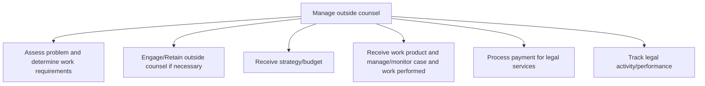
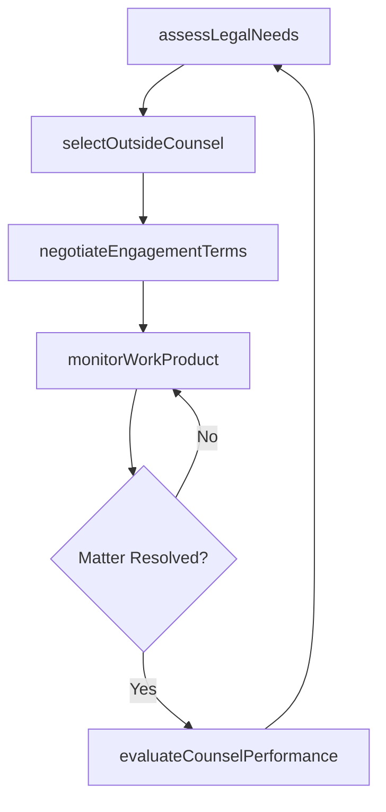

# Manage outside counsel

> Business-as-Code definition for selecting, engaging, overseeing, and evaluating external legal counsel to supplement in-house legal capabilities and manage legal matters cost-effectively.

## Overview

Managing professionals, sought externally for assistance over legal and ethical concerns. Administer and oversee assistance from subject matter experts and professionals for sourcing expert opinion and counseling over legal and ethical matters.

## Process Hierarchy



## GraphDL

```yaml
manage:
  object: Outside Counsel
  actor: GeneralCounsel
  result: OutsideCounselManagementReport
```

## Actions

| Action | Description |
|--------|-------------|
| assessLegalNeeds | Evaluate legal matters to determine outside counsel requirements |
| selectOutsideCounsel | Identify and engage appropriate external legal firms or attorneys |
| negotiateEngagementTerms | Define scope, strategy, budget, and billing arrangements with outside counsel |
| monitorWorkProduct | Review deliverables and track case progress against milestones |
| evaluateCounselPerformance | Assess outside counsel effectiveness, quality, and cost-efficiency |

## Events

| Event | Description |
|-------|-------------|
| legalNeedsAssessed | Legal matter analyzed and outside counsel requirements determined |
| outsideCounselSelected | External legal firm or attorney engaged for a matter |
| engagementTermsNegotiated | Scope, budget, and billing arrangements finalized |
| workProductMonitored | Case deliverables reviewed and progress tracked |
| counselPerformanceEvaluated | Outside counsel performance assessment completed |

## Searches

| Search | Description |
|--------|-------------|
| findOutsideCounsel | List outside counsel engagements by firm, matter type, or status |
| getEngagementDetails | Retrieve engagement terms, budgets, and billing data for a counsel relationship |
| getCounselPerformance | Query performance metrics and evaluations for outside counsel firms |

## Process Flow



## RACI Matrix

| Activity | Responsible | Accountable | Consulted | Informed |
|----------|-------------|-------------|-----------|----------|
| assessLegalNeeds | LegalOperationsManager | GeneralCounsel | BusinessUnits | CFO |
| selectOutsideCounsel | LegalOperationsManager | GeneralCounsel | Procurement | Finance |
| negotiateEngagementTerms | GeneralCounsel | CEO | Finance | LegalOperationsManager |
| evaluateCounselPerformance | LegalOperationsManager | GeneralCounsel | BusinessUnits | Finance |

## Sub-Processes

| ID | Name | Description |
|----|------|-------------|
| 12.4.7.1 | Assess problem and determine work requirements | Examining the problems and deciding the action requirements for engaging outside counsel. This proce |
| 12.4.7.2 | Engage/Retain outside counsel if necessary | Recruiting the assistance of outside counsel for any legal and/or ethical concerns. Engage and/or re |
| 12.4.7.3 | Receive strategy/budget | Making a financial plan. This strategy sets out, using figures, an organization's expected future re |
| 12.4.7.4 | Receive work product and manage/monitor case and work performed | Receiving deliverables from outside counsel, and monitoring the efforts committed by them. Track the |
| 12.4.7.5 | Process payment for legal services | Making payments to legal advisers for their services. Payments include addressing issues or suits by |
| 12.4.7.6 | Track legal activity/performance | Keeping track of the legal activities and performance of the organization. |

## Related Processes

| Process | Relationship |
|---------|-------------|
| 12.4.9 Resolve disputes and litigations | Consumer - outside counsel engaged for dispute resolution |
| 12.4.6 Develop legal policies and procedures | Upstream - policies govern outside counsel engagement standards |
| 9.6.2 Process accounts payable | Downstream - legal invoices processed through AP |

## Related Departments

| Department | Role |
|-----------|------|
| Legal | Manages outside counsel relationships and oversees work product |
| Finance | Reviews and processes legal service invoices and budgets |
| Procurement | Supports vendor selection and contract negotiation for legal services |
| Business Units | Request outside counsel support for operational legal matters |

## Related Occupations

| Occupation | Involvement |
|-----------|-------------|
| General Counsel | Oversees all outside counsel engagements and approves major retentions |
| Legal Operations Manager | Manages day-to-day counsel relationships, billing, and performance tracking |
| Procurement Manager | Supports RFP processes and contract negotiations for legal services |

## KPIs

| KPI | Description | Unit |
|-----|-------------|------|
| Outside Counsel Spend vs Budget | Percentage variance between actual and budgeted outside counsel costs | % |
| Matter Resolution Timeliness | Percentage of matters resolved within target timeline | % |
| Counsel Satisfaction Score | Average internal stakeholder satisfaction rating for outside counsel | Score (1-5) |
| Alternative Fee Adoption Rate | Percentage of engagements using alternative fee arrangements vs. hourly billing | % |

## Usage

```typescript
import { manageOutsideCounsel } from '@headlessly/manage-outside-counsel'

const counsel = manageOutsideCounsel()

// Assess legal needs and determine outside counsel requirements
const assessment = await counsel.assessLegalNeeds({
  matterType: 'patent-litigation',
  jurisdiction: 'US-Federal',
  complexity: 'high',
  inHouseCapability: 'limited'
})

// Evaluate outside counsel performance
const evaluation = await counsel.evaluateCounselPerformance({
  firmId: 'FIRM-2025-003',
  period: 'FY-2024',
  metrics: ['cost-efficiency', 'matter-outcomes', 'responsiveness', 'diversity']
})
```
