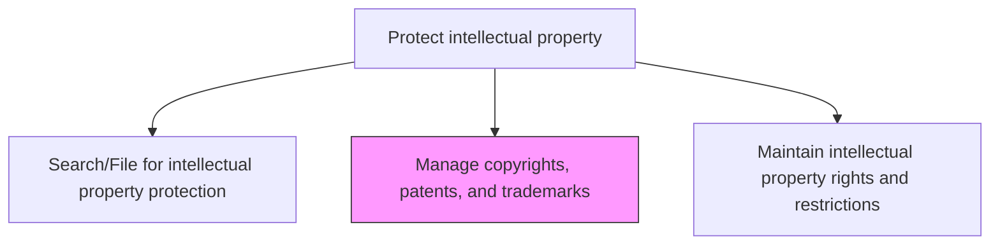
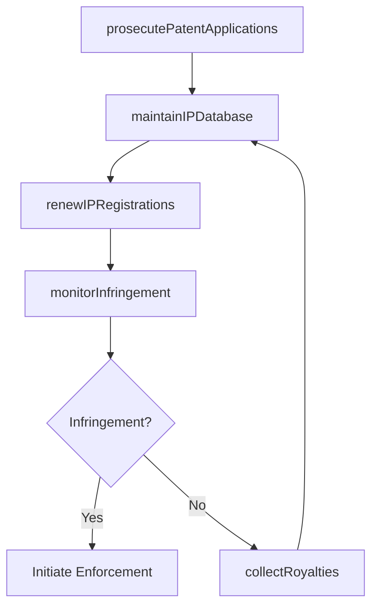

# Manage copyrights, patents, and trademarks

> Business-as-Code definition for administering the organization's portfolio of patents, copyrights, and trademarks including prosecution, maintenance, renewal, and infringement monitoring.

## Overview

Managing the patents and copyrights already held or sought by the organization. Administer and oversee applying for, securing, and maintaining intellectual property rights in the form of patents and copyrights. Submit applications for such rights. Handle associated legal issues. Draft and communicate proper attributions. Collect royalties. Monitor any misuse of the intellectual property rights.

## Process Hierarchy



## GraphDL

```yaml
manage:
  object: Copyrights, Patents, And Trademarks
  actor: IPCounsel
  result: IPPortfolioStatus
```

## Actions

| Action | Description |
|--------|-------------|
| prosecutePatentApplications | Manage patent prosecution including office action responses and amendments |
| renewIPRegistrations | Track and process renewal filings for patents, trademarks, and copyrights |
| monitorInfringement | Scan markets, publications, and digital channels for unauthorized IP use |
| collectRoyalties | Track and collect royalty payments from licensed IP usage |
| maintainIPDatabase | Update the IP management system with registration status and key dates |

## Events

| Event | Description |
|-------|-------------|
| patentApplicationProsecuted | Patent office action response filed or amendment submitted |
| ipRegistrationsRenewed | Patent, trademark, or copyright renewal processed |
| infringementDetected | Unauthorized use of organization's IP identified |
| royaltiesCollected | Royalty payments received and reconciled |
| ipDatabaseUpdated | IP management system records updated with current status |

## Searches

| Search | Description |
|--------|-------------|
| getIPPortfolio | Retrieve IP assets by type, status, jurisdiction, or expiration date |
| getRenewalSchedule | List upcoming IP renewal deadlines by type or jurisdiction |
| getInfringementCases | Query detected infringement cases by IP asset, infringer, or status |

## Process Flow



## RACI Matrix

| Activity | Responsible | Accountable | Consulted | Informed |
|----------|-------------|-------------|-----------|----------|
| prosecutePatentApplications | PatentAgent | IPCounsel | OutsideCounsel | Inventors |
| renewIPRegistrations | IPParalegal | IPCounsel | Finance | GeneralCounsel |
| monitorInfringement | IPCounsel | GeneralCounsel | Marketing | BusinessUnits |
| collectRoyalties | IPCounsel | GeneralCounsel | Finance | CFO |

## Related Processes

| Process | Relationship |
|---------|-------------|
| 12.4.8.1 Search/File for intellectual property protection | Upstream - filed applications enter the managed portfolio |
| 12.4.8.3 Maintain intellectual property rights and restrictions | Downstream - managed IP feeds rights and restrictions framework |
| 12.4.9 Resolve disputes and litigations | Consumer - infringement cases may escalate to litigation |

## Related Departments

| Department | Role |
|-----------|------|
| Legal | Manages patent prosecution, trademark maintenance, and infringement monitoring |
| Research and Development | Supports patent prosecution with technical expertise |
| Finance | Tracks IP maintenance costs and royalty revenue streams |
| Marketing | Monitors brand and trademark use in the marketplace |

## Related Occupations

| Occupation | Involvement |
|-----------|-------------|
| IP Counsel | Oversees IP portfolio strategy and enforcement decisions |
| Patent Agent | Manages patent prosecution and office action responses |
| IP Paralegal | Tracks renewal deadlines and maintains IP database records |

## KPIs

| KPI | Description | Unit |
|-----|-------------|------|
| Renewal Compliance Rate | Percentage of IP registrations renewed before deadline | % |
| Prosecution Success Rate | Percentage of patent applications resulting in granted patents | % |
| Royalty Collection Efficiency | Percentage of owed royalties collected within terms | % |
| Portfolio Maintenance Cost | Annual cost per active IP asset for maintenance and prosecution | USD |

## Usage

```typescript
import { manageCopyrightsPatentsAndTrademarks } from '@headlessly/manage-copyrights-patents-and-trademarks'

const ipManagement = manageCopyrightsPatentsAndTrademarks()

// Manage patent prosecution for a pending application
const prosecution = await ipManagement.prosecutePatentApplications({
  applicationNumber: 'US-2024-0123456',
  officeAction: 'non-final-rejection',
  responseDeadline: '2025-06-15',
  amendments: ['narrow-claims-2-5', 'add-dependent-claim-8']
})

// Monitor for IP infringement
const monitoring = await ipManagement.monitorInfringement({
  assetTypes: ['patent', 'trademark'],
  scanChannels: ['marketplace', 'web-search', 'industry-publications'],
  frequency: 'monthly'
})
```
