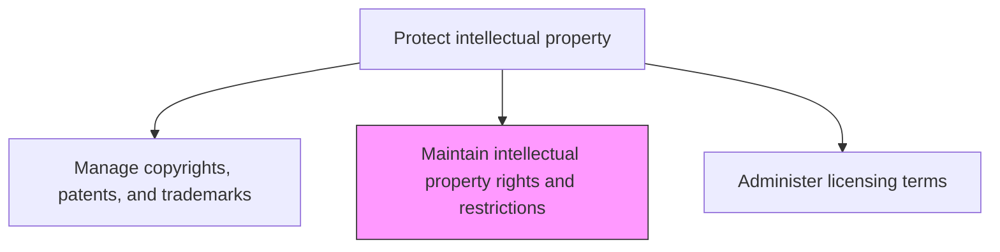
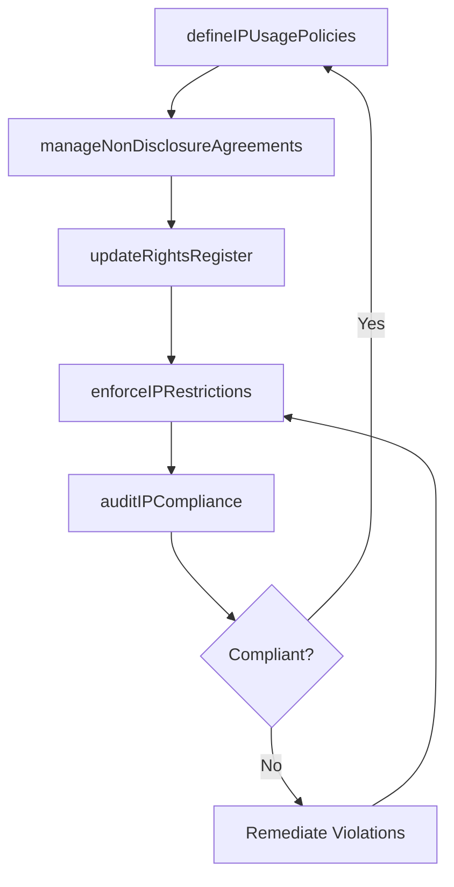

# Maintain intellectual property rights and restrictions

> Business-as-Code definition for establishing and maintaining the framework of rights, restrictions, and policies that govern how the organization's intellectual property may be used internally and externally.

## Overview

Managing the upkeep of intellectual property rights by creating and managing a framework of rules, policies, procedures, and restrictions. Outline a clear policy for any possible scenario of their use by any external agent.

## Process Hierarchy



## GraphDL

```yaml
maintain:
  object: Intellectual Property Rights And Restrictions
  actor: IPCounsel
  result: IPRightsFramework
```

## Actions

| Action | Description |
|--------|-------------|
| defineIPUsagePolicies | Establish policies governing internal and external use of organizational IP |
| manageNonDisclosureAgreements | Draft, execute, and track NDAs to protect confidential information and trade secrets |
| enforceIPRestrictions | Monitor and enforce IP usage restrictions across business relationships |
| updateRightsRegister | Maintain a current register of IP ownership, assignments, and encumbrances |
| auditIPCompliance | Conduct periodic audits to ensure IP policies and restrictions are followed |

## Events

| Event | Description |
|-------|-------------|
| ipUsagePoliciesDefined | IP usage policies established or updated |
| ndaManaged | NDA drafted, executed, or renewed for a business relationship |
| ipRestrictionsEnforced | IP usage restriction enforced against unauthorized use |
| rightsRegisterUpdated | IP ownership and assignment records updated |
| ipComplianceAudited | IP policy compliance audit completed |

## Searches

| Search | Description |
|--------|-------------|
| getIPPolicies | Retrieve IP usage policies by type, scope, or effective date |
| findNDAs | List NDAs by counterparty, status, or expiration date |
| getComplianceAuditResults | Query IP compliance audit results by department or period |

## Process Flow



## RACI Matrix

| Activity | Responsible | Accountable | Consulted | Informed |
|----------|-------------|-------------|-----------|----------|
| defineIPUsagePolicies | IPCounsel | GeneralCounsel | BusinessUnits | AllStaff |
| manageNonDisclosureAgreements | IPCounsel | GeneralCounsel | Procurement | BusinessUnits |
| enforceIPRestrictions | IPCounsel | GeneralCounsel | Compliance | OutsideCounsel |
| auditIPCompliance | ComplianceAnalyst | IPCounsel | InternalAudit | GeneralCounsel |

## Related Processes

| Process | Relationship |
|---------|-------------|
| 12.4.8.2 Manage copyrights, patents, and trademarks | Upstream - managed IP assets define the rights to be maintained |
| 12.4.8.4 Administer licensing terms | Downstream - IP rights framework governs licensing terms |
| 12.4.6 Develop legal policies and procedures | Parallel - IP policies are a subset of legal policy framework |

## Related Departments

| Department | Role |
|-----------|------|
| Legal | Defines IP usage policies and manages NDAs |
| Compliance | Audits adherence to IP restrictions and policies |
| Business Units | Implement IP usage policies within their operations |
| Procurement | Ensures IP protections are embedded in vendor agreements |

## Related Occupations

| Occupation | Involvement |
|-----------|-------------|
| IP Counsel | Defines IP rights framework and manages restrictions |
| Compliance Analyst | Conducts IP policy compliance audits |
| Contract Manager | Ensures IP clauses are included in commercial agreements |

## KPIs

| KPI | Description | Unit |
|-----|-------------|------|
| NDA Coverage Rate | Percentage of business relationships with active NDAs | % |
| IP Policy Currency | Percentage of IP policies reviewed and updated within 12 months | % |
| Restriction Violation Rate | Number of IP restriction violations detected per quarter | Count |
| Audit Compliance Score | Percentage of audited areas in compliance with IP policies | % |

## Usage

```typescript
import { maintainIntellectualPropertyRightsAndRestrictions } from '@headlessly/maintain-intellectual-property-rights-and-restrictions'

const ipRights = maintainIntellectualPropertyRightsAndRestrictions()

// Define IP usage policies for a technology area
const policy = await ipRights.defineIPUsagePolicies({
  technologyArea: 'machine-learning-models',
  usageScope: ['internal-development', 'customer-deployment'],
  restrictions: ['no-reverse-engineering', 'attribution-required'],
  effectiveDate: '2025-04-01'
})

// Manage NDA for a new partnership
const nda = await ipRights.manageNonDisclosureAgreements({
  counterparty: 'partner-corp',
  ndaType: 'mutual',
  protectedInformation: ['source-code', 'algorithms', 'training-data'],
  duration: '3-years'
})
```
