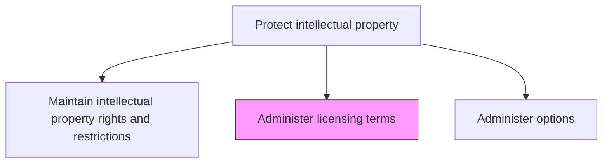
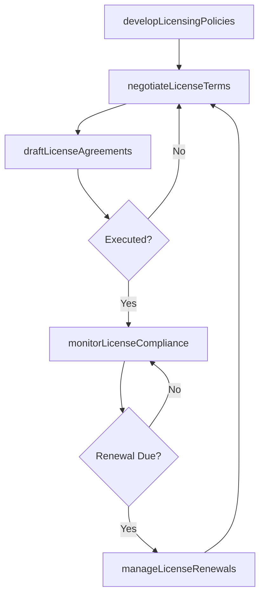

# Administer licensing terms

> Business-as-Code definition for creating, negotiating, and managing licensing agreements that govern the terms under which the organization's intellectual property may be used by third parties.

## Overview

Administering and overseeing the terms and policies associated with licensing the organization's intellectual property. Create and manage the policies and terms governing the possible granting of a license to any external agent. Demarcate a clear framework that governs the licensing of any patents or copyrights held by the organization.

## Process Hierarchy



## GraphDL

```yaml
administer:
  object: Licensing Terms
  actor: IPCounsel
  result: LicensingAgreement
```

## Actions

| Action | Description |
|--------|-------------|
| developLicensingPolicies | Establish standard licensing terms, royalty structures, and approval criteria |
| negotiateLicenseTerms | Negotiate specific terms with licensees including scope, territory, and royalties |
| draftLicenseAgreements | Prepare licensing agreements incorporating negotiated terms and standard clauses |
| monitorLicenseCompliance | Track licensee adherence to agreement terms, usage limits, and reporting obligations |
| manageLicenseRenewals | Process license renewals, renegotiations, and terminations |

## Events

| Event | Description |
|-------|-------------|
| licensingPoliciesDeveloped | Standard licensing terms and criteria established or updated |
| licenseTermsNegotiated | License terms finalized with a specific licensee |
| licenseAgreementDrafted | Licensing agreement prepared and ready for execution |
| licenseComplianceMonitored | Licensee compliance assessment completed |
| licenseRenewalManaged | License renewal, renegotiation, or termination processed |

## Searches

| Search | Description |
|--------|-------------|
| getLicenseAgreements | Retrieve licensing agreements by licensee, IP asset, or status |
| getRoyaltySchedule | Query royalty payment schedules by agreement, licensee, or period |
| getLicenseComplianceStatus | List licensee compliance assessments by agreement or rating |

## Process Flow



## RACI Matrix

| Activity | Responsible | Accountable | Consulted | Informed |
|----------|-------------|-------------|-----------|----------|
| developLicensingPolicies | IPCounsel | GeneralCounsel | Finance | BusinessDevelopment |
| negotiateLicenseTerms | IPCounsel | GeneralCounsel | BusinessDevelopment | Finance |
| monitorLicenseCompliance | IPParalegal | IPCounsel | Finance | Compliance |
| manageLicenseRenewals | IPCounsel | GeneralCounsel | BusinessDevelopment | Finance |

## Related Processes

| Process | Relationship |
|---------|-------------|
| 12.4.8.3 Maintain intellectual property rights and restrictions | Upstream - IP rights framework defines licensable assets |
| 12.4.8.5 Administer options | Downstream - license options managed as part of licensing terms |
| 12.4.11 Negotiate and document agreements/contracts | Parallel - licensing agreements follow contract management standards |

## Related Departments

| Department | Role |
|-----------|------|
| Legal | Negotiates and drafts licensing agreements |
| Business Development | Identifies licensing opportunities and manages licensee relationships |
| Finance | Tracks royalty revenue and forecasts licensing income |
| Compliance | Monitors licensee adherence to agreement terms |

## Related Occupations

| Occupation | Involvement |
|-----------|-------------|
| IP Counsel | Negotiates licensing terms and drafts agreements |
| Business Development Manager | Identifies licensing opportunities and manages relationships |
| IP Paralegal | Tracks compliance, renewal dates, and royalty payments |

## KPIs

| KPI | Description | Unit |
|-----|-------------|------|
| Licensing Revenue Growth | Year-over-year growth in revenue from IP licensing agreements | % |
| License Compliance Rate | Percentage of licensees in full compliance with agreement terms | % |
| License Negotiation Cycle Time | Average days from initial inquiry to executed license agreement | Days |
| Royalty Collection Rate | Percentage of owed royalties collected within payment terms | % |

## Usage

```typescript
import { administerLicensingTerms } from '@headlessly/administer-licensing-terms'

const licensing = administerLicensingTerms()

// Negotiate license terms with a potential licensee
const negotiation = await licensing.negotiateLicenseTerms({
  licensee: 'tech-partner-inc',
  ipAssets: ['PAT-2024-0147', 'PAT-2024-0203'],
  licenseType: 'non-exclusive',
  territory: 'worldwide',
  royaltyRate: 3.5
})

// Monitor compliance for active licenses
const compliance = await licensing.monitorLicenseCompliance({
  licenseId: 'LIC-2025-018',
  checkpoints: ['usage-reports', 'royalty-payments', 'sublicensing-restrictions'],
  period: 'Q1-2025'
})
```
