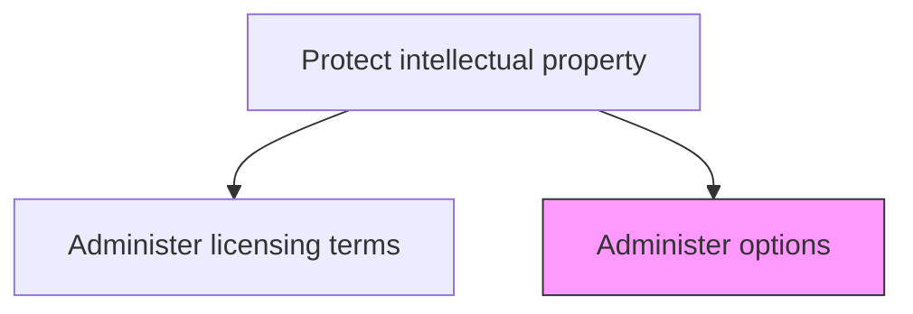
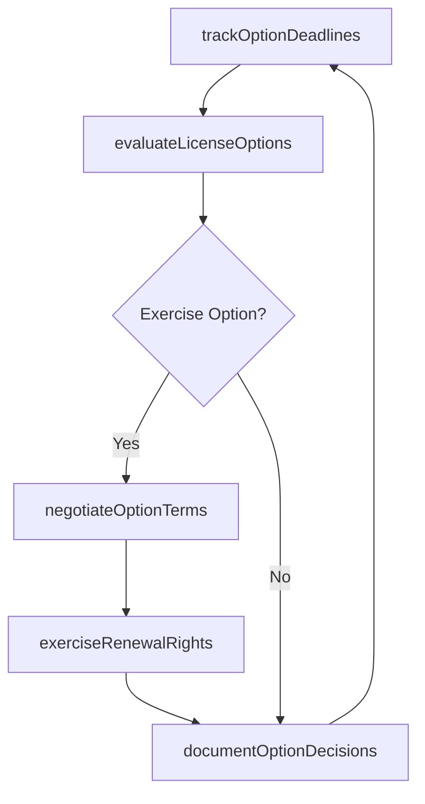

# Administer options

> Business-as-Code definition for managing licensing options including renewal rights, expansion territories, sublicensing provisions, and favorable terms negotiation within intellectual property agreements.

## Overview

Managing options regarding licensing agreements. Follow favorable terms and conditions.

## Process Hierarchy



## GraphDL

```yaml
administer:
  object: Options
  actor: IPCounsel
  result: LicenseOptionDecision
```

## Actions

| Action | Description |
|--------|-------------|
| evaluateLicenseOptions | Assess available options within licensing agreements including renewal and expansion |
| exerciseRenewalRights | Execute renewal options before expiration to maintain favorable licensing terms |
| negotiateOptionTerms | Negotiate terms for exercising license options such as territory expansion or sublicensing |
| trackOptionDeadlines | Monitor critical deadlines for option exercise windows across all license agreements |
| documentOptionDecisions | Record option exercise decisions and their business rationale |

## Events

| Event | Description |
|-------|-------------|
| licenseOptionsEvaluated | Available licensing options assessed with recommendations |
| renewalRightsExercised | License renewal option exercised before expiration |
| optionTermsNegotiated | Option exercise terms finalized with counterparty |
| optionDeadlinesTracked | Option exercise window deadlines reviewed and updated |
| optionDecisionsDocumented | Option exercise decisions and rationale recorded |

## Searches

| Search | Description |
|--------|-------------|
| getAvailableOptions | List unexercised licensing options by type, deadline, or agreement |
| getOptionHistory | Retrieve option exercise history by agreement, type, or period |
| getUpcomingDeadlines | Query option exercise deadlines within a specified timeframe |

## Process Flow



## RACI Matrix

| Activity | Responsible | Accountable | Consulted | Informed |
|----------|-------------|-------------|-----------|----------|
| evaluateLicenseOptions | IPCounsel | GeneralCounsel | BusinessDevelopment | Finance |
| exerciseRenewalRights | IPCounsel | GeneralCounsel | Finance | BusinessUnits |
| negotiateOptionTerms | IPCounsel | GeneralCounsel | BusinessDevelopment | CFO |
| trackOptionDeadlines | IPParalegal | IPCounsel | LegalOperationsManager | GeneralCounsel |

## Related Processes

| Process | Relationship |
|---------|-------------|
| 12.4.8.4 Administer licensing terms | Upstream - licensing terms define available options |
| 12.4.11 Negotiate and document agreements/contracts | Parallel - option negotiations follow contract management practices |
| 9.3.3 Manage budgets | Consumer - option exercise costs integrated into budget planning |

## Related Departments

| Department | Role |
|-----------|------|
| Legal | Evaluates and exercises licensing options |
| Business Development | Provides strategic input on option exercise decisions |
| Finance | Assesses financial impact of option exercise or expiration |

## Related Occupations

| Occupation | Involvement |
|-----------|-------------|
| IP Counsel | Evaluates options and negotiates exercise terms |
| IP Paralegal | Tracks option deadlines and maintains records |
| Business Development Manager | Provides market context for option exercise decisions |

## KPIs

| KPI | Description | Unit |
|-----|-------------|------|
| Option Exercise Rate | Percentage of available licensing options exercised vs. expired | % |
| Option Deadline Compliance | Percentage of option deadlines tracked with timely action taken | % |
| Option Value Realized | Financial value realized from exercised licensing options | USD |
| Decision Turnaround Time | Average days from option evaluation to exercise decision | Days |

## Usage

```typescript
import { administerOptions } from '@headlessly/administer-options'

const options = administerOptions()

// Evaluate available licensing options for an agreement
const evaluation = await options.evaluateLicenseOptions({
  licenseId: 'LIC-2025-018',
  optionTypes: ['renewal', 'territory-expansion', 'sublicensing'],
  businessContext: 'market-expansion-apac'
})

// Exercise a renewal right before deadline
const renewal = await options.exerciseRenewalRights({
  licenseId: 'LIC-2025-018',
  optionType: 'renewal',
  renewalTerm: '3-years',
  exerciseDeadline: '2025-09-30'
})
```
