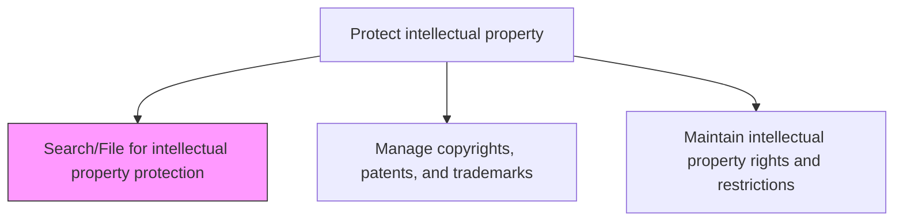
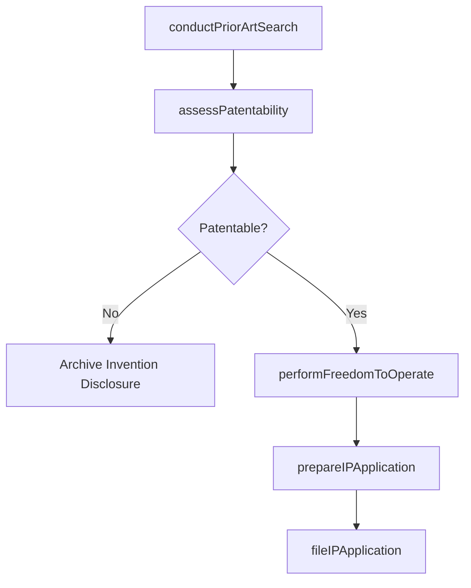

# Search/File for intellectual property protection

> Business-as-Code definition for conducting prior art searches, freedom-to-operate analyses, and filing intellectual property protection applications with patent, trademark, and copyright offices.

## Overview

Conducting prior art searches, freedom-to-operate analyses, and filing intellectual property protection applications with relevant patent, trademark, and copyright offices. Evaluate the novelty and patentability of inventions, search existing IP databases, and prepare and submit protection applications to secure the organization's intellectual property rights.

## Process Hierarchy



## GraphDL

```yaml
search/file:
  object: For Intellectual Property Protection
  actor: PatentAgent
  result: IPFilingRecord
```

## Actions

| Action | Description |
|--------|-------------|
| conductPriorArtSearch | Search patent and trademark databases for existing IP relevant to the invention |
| assessPatentability | Evaluate the novelty, non-obviousness, and utility of inventions for patent eligibility |
| performFreedomToOperate | Analyze existing patents to determine if a product design may infringe third-party rights |
| prepareIPApplication | Draft patent, trademark, or copyright applications with claims and specifications |
| fileIPApplication | Submit completed IP protection applications to relevant government offices |

## Events

| Event | Description |
|-------|-------------|
| priorArtSearchCompleted | Patent and trademark database search completed with results documented |
| patentabilityAssessed | Invention evaluated for patent eligibility with recommendation |
| freedomToOperateCompleted | FTO analysis completed with risk assessment |
| ipApplicationPrepared | IP protection application drafted and ready for filing |
| ipApplicationFiled | IP protection application submitted to relevant office |

## Searches

| Search | Description |
|--------|-------------|
| getPriorArtResults | Retrieve prior art search results by invention, technology area, or date |
| getFilingStatus | Query IP application filing status by application number or type |
| getFTOAnalyses | List freedom-to-operate analyses by product or technology area |

## Process Flow



## RACI Matrix

| Activity | Responsible | Accountable | Consulted | Informed |
|----------|-------------|-------------|-----------|----------|
| conductPriorArtSearch | PatentAgent | IPCounsel | Inventors | RandD |
| assessPatentability | IPCounsel | GeneralCounsel | PatentAgent | ProductDevelopment |
| performFreedomToOperate | IPCounsel | GeneralCounsel | OutsideCounsel | BusinessUnits |
| fileIPApplication | PatentAgent | IPCounsel | Inventors | GeneralCounsel |

## Related Processes

| Process | Relationship |
|---------|-------------|
| 12.4.8.2 Manage copyrights, patents, and trademarks | Downstream - filed applications become managed IP assets |
| 12.4.7 Manage outside counsel | Consumer - outside patent counsel engaged for complex filings |
| 2.2.1 Design and prototype products | Upstream - product designs trigger invention disclosures |

## Related Departments

| Department | Role |
|-----------|------|
| Legal | Conducts patentability assessments and manages IP filings |
| Research and Development | Submits invention disclosures and supports prior art analysis |
| Product Development | Provides technical specifications for trademark and design filings |

## Related Occupations

| Occupation | Involvement |
|-----------|-------------|
| Patent Agent | Conducts prior art searches and prepares patent applications |
| IP Counsel | Evaluates patentability and manages FTO analyses |
| Trademark Attorney | Conducts trademark searches and files registrations |

## KPIs

| KPI | Description | Unit |
|-----|-------------|------|
| Filing Cycle Time | Average days from invention disclosure to application filing | Days |
| Prior Art Search Thoroughness | Percentage of filings with comprehensive prior art searches completed | % |
| Application Acceptance Rate | Percentage of filed applications accepted without office action rejections | % |
| FTO Coverage | Percentage of new products with completed freedom-to-operate analyses | % |

## Usage

```typescript
import { searchFileForIntellectualPropertyProtection } from '@headlessly/search-file-for-intellectual-property-protection'

const ipSearch = searchFileForIntellectualPropertyProtection()

// Conduct a prior art search for a new invention
const priorArt = await ipSearch.conductPriorArtSearch({
  inventionTitle: 'adaptive-caching-algorithm',
  technologyArea: 'distributed-systems',
  databases: ['USPTO', 'EPO', 'WIPO'],
  searchScope: 'global'
})

// File a patent application
const filing = await ipSearch.fileIPApplication({
  applicationType: 'utility-patent',
  inventionDisclosureId: 'INV-2025-032',
  filingOffice: 'USPTO',
  priorityClaim: 'provisional-2024-089',
  inventors: ['john-smith', 'jane-doe']
})
```
