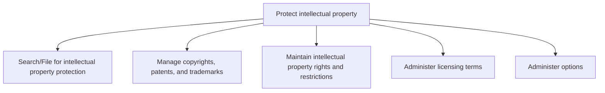
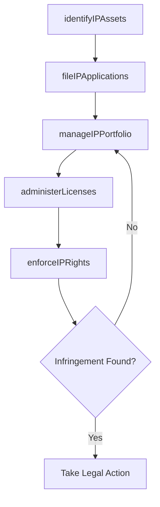

# Protect intellectual property

> Business-as-Code definition for identifying, securing, managing, and enforcing intellectual property rights including patents, copyrights, trademarks, trade secrets, and licensing agreements.

## Overview

Safeguarding the intellectual property of the organization. This process requires the organization to protect a wide variety of intellectual property created by it. It involves creating and managing non-disclosure agreements (NDAs), following up on current developments in the areas where the organization holds patents, tracking the use of the organization's copyrighted material, creating and upholding licensing terms, and administering policies for safeguarding intellectual property.

## Process Hierarchy



## GraphDL

```yaml
protect:
  object: Intellectual Property
  actor: IPCounsel
  result: IntellectualPropertyPortfolio
```

## Actions

| Action | Description |
|--------|-------------|
| identifyIPAssets | Catalog inventions, creative works, and brand assets eligible for IP protection |
| fileIPApplications | Submit patent, trademark, and copyright applications to relevant authorities |
| manageIPPortfolio | Maintain and track the organization's intellectual property portfolio |
| enforceIPRights | Detect infringement and initiate enforcement actions to protect IP |
| administerLicenses | Manage licensing agreements for both inbound and outbound IP usage |

## Events

| Event | Description |
|-------|-------------|
| ipAssetsIdentified | Eligible inventions, creative works, and brand assets cataloged |
| ipApplicationsFiled | Patent, trademark, or copyright applications submitted |
| ipPortfolioManaged | IP portfolio reviewed and maintenance actions completed |
| ipRightsEnforced | Infringement detected and enforcement action initiated |
| licensesAdministered | Licensing agreements executed or renewed |

## Searches

| Search | Description |
|--------|-------------|
| findIPAssets | List intellectual property assets by type, status, or jurisdiction |
| getIPApplications | Retrieve IP application filings by type, status, or priority date |
| getLicenseAgreements | Query licensing agreements by licensee, IP type, or revenue |

## Process Flow



## RACI Matrix

| Activity | Responsible | Accountable | Consulted | Informed |
|----------|-------------|-------------|-----------|----------|
| identifyIPAssets | IPCounsel | GeneralCounsel | RandD | ProductDevelopment |
| fileIPApplications | PatentAgent | IPCounsel | Inventors | GeneralCounsel |
| manageIPPortfolio | IPCounsel | GeneralCounsel | Finance | BusinessUnits |
| enforceIPRights | IPCounsel | GeneralCounsel | OutsideCounsel | CEO |

## Sub-Processes

| ID | Name | Description |
|----|------|-------------|
| 12.4.8.1 | Search/File for intellectual property protection | Conducting prior art searches, freedom-to-operate analyses, and filing IP protection applications wi |
| 12.4.8.2 | Manage copyrights, patents, and trademarks | Managing the patents and copyrights already held or sought by the organization. Administer and overs |
| 12.4.8.3 | Maintain intellectual property rights and restrictions | Managing the upkeep of intellectual property rights by creating and managing a framework of rules, p |
| 12.4.8.4 | Administer licensing terms | Administering and overseeing the terms and policies associated with licensing the organization's int |
| 12.4.8.5 | Administer options | Managing options regarding licensing agreements. Follow favorable terms and conditions. |

## Related Processes

| Process | Relationship |
|---------|-------------|
| 12.4.7 Manage outside counsel | Consumer - outside counsel engaged for patent prosecution and IP litigation |
| 12.4.11 Negotiate and document agreements/contracts | Parallel - licensing terms embedded in commercial agreements |
| 2.1.2 Manage the product/service portfolio | Upstream - product innovations trigger IP protection activities |

## Related Departments

| Department | Role |
|-----------|------|
| Legal | Manages IP portfolio, files applications, and enforces rights |
| Research and Development | Identifies inventions and provides technical disclosures |
| Product Development | Collaborates on trademark and design protection for products |
| Finance | Tracks IP-related revenue, costs, and royalty streams |

## Related Occupations

| Occupation | Involvement |
|-----------|-------------|
| IP Counsel | Manages IP portfolio strategy, filing, and enforcement |
| Patent Agent | Conducts prior art searches and prepares patent applications |
| Trademark Attorney | Files and manages trademark registrations and brand protection |

## KPIs

| KPI | Description | Unit |
|-----|-------------|------|
| IP Portfolio Size | Total number of active patents, trademarks, and copyrights | Count |
| Patent Grant Rate | Percentage of patent applications granted | % |
| Licensing Revenue | Annual revenue generated from IP licensing agreements | USD |
| Infringement Response Time | Average days from infringement detection to enforcement action | Days |

## Usage

```typescript
import { protectIntellectualProperty } from '@headlessly/protect-intellectual-property'

const ipProtection = protectIntellectualProperty()

// Identify IP assets from recent product development
const assets = await ipProtection.identifyIPAssets({
  source: 'product-development',
  types: ['patent', 'trademark', 'trade-secret'],
  period: 'Q1-2025'
})

// Enforce IP rights against detected infringement
const enforcement = await ipProtection.enforceIPRights({
  assetId: 'PAT-2024-0147',
  infringerName: 'competitor-corp',
  infringementType: 'product-copy',
  actionType: 'cease-and-desist'
})
```
