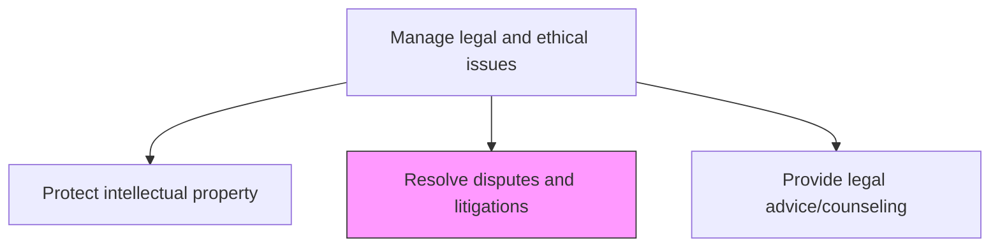
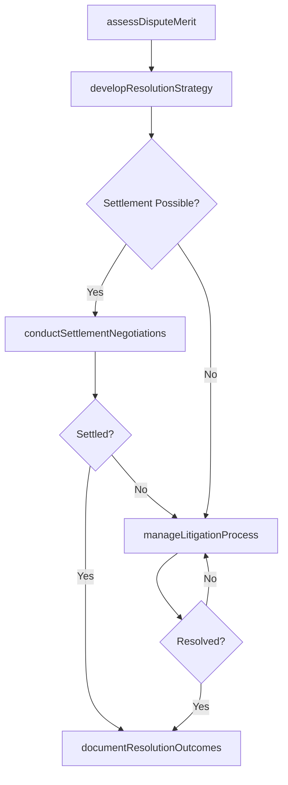

# Resolve disputes and litigations

> Business-as-Code definition for managing the resolution of legal disputes through negotiation, mediation, arbitration, and litigation to protect organizational interests and minimize legal exposure.

## Overview

Resolving disputes or civil lawsuits internally or externally.

## Process Hierarchy



## GraphDL

```yaml
resolve:
  object: Disputes And Litigations
  actor: LitigationCounsel
  result: DisputeResolution
```

## Actions

| Action | Description |
|--------|-------------|
| assessDisputeMerit | Evaluate the legal merit, risks, and potential exposure of a dispute |
| developResolutionStrategy | Define the optimal resolution approach including negotiation, mediation, or litigation |
| conductSettlementNegotiations | Negotiate settlement terms with opposing parties to resolve disputes |
| manageLitigationProcess | Oversee active litigation including discovery, motions, and trial preparation |
| documentResolutionOutcomes | Record dispute resolution outcomes, settlements, and lessons learned |

## Events

| Event | Description |
|-------|-------------|
| disputeMeritAssessed | Dispute merit evaluation and risk analysis completed |
| resolutionStrategyDeveloped | Dispute resolution approach and strategy defined |
| settlementNegotiationsConducted | Settlement terms negotiated with opposing parties |
| litigationProcessManaged | Litigation milestone completed or case status updated |
| resolutionOutcomesDocumented | Dispute resolution outcomes and lessons learned recorded |

## Searches

| Search | Description |
|--------|-------------|
| findActiveDisputes | List active disputes by type, status, jurisdiction, or opposing party |
| getResolutionHistory | Retrieve dispute resolution outcomes by matter type or period |
| getLitigationExposure | Query total litigation exposure by category, jurisdiction, or severity |

## Process Flow



## RACI Matrix

| Activity | Responsible | Accountable | Consulted | Informed |
|----------|-------------|-------------|-----------|----------|
| assessDisputeMerit | LitigationCounsel | GeneralCounsel | OutsideCounsel | BusinessUnits |
| developResolutionStrategy | GeneralCounsel | CEO | LitigationCounsel | CFO |
| conductSettlementNegotiations | LitigationCounsel | GeneralCounsel | OutsideCounsel | Finance |
| manageLitigationProcess | LitigationCounsel | GeneralCounsel | OutsideCounsel | Board |

## Related Processes

| Process | Relationship |
|---------|-------------|
| 12.4.7 Manage outside counsel | Consumer - outside counsel engaged for litigation matters |
| 12.4.10 Provide legal advice/counseling | Upstream - internal counsel advises on dispute resolution approach |
| 11.2 Manage compliance | Parallel - compliance findings may trigger or inform disputes |

## Related Departments

| Department | Role |
|-----------|------|
| Legal | Manages dispute assessment, strategy, and resolution |
| Finance | Assesses financial exposure and approves settlement amounts |
| Business Units | Provide context and evidence for dispute matters |
| Risk Management | Evaluates risk impact and informs resolution strategy |

## Related Occupations

| Occupation | Involvement |
|-----------|-------------|
| Litigation Counsel | Manages dispute assessment and litigation process |
| General Counsel | Approves resolution strategy and settlement authority |
| Paralegal | Supports discovery, document management, and case preparation |

## KPIs

| KPI | Description | Unit |
|-----|-------------|------|
| Dispute Resolution Cycle Time | Average days from dispute identification to final resolution | Days |
| Settlement Rate | Percentage of disputes resolved through settlement vs. trial | % |
| Litigation Cost per Matter | Average total cost to resolve a litigation matter | USD |
| Favorable Outcome Rate | Percentage of disputes resolved with favorable outcomes | % |

## Usage

```typescript
import { resolveDisputesAndLitigations } from '@headlessly/resolve-disputes-and-litigations'

const disputes = resolveDisputesAndLitigations()

// Assess the merit of a new dispute
const assessment = await disputes.assessDisputeMerit({
  disputeType: 'contract-breach',
  opposingParty: 'vendor-corp',
  claimedAmount: 2500000,
  jurisdiction: 'US-Delaware'
})

// Conduct settlement negotiations
const negotiation = await disputes.conductSettlementNegotiations({
  disputeId: 'DIS-2025-014',
  settlementAuthority: 1000000,
  negotiationApproach: 'mediated',
  mediator: 'AAA-commercial'
})
```
