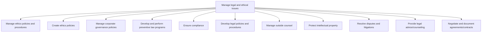
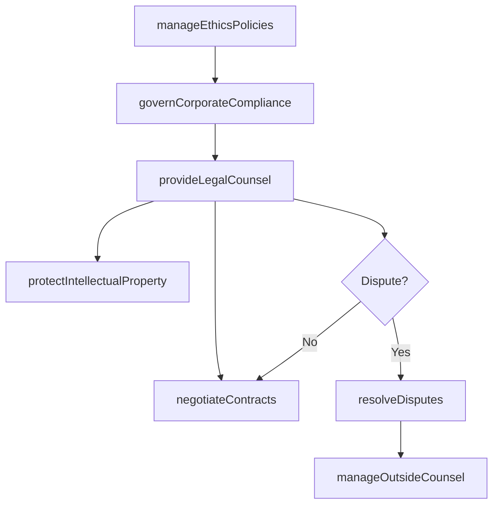

# Manage legal and ethical issues

> Business-as-Code definition for governing the organization's legal and ethical practices including ethics policy management, corporate governance, compliance programs, intellectual property protection, dispute resolution, and contract negotiation.

## Overview

Managing legal practices to abide by the law, as well as ethical practices.

## Process Hierarchy



## GraphDL

```yaml
manage:
  object: Legal And Ethical Issues
  actor: GeneralCounsel
  result: LegalAndEthicsPosture
```

## Actions

| Action | Description |
|--------|-------------|
| manageEthicsPolicies | Develop, maintain, and enforce organizational ethics standards |
| governCorporateCompliance | Administer corporate governance policies and compliance programs |
| protectIntellectualProperty | File, maintain, and enforce patents, trademarks, and copyrights |
| resolveDisputes | Manage litigation, arbitration, and alternative dispute resolution |
| negotiateContracts | Draft, review, and negotiate legal agreements and contracts |
| manageOutsideCounsel | Engage, direct, and evaluate external legal service providers |
| provideLegalCounsel | Deliver internal legal advice on operational and strategic matters |

## Events

| Event | Description |
|-------|-------------|
| ethicsPoliciesManaged | Ethics code or policy updated and communicated |
| corporateComplianceGoverned | Governance or compliance review completed |
| intellectualPropertyProtected | IP filing submitted or enforcement action taken |
| disputeResolved | Legal dispute or litigation matter settled or adjudicated |
| contractNegotiated | Agreement or contract executed with counterparty |
| outsideCounselManaged | Outside counsel engagement reviewed and evaluated |
| legalCounselProvided | Internal legal opinion or advisory delivered |

## Searches

| Search | Description |
|--------|-------------|
| findLegalMatters | Query open legal matters by type, status, or jurisdiction |
| getIPPortfolio | Retrieve intellectual property holdings by type or status |
| findContracts | List contracts by counterparty, expiration, or value |
| getLegalSpend | Retrieve outside counsel expenditure by matter or firm |
| getEthicsComplaints | Query ethics hotline reports by category or resolution status |

## Process Flow



## RACI Matrix

| Activity | Responsible | Accountable | Consulted | Informed |
|----------|-------------|-------------|-----------|----------|
| manageEthicsPolicies | EthicsOfficer | GeneralCounsel | HR | AllStaff |
| governCorporateCompliance | ComplianceManager | GeneralCounsel | InternalAudit | Board |
| protectIntellectualProperty | IPCounsel | GeneralCounsel | R&D | Engineering |
| resolveDisputes | LitigationCounsel | GeneralCounsel | ExternalCounsel | CFO |
| negotiateContracts | ContractsCounsel | GeneralCounsel | Procurement | BusinessUnits |

## Sub-Processes

| ID | Name | Description |
|----|------|-------------|
| 12.4.1 | Manage ethics policies and procedures | Overseeing the lifecycle of organizational ethics policies including development, dissemination, enfo |
| 12.4.2 | Create ethics policies | Creating a code of ethics that communicate the organization's philosophy to employees, vendors, cust |
| 12.4.3 | Manage corporate governance policies | Administering the system of rules, practices, and processes through which a company is directed and  |
| 12.4.4 | Develop and perform preventive law programs | Creating and applying programs and activities. Encourage the adherence preventive laws, such as envi |
| 12.4.5 | Ensure compliance | Ensuring the organization's compliance position. Validate compliance with different statutes, regula |
| 12.4.6 | Develop legal policies and procedures | Establishing, documenting, and maintaining legal policies and procedures that guide organizational c |
| 12.4.7 | Manage outside counsel | Managing professionals, sought externally for assistance over legal and ethical concerns. Administer |
| 12.4.8 | Protect intellectual property | Safeguarding the intellectual property of the organization. This process requires the organization t |
| 12.4.9 | Resolve disputes and litigations | Resolving disputes or civil lawsuits internally or externally. |
| 12.4.10 | Provide legal advice/counseling | Providing legal advice concerning the substance or procedure of a law in relation to a particular si |
| 12.4.11 | Negotiate and document agreements/contracts | Negotiating terms to reach a final draft of a contract that is acceptable to all parties. |

## Related Processes

| Process | Relationship |
|---------|-------------|
| 11.2 Manage compliance | Parallel - compliance obligations drive legal policy requirements |
| 12.3 Manage relations with board of directors | Downstream - legal matters reported to board governance committees |
| 12.2 Manage government and industry relationships | Parallel - regulatory engagement intersects with legal compliance |
| 9.0 Acquire and Manage Human Capital | Parallel - ethics and employment law managed jointly |

## Related Departments

| Department | Role |
|-----------|------|
| Legal | Owns all legal matters, contracts, and IP protection |
| Ethics and Compliance | Manages ethics policies, training, and whistleblower programs |
| Human Resources | Coordinates ethics training and workplace conduct policies |
| Procurement | Partners on contract negotiations and vendor agreements |
| R&D | Collaborates on intellectual property identification and filing |

## Related Occupations

| Occupation | Involvement |
|-----------|-------------|
| General Counsel | Executive oversight of all legal and ethics functions |
| Intellectual Property Attorney | Manages patent, trademark, and copyright portfolios |
| Contracts Manager | Drafts, negotiates, and administers commercial agreements |
| Ethics Officer | Administers ethics program and investigates compliance concerns |

## KPIs

| KPI | Description | Unit |
|-----|-------------|------|
| Legal Spend as Revenue Percentage | Total legal expenditure relative to annual revenue | % |
| Contract Cycle Time | Average time from contract initiation to execution | Days |
| IP Portfolio Size | Number of active patents, trademarks, and copyrights | Count |
| Dispute Resolution Rate | Percentage of disputes resolved without litigation | % |
| Ethics Complaint Resolution Time | Average time to investigate and resolve ethics complaints | Days |

## Usage

```typescript
import { manageLegalAndEthicalIssues } from '@headlessly/manage-legal-and-ethical-issues'

const legal = manageLegalAndEthicalIssues()

// Negotiate a vendor contract
const contract = await legal.negotiateContracts({
  counterparty: 'Acme-Supplies-Inc',
  type: 'master-services-agreement',
  value: 2500000,
  term: '3-years'
})

// Query IP portfolio
const portfolio = await legal.getIPPortfolio({
  type: 'patent',
  status: 'active',
  jurisdiction: 'US'
})

// Resolve an active dispute
const resolution = await legal.resolveDisputes({
  matterId: 'LIT-2025-0012',
  method: 'mediation',
  targetSettlement: 500000
})
```
