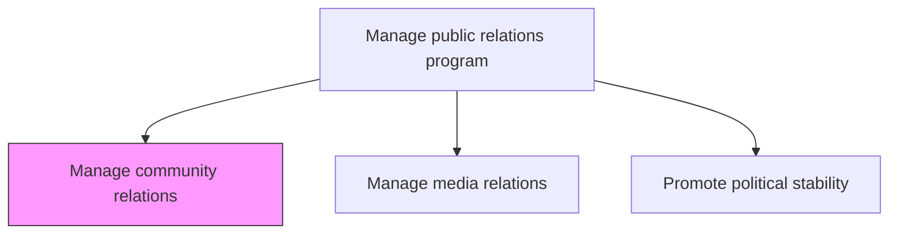
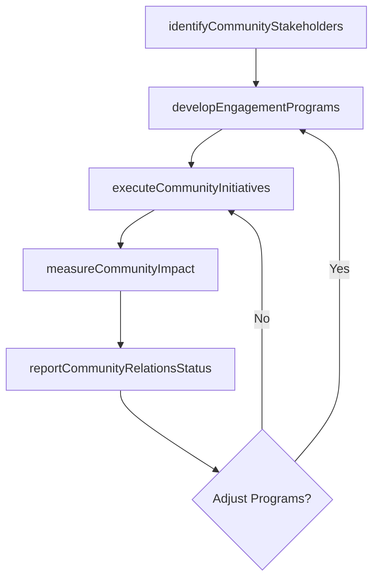

# Manage community relations

> Business-as-Code definition for building and maintaining relationships with local communities through civic engagement, charitable programs, and corporate social responsibility initiatives.

## Overview

Developing and administering community relations. Establish business connections with the people constituting the environment the organization operates in and draws resources from in order to foster mutual understanding, trust, and support. Create programs that promote the organization's image in a positive and community-oriented way.

## Process Hierarchy



## GraphDL

```yaml
manage:
  object: Community Relations
  actor: CommunityRelationsManager
  result: CommunityEngagementReport
```

## Actions

| Action | Description |
|--------|-------------|
| identifyCommunityStakeholders | Map local community groups, civic organizations, and key influencers |
| developEngagementPrograms | Design community outreach programs including volunteering, sponsorships, and events |
| executeCommunityInitiatives | Implement community engagement activities and track participation |
| measureCommunityImpact | Assess the social impact and community perception of engagement initiatives |
| reportCommunityRelationsStatus | Produce reports on community engagement activities and outcomes |

## Events

| Event | Description |
|-------|-------------|
| communityStakeholdersIdentified | Local community groups and key influencers mapped |
| engagementProgramsDeveloped | Community outreach programs designed and approved |
| communityInitiativesExecuted | Community engagement activities implemented |
| communityImpactMeasured | Social impact and community perception assessed |
| communityRelationsStatusReported | Community engagement report delivered to leadership |

## Searches

| Search | Description |
|--------|-------------|
| findCommunityPartners | List community organizations by type, region, or engagement level |
| getEngagementPrograms | Retrieve community programs by status, region, or initiative type |
| getCommunityImpactMetrics | Query community impact metrics by program, region, or period |

## Process Flow



## RACI Matrix

| Activity | Responsible | Accountable | Consulted | Informed |
|----------|-------------|-------------|-----------|----------|
| identifyCommunityStakeholders | CommunityRelationsManager | PRDirector | LocalLeadership | CSR |
| developEngagementPrograms | CommunityRelationsManager | PRDirector | CSR | Marketing |
| executeCommunityInitiatives | CommunityRelationsManager | PRDirector | HR | LocalLeadership |
| measureCommunityImpact | PRAnalyst | PRDirector | CommunityRelationsManager | CEO |

## Related Processes

| Process | Relationship |
|---------|-------------|
| 12.5.2 Manage media relations | Parallel - community events generate media coverage opportunities |
| 12.2 Manage government and industry relationships | Parallel - community engagement supports government relations |
| 13.2 Manage corporate social responsibility | Upstream - CSR strategy guides community engagement priorities |

## Related Departments

| Department | Role |
|-----------|------|
| Corporate Communications | Manages community relations strategy and execution |
| Human Resources | Coordinates employee volunteering and community service programs |
| CSR | Aligns community engagement with corporate social responsibility goals |
| Local Operations | Implements community initiatives at the regional level |

## Related Occupations

| Occupation | Involvement |
|-----------|-------------|
| Community Relations Manager | Leads community stakeholder engagement and program management |
| CSR Specialist | Aligns community initiatives with sustainability and social goals |
| Public Relations Specialist | Communicates community engagement through media channels |

## KPIs

| KPI | Description | Unit |
|-----|-------------|------|
| Community Engagement Events | Number of community engagement activities conducted per year | Count |
| Employee Volunteer Hours | Total employee volunteer hours contributed to community programs | Hours |
| Community Satisfaction Score | Survey-based community perception rating | Score (1-10) |
| Charitable Investment | Total corporate charitable contributions and sponsorships | USD |

## Usage

```typescript
import { manageCommunityRelations } from '@headlessly/manage-community-relations'

const community = manageCommunityRelations()

// Identify community stakeholders in a new operating region
const stakeholders = await community.identifyCommunityStakeholders({
  region: 'Austin-TX',
  stakeholderTypes: ['civic-organizations', 'schools', 'nonprofits', 'neighborhood-groups'],
  engagementPriority: 'high'
})

// Measure community impact of initiatives
const impact = await community.measureCommunityImpact({
  programs: ['stem-education-grants', 'local-hiring-initiative', 'environmental-cleanup'],
  period: 'FY-2024',
  metrics: ['beneficiaries-reached', 'community-perception', 'media-coverage']
})
```
