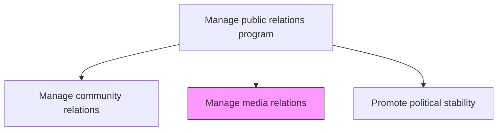
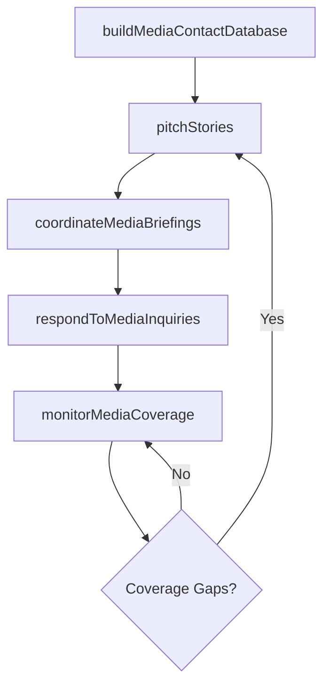

# Manage media relations

> Business-as-Code definition for building and maintaining relationships with journalists, editors, and media outlets to generate favorable coverage and manage the organization's public narrative.

## Overview

Developing and managing relations with media. Develop connections with journalists to solicit critical, third-party endorsements for a product, issue, service, or organization.

## Process Hierarchy



## GraphDL

```yaml
manage:
  object: Media Relations
  actor: MediaRelationsManager
  result: MediaCoverageReport
```

## Actions

| Action | Description |
|--------|-------------|
| buildMediaContactDatabase | Develop and maintain a database of journalist contacts by beat, outlet, and region |
| pitchStories | Proactively pitch newsworthy stories and exclusives to targeted journalists |
| coordinateMediaBriefings | Organize press conferences, media tours, and executive briefings |
| respondToMediaInquiries | Handle incoming media questions and interview requests with timely responses |
| monitorMediaCoverage | Track and analyze media coverage for tone, reach, and key message penetration |

## Events

| Event | Description |
|-------|-------------|
| mediaContactDatabaseUpdated | Journalist contact database refreshed with new contacts and beat changes |
| storyPitched | Newsworthy story pitched to targeted media contacts |
| mediaBriefingCoordinated | Press conference or media briefing conducted |
| mediaInquiryResponded | Media question or interview request addressed |
| mediaCoverageMonitored | Media coverage analysis report generated |

## Searches

| Search | Description |
|--------|-------------|
| findMediaContacts | List journalist contacts by beat, outlet, region, or engagement history |
| getStoryPitches | Retrieve story pitches by topic, status, or media outlet |
| getMediaCoverageAnalysis | Query media coverage metrics by period, topic, or sentiment |

## Process Flow



## RACI Matrix

| Activity | Responsible | Accountable | Consulted | Informed |
|----------|-------------|-------------|-----------|----------|
| buildMediaContactDatabase | MediaRelationsManager | PRDirector | PRSpecialist | Marketing |
| pitchStories | MediaRelationsManager | PRDirector | ExecutiveCommunications | Legal |
| coordinateMediaBriefings | MediaRelationsManager | PRDirector | Executives | Marketing |
| monitorMediaCoverage | PRAnalyst | PRDirector | MediaRelationsManager | Executive |

## Related Processes

| Process | Relationship |
|---------|-------------|
| 12.5.4 Create press releases | Upstream - press releases are a primary tool for media engagement |
| 12.5.5 Issue press releases | Downstream - media contacts receive distributed press releases |
| 12.5.1 Manage community relations | Parallel - community events generate media coverage |

## Related Departments

| Department | Role |
|-----------|------|
| Corporate Communications | Manages media strategy and journalist relationships |
| Marketing | Coordinates product messaging with media outreach |
| Legal | Reviews public statements for compliance and risk |
| Executive Office | Provides spokespeople for media interactions |

## Related Occupations

| Occupation | Involvement |
|-----------|-------------|
| Media Relations Manager | Builds journalist relationships and manages media outreach |
| PR Specialist | Pitches stories and coordinates media briefings |
| Communications Analyst | Monitors and reports on media coverage |

## KPIs

| KPI | Description | Unit |
|-----|-------------|------|
| Media Pickup Rate | Percentage of story pitches that result in published coverage | % |
| Journalist Response Time | Average response time to incoming media inquiries | Hours |
| Positive Coverage Ratio | Percentage of media coverage with positive or neutral tone | % |
| Media Reach | Total audience reach of media coverage generated | Impressions |

## Usage

```typescript
import { manageMediaRelations } from '@headlessly/manage-media-relations'

const media = manageMediaRelations()

// Pitch a story to targeted journalists
const pitch = await media.pitchStories({
  topic: 'sustainability-milestone',
  targetJournalists: ['tech-reporter-wsj', 'sustainability-beat-reuters'],
  embargo: '2025-04-15',
  exclusiveOffer: true
})

// Monitor media coverage for recent announcements
const coverage = await media.monitorMediaCoverage({
  topics: ['product-launch', 'earnings', 'sustainability'],
  period: 'last-7-days',
  sentimentAnalysis: true,
  includeCompetitors: true
})
```
