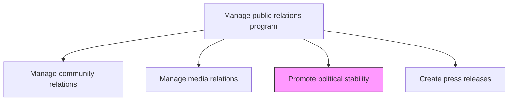
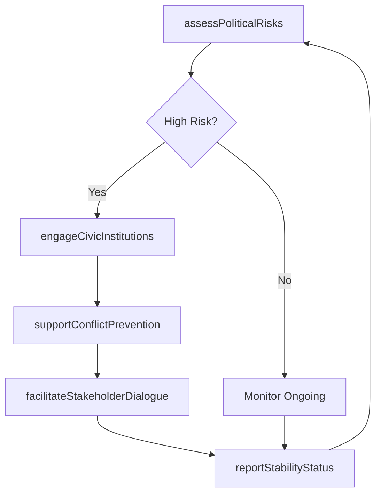

# Promote political stability

> Business-as-Code definition for supporting political security and stability in operating regions through civic engagement, conflict prevention programs, and constructive dialogue with political stakeholders.

## Overview

Promoting political security and stability in the regions where the organization conducts business. Encourage political stability in the regions where the organization operates. Support civic programs, citizen engagement, connection platforms, etc.

## Process Hierarchy



## GraphDL

```yaml
promote:
  object: Political Stability
  actor: GovernmentRelationsDirector
  result: PoliticalStabilityAssessment
```

## Actions

| Action | Description |
|--------|-------------|
| assessPoliticalRisks | Monitor and evaluate political risks in regions where the organization operates |
| engageCivicInstitutions | Partner with civic organizations and democratic institutions to support stability |
| supportConflictPrevention | Fund or participate in conflict prevention and peacebuilding programs |
| facilitateStakeholderDialogue | Organize forums for constructive dialogue between political and business stakeholders |
| reportStabilityStatus | Produce reports on political risk assessments and stability promotion activities |

## Events

| Event | Description |
|-------|-------------|
| politicalRisksAssessed | Political risk evaluation completed for operating regions |
| civicInstitutionsEngaged | Partnership with civic organization established or renewed |
| conflictPreventionSupported | Conflict prevention or peacebuilding program initiated |
| stakeholderDialogueFacilitated | Stakeholder dialogue forum conducted |
| stabilityStatusReported | Political stability assessment report delivered |

## Searches

| Search | Description |
|--------|-------------|
| getPoliticalRiskAssessments | Retrieve political risk ratings by region, severity, or trend |
| getCivicPartnerships | List civic institution partnerships by region, type, or status |
| getStabilityPrograms | Query political stability programs by region, investment, or impact |

## Process Flow



## RACI Matrix

| Activity | Responsible | Accountable | Consulted | Informed |
|----------|-------------|-------------|-----------|----------|
| assessPoliticalRisks | GovernmentRelationsDirector | PRDirector | RiskManagement | CEO |
| engageCivicInstitutions | GovernmentRelationsDirector | PRDirector | CSR | LocalLeadership |
| supportConflictPrevention | CSRManager | PRDirector | GovernmentRelationsDirector | Board |
| facilitateStakeholderDialogue | GovernmentRelationsDirector | CEO | PRDirector | Legal |

## Related Processes

| Process | Relationship |
|---------|-------------|
| 12.2.1 Manage government relations | Parallel - government relationships support political stability efforts |
| 12.5.1 Manage community relations | Parallel - community engagement contributes to social stability |
| 11.1 Manage enterprise risk | Upstream - political risk assessment feeds enterprise risk management |

## Related Departments

| Department | Role |
|-----------|------|
| Government Relations | Engages political stakeholders and monitors political environment |
| Corporate Communications | Manages messaging around stability initiatives |
| CSR | Funds and coordinates conflict prevention and civic programs |
| Risk Management | Assesses political risk impact on business operations |

## Related Occupations

| Occupation | Involvement |
|-----------|-------------|
| Government Relations Director | Leads political engagement and stability promotion |
| Risk Analyst | Monitors political risk indicators in operating regions |
| CSR Manager | Manages civic and conflict prevention program investments |

## KPIs

| KPI | Description | Unit |
|-----|-------------|------|
| Political Risk Score | Average political risk rating across operating regions | Score (1-10) |
| Civic Partnership Count | Number of active civic institution partnerships | Count |
| Stability Program Investment | Annual investment in political stability and civic programs | USD |
| Stakeholder Dialogue Sessions | Number of stakeholder dialogue forums conducted per year | Count |

## Usage

```typescript
import { promotePoliticalStability } from '@headlessly/promote-political-stability'

const stability = promotePoliticalStability()

// Assess political risks in operating regions
const risks = await stability.assessPoliticalRisks({
  regions: ['Southeast-Asia', 'Latin-America', 'Sub-Saharan-Africa'],
  riskFactors: ['governance-quality', 'social-unrest', 'regulatory-stability'],
  forecastHorizon: '12-months'
})

// Support conflict prevention program
const program = await stability.supportConflictPrevention({
  region: 'Southeast-Asia',
  programType: 'civic-dialogue-platform',
  partnerOrganization: 'peace-institute',
  investment: 250000
})
```
