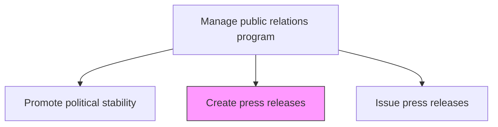
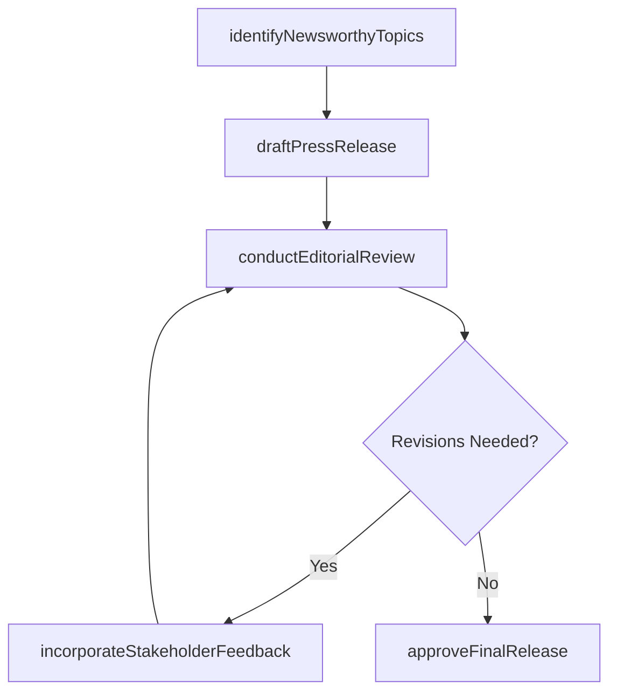

# Create press releases

> Business-as-Code definition for drafting, reviewing, and approving press releases that communicate organizational news, developments, and announcements to the media and public.

## Overview

Developing press releases to communicate developments and generate interest in the organization.

## Process Hierarchy



## GraphDL

```yaml
create:
  object: Press Releases
  actor: PRSpecialist
  result: ApprovedPressRelease
```

## Actions

| Action | Description |
|--------|-------------|
| identifyNewsworthyTopics | Assess organizational developments for press release potential and newsworthiness |
| draftPressRelease | Write the press release including headline, body, quotes, and boilerplate |
| conductEditorialReview | Route the draft through editorial, legal, and executive review cycles |
| incorporateStakeholderFeedback | Revise the press release based on reviewer comments and legal guidance |
| approveFinalRelease | Obtain final approval from authorized spokesperson and legal for distribution |

## Events

| Event | Description |
|-------|-------------|
| newsworthyTopicIdentified | Organizational development identified as press release candidate |
| pressReleaseDrafted | Press release initial draft completed |
| editorialReviewConducted | Editorial, legal, and executive review completed |
| stakeholderFeedbackIncorporated | Reviewer comments and revisions applied to draft |
| finalReleaseApproved | Press release approved for distribution |

## Searches

| Search | Description |
|--------|-------------|
| getPressReleaseDrafts | Retrieve press release drafts by topic, status, or author |
| getApprovalStatus | Query press release approval workflow status by release or reviewer |
| getReleaseCalendar | List scheduled press releases by date, topic, or embargo status |

## Process Flow



## RACI Matrix

| Activity | Responsible | Accountable | Consulted | Informed |
|----------|-------------|-------------|-----------|----------|
| identifyNewsworthyTopics | PRSpecialist | PRDirector | Marketing | Executive |
| draftPressRelease | PRSpecialist | PRDirector | SubjectMatterExpert | Legal |
| conductEditorialReview | PRDirector | VP Communications | Legal | InvestorRelations |
| approveFinalRelease | PRDirector | VP Communications | Legal | Marketing |

## Related Processes

| Process | Relationship |
|---------|-------------|
| 12.5.5 Issue press releases | Downstream - approved releases distributed through media channels |
| 12.5.2 Manage media relations | Parallel - media contacts inform press release targeting |
| 12.1.3 Disseminate information to analysts | Parallel - analyst communications coordinate with press releases |

## Related Departments

| Department | Role |
|-----------|------|
| Corporate Communications | Drafts and manages press release creation process |
| Legal | Reviews releases for regulatory compliance and litigation risk |
| Marketing | Provides product and brand messaging alignment |
| Investor Relations | Coordinates financial disclosures with press announcements |

## Related Occupations

| Occupation | Involvement |
|-----------|-------------|
| PR Specialist | Drafts press releases and manages editorial process |
| PR Director | Reviews and approves final press releases |
| Corporate Attorney | Reviews releases for legal and regulatory compliance |

## KPIs

| KPI | Description | Unit |
|-----|-------------|------|
| Press Release Production Time | Average days from topic identification to final approval | Days |
| Approval Cycle Iterations | Average number of review cycles before final approval | Count |
| Press Releases Published | Total number of press releases published per quarter | Count |
| Legal Review Compliance | Percentage of press releases passing legal review without material changes | % |

## Usage

```typescript
import { createPressReleases } from '@headlessly/create-press-releases'

const pressReleases = createPressReleases()

// Draft a press release for a product announcement
const draft = await pressReleases.draftPressRelease({
  topic: 'product-launch',
  headline: 'Company Announces AI-Powered Platform for Enterprise Automation',
  keyMessages: ['industry-first', 'SOC2-certified', '10x-productivity'],
  executiveQuote: { speaker: 'CEO', quote: 'This platform represents a paradigm shift...' },
  embargoDate: '2025-04-01'
})

// Conduct editorial review
const review = await pressReleases.conductEditorialReview({
  releaseId: draft.id,
  reviewers: ['legal', 'marketing', 'investor-relations'],
  deadline: '2025-03-28'
})
```
