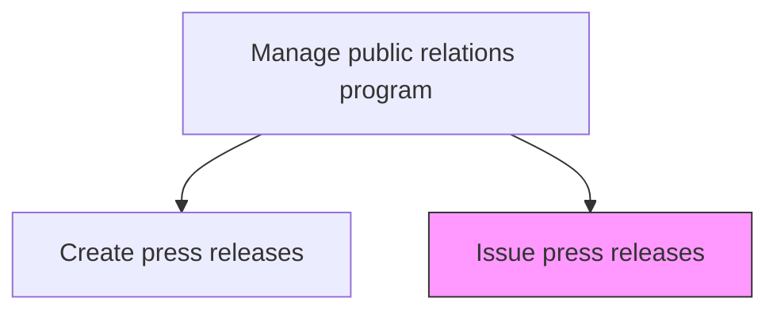
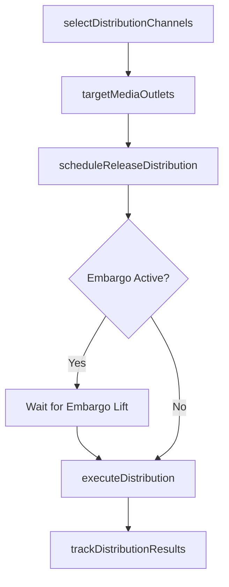

# Issue press releases

> Business-as-Code definition for distributing approved press releases through targeted media channels including wire services, digital platforms, social media, and direct journalist outreach.

## Overview

Issuing press releases to carefully selected media in distribution channels such as the web, newspapers, and social media.

## Process Hierarchy



## GraphDL

```yaml
issue:
  object: Press Releases
  actor: MediaRelationsManager
  result: PressReleaseDistributionReport
```

## Actions

| Action | Description |
|--------|-------------|
| selectDistributionChannels | Determine the optimal mix of wire services, digital, and social channels for the release |
| targetMediaOutlets | Identify specific journalists, editors, and outlets for targeted distribution |
| scheduleReleaseDistribution | Set distribution timing including embargo lifts and coordinated announcements |
| executeDistribution | Distribute the press release through selected channels and contact lists |
| trackDistributionResults | Monitor media pickup, engagement metrics, and audience reach |

## Events

| Event | Description |
|-------|-------------|
| distributionChannelsSelected | Optimal distribution channels determined for the release |
| mediaOutletsTargeted | Target journalist and outlet list finalized |
| releaseDistributionScheduled | Distribution timing and embargo details confirmed |
| distributionExecuted | Press release distributed through selected channels |
| distributionResultsTracked | Media pickup and engagement metrics collected |

## Searches

| Search | Description |
|--------|-------------|
| getDistributionHistory | Retrieve press release distribution records by date, channel, or topic |
| getPickupMetrics | Query media pickup rates and coverage metrics by release or channel |
| getAudienceReach | List total audience reach by release, outlet, or distribution channel |

## Process Flow



## RACI Matrix

| Activity | Responsible | Accountable | Consulted | Informed |
|----------|-------------|-------------|-----------|----------|
| selectDistributionChannels | MediaRelationsManager | PRDirector | Marketing | InvestorRelations |
| targetMediaOutlets | MediaRelationsManager | PRDirector | PRSpecialist | Marketing |
| executeDistribution | MediaRelationsManager | PRDirector | IT | Legal |
| trackDistributionResults | PRAnalyst | PRDirector | MediaRelationsManager | Marketing |

## Related Processes

| Process | Relationship |
|---------|-------------|
| 12.5.4 Create press releases | Upstream - approved press releases ready for distribution |
| 12.5.2 Manage media relations | Parallel - media contact relationships enable targeted distribution |
| 12.1.3 Disseminate information to analysts | Parallel - analyst communications coordinated with press distribution |

## Related Departments

| Department | Role |
|-----------|------|
| Corporate Communications | Manages distribution strategy and execution |
| Marketing | Coordinates social media and digital channel distribution |
| Investor Relations | Ensures financial disclosures are properly distributed |
| IT | Supports wire service integrations and digital distribution tools |

## Related Occupations

| Occupation | Involvement |
|-----------|-------------|
| Media Relations Manager | Selects channels, targets outlets, and executes distribution |
| PR Analyst | Tracks distribution results and media pickup metrics |
| Social Media Manager | Distributes releases through social media channels |

## KPIs

| KPI | Description | Unit |
|-----|-------------|------|
| Media Pickup Rate | Percentage of targeted outlets that publish or reference the release | % |
| Distribution Reach | Total audience impressions from press release distribution | Impressions |
| Time to First Pickup | Average time from distribution to first media publication | Hours |
| Social Media Engagement | Total engagement metrics from social media distribution | Interactions |

## Usage

```typescript
import { issuePressReleases } from '@headlessly/issue-press-releases'

const distribution = issuePressReleases()

// Select distribution channels for a product launch release
const channels = await distribution.selectDistributionChannels({
  releaseType: 'product-announcement',
  targetAudience: ['business-press', 'tech-press', 'industry-analysts'],
  channels: ['wire-service', 'company-newsroom', 'social-media', 'email-pitch'],
  budget: 5000
})

// Execute distribution with embargo
const result = await distribution.executeDistribution({
  releaseId: 'PR-2025-042',
  channels: channels.selectedChannels,
  embargoLift: '2025-04-01T09:00:00-04:00',
  followUpPitch: true,
  socialMediaAccounts: ['twitter', 'linkedin']
})
```
