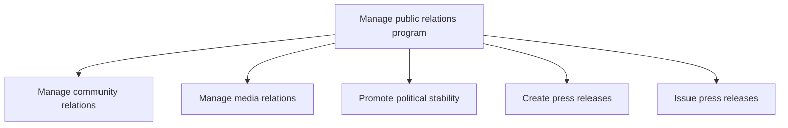
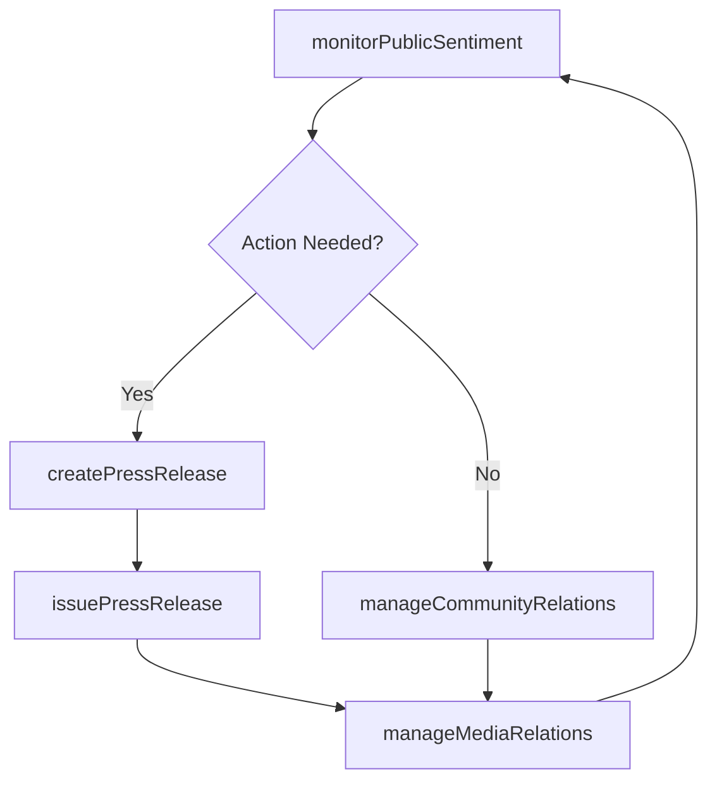

# Manage public relations program

> Business-as-Code definition for managing public perception and reputation through community relations, media engagement, political stability promotion, and strategic press release creation and distribution.

## Overview

Managing a public relations programs through business and communications skills.

## Process Hierarchy



## GraphDL

```yaml
manage:
  object: Public Relations Program
  actor: PRDirector
  result: PublicReputationReport
```

## Actions

| Action | Description |
|--------|-------------|
| manageCommunityRelations | Build and maintain relationships with local communities and civic organizations |
| manageMediaRelations | Develop and maintain relationships with journalists and media outlets |
| promotePoliticalStability | Support political stability and security in operating regions |
| createPressRelease | Draft press releases to communicate organizational developments |
| issuePressRelease | Distribute press releases through targeted media channels |
| monitorPublicSentiment | Track media coverage, social sentiment, and brand perception |

## Events

| Event | Description |
|-------|-------------|
| communityRelationsManaged | Community engagement activity completed |
| mediaRelationsManaged | Media briefing or journalist interaction conducted |
| politicalStabilityPromoted | Political engagement or stability initiative executed |
| pressReleaseCreated | Press release drafted and approved for distribution |
| pressReleaseIssued | Press release distributed through media channels |
| publicSentimentMonitored | Media and sentiment analysis report generated |

## Searches

| Search | Description |
|--------|-------------|
| findMediaContacts | List journalist and media outlet contacts by beat or publication |
| getPressReleaseHistory | Retrieve issued press releases by date, topic, or channel |
| getSentimentAnalysis | Query media sentiment and brand perception metrics |
| getCommunityEngagements | List community relations activities by region or initiative |

## Process Flow



## RACI Matrix

| Activity | Responsible | Accountable | Consulted | Informed |
|----------|-------------|-------------|-----------|----------|
| manageCommunityRelations | CommunityRelationsManager | PRDirector | CSR | LocalLeadership |
| manageMediaRelations | MediaRelationsManager | PRDirector | Legal | Marketing |
| createPressRelease | PRSpecialist | PRDirector | Legal | Executive |
| issuePressRelease | MediaRelationsManager | PRDirector | InvestorRelations | Marketing |
| monitorPublicSentiment | PRAnalyst | PRDirector | Marketing | Executive |

## Sub-Processes

| ID | Name | Description |
|----|------|-------------|
| 12.5.1 | Manage community relations | Developing and administering community relations. Establish business connections with the people con |
| 12.5.2 | Manage media relations | Developing and managing relations with media. Develop connections with journalists to solicit critic |
| 12.5.3 | Promote political stability | Promoting political security and stability in the regions where the organization conducts business.  |
| 12.5.4 | Create press releases | Developing press releases to communicate developments and generate interest in the organization. |
| 12.5.5 | Issue press releases | Issuing press releases to carefully selected media in distribution channels such as the web, newspap |

## Related Processes

| Process | Relationship |
|---------|-------------|
| 12.1 Build investor relationships | Parallel - public disclosures complement investor communications |
| 12.2 Manage government and industry relationships | Parallel - public messaging aligns with government positioning |
| 12.4 Manage legal and ethical issues | Upstream - legal review required before public statements |

## Related Departments

| Department | Role |
|-----------|------|
| Corporate Communications | Owns media relations, press releases, and public messaging |
| Community Relations | Manages local community engagement and civic partnerships |
| Marketing | Coordinates brand messaging with public relations strategy |
| Legal | Reviews public statements for regulatory and litigation risk |

## Related Occupations

| Occupation | Involvement |
|-----------|-------------|
| Public Relations Director | Oversees all public relations strategy and execution |
| Media Relations Specialist | Manages journalist relationships and media outreach |
| Communications Analyst | Monitors media coverage and public sentiment metrics |

## KPIs

| KPI | Description | Unit |
|-----|-------------|------|
| Media Sentiment Score | Net positive-to-negative ratio of media coverage | Ratio |
| Press Release Pickup Rate | Percentage of press releases covered by target media outlets | % |
| Share of Voice | Organization's media mentions relative to competitors | % |
| Community Engagement Score | Survey-based satisfaction from community stakeholders | Score (1-10) |

## Usage

```typescript
import { managePublicRelationsProgram } from '@headlessly/manage-public-relations-program'

const pr = managePublicRelationsProgram()

// Create a press release for product launch
const release = await pr.createPressRelease({
  topic: 'product-launch',
  headline: 'Company Announces Next-Generation Platform',
  embargoed: true,
  releaseDate: '2025-03-01'
})

// Monitor public sentiment
const sentiment = await pr.monitorPublicSentiment({
  period: 'last-30-days',
  topics: ['brand', 'products', 'leadership'],
  includeCompetitors: true
})

// Issue the press release
const distribution = await pr.issuePressRelease({
  releaseId: release.id,
  channels: ['wire-service', 'web', 'social-media'],
  targetMedia: ['business-press', 'tech-press']
})
```
