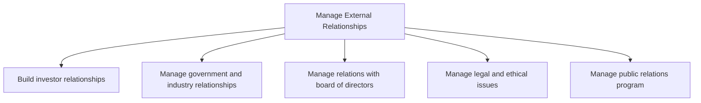
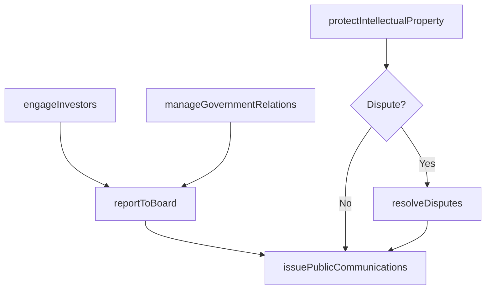

# Manage External Relationships

> Business-as-Code definition for cultivating and governing the organization's relationships with investors, government bodies, industry groups, the board of directors, legal stakeholders, and the public.

## Overview

Fostering external relationships with stakeholders of the entity, including investors, government and industry, the board of directors, and the general public. This is not related to customer management.

## Process Hierarchy



## GraphDL

```yaml
manage:
  object: External Relationships
  actor: CorporateAffairsOfficer
  result: StakeholderRelationshipPortfolio
```

## Actions

| Action | Description |
|--------|-------------|
| engageInvestors | Build and maintain relationships with shareholders, lenders, and analysts |
| manageGovernmentRelations | Coordinate interactions with government agencies and regulatory bodies |
| reportToBoard | Prepare and deliver financial, audit, and strategic reports to the board of directors |
| resolveDisputes | Manage litigation, dispute resolution, and legal negotiations |
| protectIntellectualProperty | File, maintain, and enforce patents, trademarks, and copyrights |
| issuePublicCommunications | Create and distribute press releases, media statements, and public disclosures |

## Events

| Event | Description |
|-------|-------------|
| investorsEngaged | Investor or analyst engagement activity completed |
| governmentRelationsManaged | Government or regulatory interaction documented |
| boardReported | Board report or filing submitted |
| disputeResolved | Legal dispute or litigation matter resolved |
| intellectualPropertyProtected | Patent, trademark, or copyright filing completed |
| publicCommunicationIssued | Press release or public statement distributed |

## Searches

| Search | Description |
|--------|-------------|
| findStakeholders | List external stakeholders by type, engagement level, or relationship status |
| getInvestorCommunications | Retrieve history of investor and analyst communications |
| findLegalMatters | Query open legal matters, disputes, or compliance cases |
| getIPPortfolio | Retrieve intellectual property holdings by type or jurisdiction |
| getBoardCalendar | Get upcoming board meetings, filings, and reporting deadlines |

## Process Flow



## RACI Matrix

| Activity | Responsible | Accountable | Consulted | Informed |
|----------|-------------|-------------|-----------|----------|
| engageInvestors | InvestorRelationsManager | CFO | CEO | Board |
| manageGovernmentRelations | GovernmentAffairsDirector | GeneralCounsel | PublicPolicy | CEO |
| reportToBoard | CorporateSecretary | CEO | CFO | InternalAudit |
| resolveDisputes | LitigationCounsel | GeneralCounsel | ExternalCounsel | CFO |
| issuePublicCommunications | PRManager | VP Communications | Legal | Marketing |

## Sub-Processes

| ID | Name | Description |
|----|------|-------------|
| 12.1 | Build investor relationships | Creating a strategic management responsibility for integrating finance, communication, marketing, an |
| 12.2 | Manage government and industry relationships | Creating and maintaining relationships with government and industry representatives. |
| 12.3 | Manage relations with board of directors | Maintaining relations with representatives of the stockholders. Establish corporate management-relat |
| 12.4 | Manage legal and ethical issues | Managing legal practices to abide by the law, as well as ethical practices. |
| 12.5 | Manage public relations program | Managing a public relations programs through business and communications skills. |

## Related Processes

| Process | Relationship |
|---------|-------------|
| 11.0 Manage Enterprise Risk, Compliance, Remediation, and Resiliency | Upstream - compliance posture shapes external disclosures |
| 8.0 Manage Financial Resources | Upstream - financial results drive investor communications |
| 1.0 Develop Vision and Strategy | Parallel - corporate strategy informs stakeholder messaging |
| 9.0 Acquire and Manage Human Capital | Parallel - board governance intersects with executive compensation |

## Related Departments

| Department | Role |
|-----------|------|
| Investor Relations | Manages shareholder, lender, and analyst communications |
| Legal | Oversees compliance, IP protection, and dispute resolution |
| Government Affairs | Coordinates lobbying and regulatory body interactions |
| Corporate Communications | Manages media relations and public disclosures |
| Corporate Secretary | Facilitates board governance and reporting |

## Related Occupations

| Occupation | Involvement |
|-----------|-------------|
| Investor Relations Manager | Primary liaison with shareholders and financial analysts |
| General Counsel | Oversees legal matters, contracts, and regulatory compliance |
| Government Affairs Director | Manages government and regulatory body relationships |
| Public Relations Specialist | Coordinates media outreach and crisis communications |

## KPIs

| KPI | Description | Unit |
|-----|-------------|------|
| Stakeholder Satisfaction Score | Survey-based satisfaction rating from key external stakeholders | Score (1-10) |
| Regulatory Filing Timeliness | Percentage of government and SEC filings submitted on time | % |
| Legal Spend Efficiency | Outside counsel spend relative to matters resolved | $/Matter |
| Media Sentiment Score | Net positive media coverage ratio over reporting period | Ratio |
| IP Portfolio Coverage | Percentage of key innovations protected by patents or trademarks | % |

## Usage

```typescript
import { manageExternalRelationships } from '@headlessly/manage-external-relationships'

const relations = manageExternalRelationships()

// Engage investor community
const engagement = await relations.engageInvestors({
  type: 'earnings-call',
  quarter: 'Q4-2024',
  participants: ['analysts', 'institutional-investors']
})

// Query open legal matters
const matters = await relations.findLegalMatters({
  status: 'open',
  category: 'intellectual-property',
  jurisdiction: 'US'
})

// Issue a public communication
const release = await relations.issuePublicCommunications({
  type: 'press-release',
  topic: 'quarterly-earnings',
  embargoed: true,
  releaseDate: '2025-02-15'
})
```
