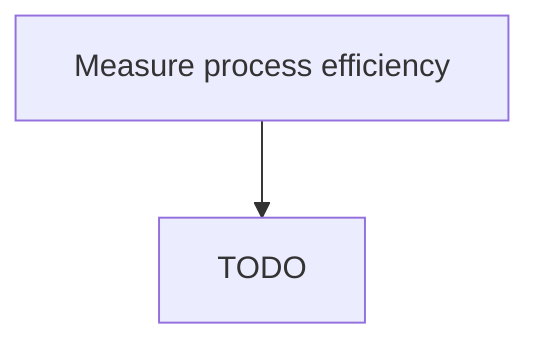

# Measure process efficiency

> TODO: Business-as-Code definition for measure process efficiency (aerospace-and-defense)

## Overview

Evaluating the efficiency of the organization's processes. Adapt evaluation to the activities and business components being measured. (Unlike process Measure staff productivity [11078], process Measures outcomes [11076] [e.g., how much of X is produced within X time period].) Measure a manufacturing process, for example, according to number of units produced per FTE or number of "high quality" units produced.

## Process Hierarchy



## GraphDL

```yaml
measure:
  object: Process Efficiency
  actor: TODO
  result: TODO
```

## Actions

| Action | Description |
|--------|-------------|
| TODO | TODO |

## Events

| Event | Description |
|-------|-------------|
| TODO | TODO |

## Searches

| Search | Description |
|--------|-------------|
| TODO | TODO |

## Process Flow


## RACI Matrix

| Activity | Responsible | Accountable | Consulted | Informed |
|----------|-------------|-------------|-----------|----------|
| TODO | TODO | TODO | TODO | TODO |

## Related Processes

| Process | Relationship |
|---------|-------------|
| TODO | TODO |

## Related Departments

| Department | Role |
|-----------|------|
| TODO | TODO |

## Related Occupations

| Occupation | Involvement |
|-----------|-------------|
| TODO | TODO |

## KPIs

| KPI | Description | Unit |
|-----|-------------|------|
| TODO | TODO | TODO |

## Usage

```typescript
import { TODO } from '@headlessly/measure-process-efficiency'

const client = TODO()

// TODO: Example action calls
```
