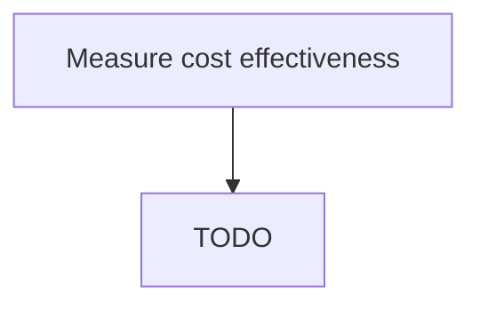

# Measure cost effectiveness

> TODO: Business-as-Code definition for measure cost effectiveness (broadcasting)

## Overview

Measuring the cost effectiveness of the organization's processes. Track the return on investing in marketing campaigns, new equipment, and process redefinition. Measure the cost per employee or cost per cycle for a given process, function, or business unit.

## Process Hierarchy



## GraphDL

```yaml
measure:
  object: Cost Effectiveness
  actor: TODO
  result: TODO
```

## Actions

| Action | Description |
|--------|-------------|
| TODO | TODO |

## Events

| Event | Description |
|-------|-------------|
| TODO | TODO |

## Searches

| Search | Description |
|--------|-------------|
| TODO | TODO |

## Process Flow


## RACI Matrix

| Activity | Responsible | Accountable | Consulted | Informed |
|----------|-------------|-------------|-----------|----------|
| TODO | TODO | TODO | TODO | TODO |

## Related Processes

| Process | Relationship |
|---------|-------------|
| TODO | TODO |

## Related Departments

| Department | Role |
|-----------|------|
| TODO | TODO |

## Related Occupations

| Occupation | Involvement |
|-----------|-------------|
| TODO | TODO |

## KPIs

| KPI | Description | Unit |
|-----|-------------|------|
| TODO | TODO | TODO |

## Usage

```typescript
import { TODO } from '@headlessly/measure-cost-effectiveness'

const client = TODO()

// TODO: Example action calls
```
