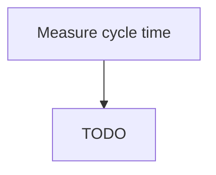

# Measure cycle time

> TODO: Business-as-Code definition for measure cycle time (broadcasting)

## Overview

Measuring how long it takes to perform certain processes or cycles of action. Select measures of customer response time, invoicing, order to cash, etc. (Actions taken based on the measurement typically exist as activities within process group Manage change [11074] or within the other function specific categories. For example, if measures indicate that the invoicing cycle is taking too long or is inconsistent, the resulting actions would take place within process Invoice the customer [10742].)

## Process Hierarchy



## GraphDL

```yaml
measure:
  object: Cycle Time
  actor: TODO
  result: TODO
```

## Actions

| Action | Description |
|--------|-------------|
| TODO | TODO |

## Events

| Event | Description |
|-------|-------------|
| TODO | TODO |

## Searches

| Search | Description |
|--------|-------------|
| TODO | TODO |

## Process Flow


## RACI Matrix

| Activity | Responsible | Accountable | Consulted | Informed |
|----------|-------------|-------------|-----------|----------|
| TODO | TODO | TODO | TODO | TODO |

## Related Processes

| Process | Relationship |
|---------|-------------|
| TODO | TODO |

## Related Departments

| Department | Role |
|-----------|------|
| TODO | TODO |

## Related Occupations

| Occupation | Involvement |
|-----------|-------------|
| TODO | TODO |

## KPIs

| KPI | Description | Unit |
|-----|-------------|------|
| TODO | TODO | TODO |

## Usage

```typescript
import { TODO } from '@headlessly/measure-cycle-time'

const client = TODO()

// TODO: Example action calls
```
