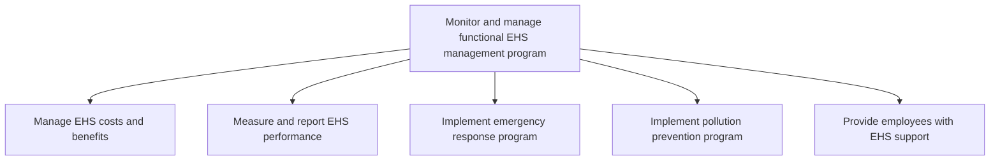

# Monitor and manage functional EHS management program

> TODO: Business-as-Code definition for monitor and manage functional ehs management program (consumer-electronics)

## Overview

TODO: Add process overview

## Process Hierarchy



## GraphDL

```yaml
monitor:
  object: And Manage Functional EHS Management Program
  actor: TODO
  result: TODO
```

## Actions

| Action | Description |
|--------|-------------|
| TODO | TODO |

## Events

| Event | Description |
|-------|-------------|
| TODO | TODO |

## Searches

| Search | Description |
|--------|-------------|
| TODO | TODO |

## Process Flow


## RACI Matrix

| Activity | Responsible | Accountable | Consulted | Informed |
|----------|-------------|-------------|-----------|----------|
| TODO | TODO | TODO | TODO | TODO |

## Sub-Processes

| ID | Name | Description |
|----|------|-------------|
| 13.8.4.1 | Manage EHS costs and benefits | TODO |
| 13.8.4.2 | Measure and report EHS performance | TODO |
| 13.8.4.3 | Implement emergency response program | TODO |
| 13.8.4.4 | Implement pollution prevention program | TODO |
| 13.8.4.5 | Provide employees with EHS support | TODO |

## Related Processes

| Process | Relationship |
|---------|-------------|
| TODO | TODO |

## Related Departments

| Department | Role |
|-----------|------|
| TODO | TODO |

## Related Occupations

| Occupation | Involvement |
|-----------|-------------|
| TODO | TODO |

## KPIs

| KPI | Description | Unit |
|-----|-------------|------|
| TODO | TODO | TODO |

## Usage

```typescript
import { TODO } from '@headlessly/monitor-and-manage-functional-ehs-management-program'

const client = TODO()

// TODO: Example action calls
```
