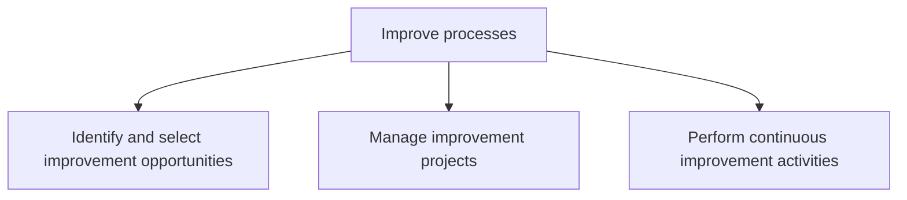

# Improve processes

> TODO: Business-as-Code definition for improve processes (consumer-products)

## Overview

Identifying and choosing improvement opportunities. Create and manage improvement projects. Perform the improvement activities continuously and routinely.

## Process Hierarchy



## GraphDL

```yaml
improve:
  object: Processes
  actor: TODO
  result: TODO
```

## Actions

| Action | Description |
|--------|-------------|
| TODO | TODO |

## Events

| Event | Description |
|-------|-------------|
| TODO | TODO |

## Searches

| Search | Description |
|--------|-------------|
| TODO | TODO |

## Process Flow


## RACI Matrix

| Activity | Responsible | Accountable | Consulted | Informed |
|----------|-------------|-------------|-----------|----------|
| TODO | TODO | TODO | TODO | TODO |

## Sub-Processes

| ID | Name | Description |
|----|------|-------------|
| 13.1.5.1 | Identify and select improvement opportunities | Helping a process owner to identify, analyze, and improve existing business processes within an orga |
| 13.1.5.2 | Manage improvement projects | Developing and implementing a systematic approach to help the organization optimize its underlying p |
| 13.1.5.3 | Perform continuous improvement activities | Persistently implementing activities for improving business processes. |

## Related Processes

| Process | Relationship |
|---------|-------------|
| TODO | TODO |

## Related Departments

| Department | Role |
|-----------|------|
| TODO | TODO |

## Related Occupations

| Occupation | Involvement |
|-----------|-------------|
| TODO | TODO |

## KPIs

| KPI | Description | Unit |
|-----|-------------|------|
| TODO | TODO | TODO |

## Usage

```typescript
import { TODO } from '@headlessly/improve-processes'

const client = TODO()

// TODO: Example action calls
```
