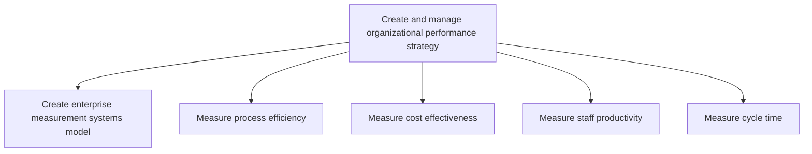

# Create and manage organizational performance strategy

> TODO: Business-as-Code definition for create and manage organizational performance strategy (consumer-products)

## Overview

Creating and implementing a strategy for administering organizational performance. This process element calls upon the organization to create and administer a strategy for measuring, tracking, streamlining, and improving internal performance. It encompasses creating a blueprint for the tactical measurement of internal processes and work force improvement, in alignment with Employee Metrics Developed and Managed [10526].

## Process Hierarchy



## GraphDL

```yaml
create:
  object: And Manage Organizational Performance Strategy
  actor: TODO
  result: TODO
```

## Actions

| Action | Description |
|--------|-------------|
| TODO | TODO |

## Events

| Event | Description |
|-------|-------------|
| TODO | TODO |

## Searches

| Search | Description |
|--------|-------------|
| TODO | TODO |

## Process Flow


## RACI Matrix

| Activity | Responsible | Accountable | Consulted | Informed |
|----------|-------------|-------------|-----------|----------|
| TODO | TODO | TODO | TODO | TODO |

## Sub-Processes

| ID | Name | Description |
|----|------|-------------|
| 13.6.1.1 | Create enterprise measurement systems model | Developing a model for organization's management systems. Develop a high-level measurement system to |
| 13.6.1.2 | Measure process efficiency | Evaluating the efficiency of the organization's processes. Adapt evaluation to the activities and bu |
| 13.6.1.3 | Measure cost effectiveness | Measuring the cost effectiveness of the organization's processes. Track the return on investing in m |
| 13.6.1.4 | Measure staff productivity | Evaluating the productivity of employees. Measure activities performed to determine where automation |
| 13.6.1.5 | Measure cycle time | Measuring how long it takes to perform certain processes or cycles of action. Select measures of cus |

## Related Processes

| Process | Relationship |
|---------|-------------|
| TODO | TODO |

## Related Departments

| Department | Role |
|-----------|------|
| TODO | TODO |

## Related Occupations

| Occupation | Involvement |
|-----------|-------------|
| TODO | TODO |

## KPIs

| KPI | Description | Unit |
|-----|-------------|------|
| TODO | TODO | TODO |

## Usage

```typescript
import { TODO } from '@headlessly/create-and-manage-organizational-performance-strategy'

const client = TODO()

// TODO: Example action calls
```
