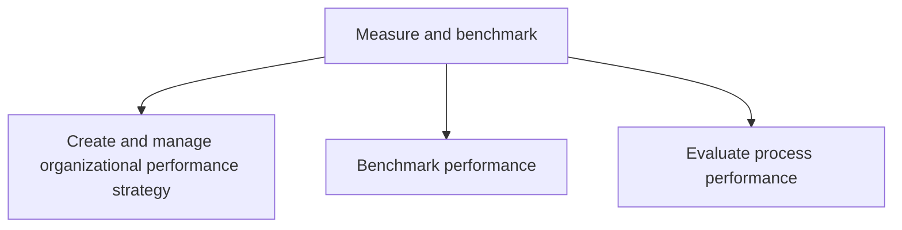

# Measure and benchmark

> TODO: Business-as-Code definition for measure and benchmark (consumer-products)

## Overview

Creating and administering a strategy to manage organizational performance. Benchmark the performance of the internal processes, as well as the organization as a whole.

## Process Hierarchy



## GraphDL

```yaml
measure:
  object: And Benchmark
  actor: TODO
  result: TODO
```

## Actions

| Action | Description |
|--------|-------------|
| TODO | TODO |

## Events

| Event | Description |
|-------|-------------|
| TODO | TODO |

## Searches

| Search | Description |
|--------|-------------|
| TODO | TODO |

## Process Flow


## RACI Matrix

| Activity | Responsible | Accountable | Consulted | Informed |
|----------|-------------|-------------|-----------|----------|
| TODO | TODO | TODO | TODO | TODO |

## Sub-Processes

| ID | Name | Description |
|----|------|-------------|
| 13.6.1 | Create and manage organizational performance strategy | Creating and implementing a strategy for administering organizational performance. This process elem |
| 13.6.2 | Benchmark performance | Comparing organizational performance internally or externally with other organizations. |
| 13.6.3 | Evaluate process performance | Assessing process data, measures, and trends in an effort to evaluate process performance and identi |

## Related Processes

| Process | Relationship |
|---------|-------------|
| TODO | TODO |

## Related Departments

| Department | Role |
|-----------|------|
| TODO | TODO |

## Related Occupations

| Occupation | Involvement |
|-----------|-------------|
| TODO | TODO |

## KPIs

| KPI | Description | Unit |
|-----|-------------|------|
| TODO | TODO | TODO |

## Usage

```typescript
import { TODO } from '@headlessly/measure-and-benchmark'

const client = TODO()

// TODO: Example action calls
```
