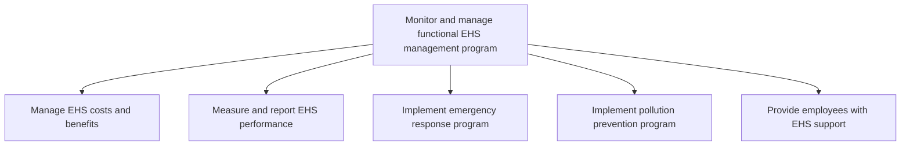

# Monitor and manage functional EHS management program

> TODO: Business-as-Code definition for monitor and manage functional ehs management program (life-sciences)

## Overview

Managing the costs and benefits of EHS. Measure and report the performance of EHS. Implement plans for emergency response and pollution prevention. Provide EHS support.

## Process Hierarchy



## GraphDL

```yaml
monitor:
  object: And Manage Functional EHS Management Program
  actor: TODO
  result: TODO
```

## Actions

| Action | Description |
|--------|-------------|
| TODO | TODO |

## Events

| Event | Description |
|-------|-------------|
| TODO | TODO |

## Searches

| Search | Description |
|--------|-------------|
| TODO | TODO |

## Process Flow


## RACI Matrix

| Activity | Responsible | Accountable | Consulted | Informed |
|----------|-------------|-------------|-----------|----------|
| TODO | TODO | TODO | TODO | TODO |

## Sub-Processes

| ID | Name | Description |
|----|------|-------------|
| 13.7.4.1 | Manage EHS costs and benefits | Administering the costs and benefits of EHS management program. Evaluate program costs to ensure tha |
| 13.7.4.2 | Measure and report EHS performance | Using performance techniques and indicators. Utilize number of audits or inspections performed, safe |
| 13.7.4.3 | Implement emergency response program | Implementing a program for organizing, coordinating, and directing available resources to respond to |
| 13.7.4.4 | Implement pollution prevention program | Implementing a program that reduces or eliminates the creation of pollutants through increased effic |
| 13.7.4.5 | Provide employees with EHS support | Supporting employees in light of the organization's environmental, health, and safety policies and s |

## Related Processes

| Process | Relationship |
|---------|-------------|
| TODO | TODO |

## Related Departments

| Department | Role |
|-----------|------|
| TODO | TODO |

## Related Occupations

| Occupation | Involvement |
|-----------|-------------|
| TODO | TODO |

## KPIs

| KPI | Description | Unit |
|-----|-------------|------|
| TODO | TODO | TODO |

## Usage

```typescript
import { TODO } from '@headlessly/monitor-and-manage-functional-ehs-management-program'

const client = TODO()

// TODO: Example action calls
```
