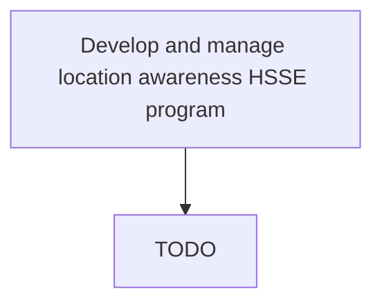

# Develop and manage location awareness HSSE program

> TODO: Business-as-Code definition for develop and manage location awareness hsse program (petroleum-downstream)

## Overview

Includes all of downstream but specific to where an employee works: tank farm, refinery, process units, blending plant, refined products storage, pumping stations, tanker loading terminals, trucking operations, receiving terminals, truck rack loading, retail operations.

## Process Hierarchy



## GraphDL

```yaml
develop:
  object: And Manage Location Awareness HSSE Program
  actor: TODO
  result: TODO
```

## Actions

| Action | Description |
|--------|-------------|
| TODO | TODO |

## Events

| Event | Description |
|-------|-------------|
| TODO | TODO |

## Searches

| Search | Description |
|--------|-------------|
| TODO | TODO |

## Process Flow


## RACI Matrix

| Activity | Responsible | Accountable | Consulted | Informed |
|----------|-------------|-------------|-----------|----------|
| TODO | TODO | TODO | TODO | TODO |

## Related Processes

| Process | Relationship |
|---------|-------------|
| TODO | TODO |

## Related Departments

| Department | Role |
|-----------|------|
| TODO | TODO |

## Related Occupations

| Occupation | Involvement |
|-----------|-------------|
| TODO | TODO |

## KPIs

| KPI | Description | Unit |
|-----|-------------|------|
| TODO | TODO | TODO |

## Usage

```typescript
import { TODO } from '@headlessly/develop-and-manage-location-awareness-hsse-program'

const client = TODO()

// TODO: Example action calls
```
