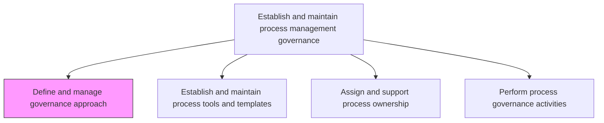
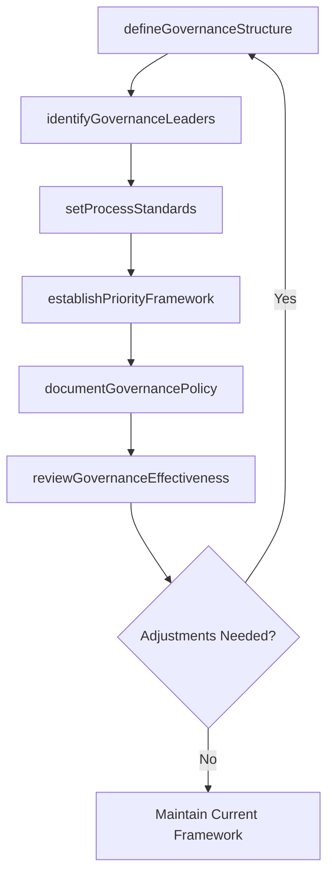

# Define and manage governance approach

> Business-as-Code definition for BPM governance approach design and management. Models the complete process of establishing, documenting, and administering the governance methodology that guides business process management initiatives.

## Overview

Outlining and managing the methodology for administering business process management (BPM). Define the method for setting standards and priorities for BPM efforts. Identify BPM governance leaders. Define BPM project participants' roles.

## Process Hierarchy



## GraphDL

```yaml
define:
  object: And Manage Governance Approach
  actor: ProcessGovernanceLead
  result: GovernanceFramework
```

## Actions

| Action | Description |
|--------|-------------|
| defineGovernanceStructure | Establish the governance hierarchy, committees, and decision rights for BPM |
| setProcessStandards | Define standards for process documentation, naming conventions, and modeling |
| identifyGovernanceLeaders | Select and appoint governance council members and BPM steering committee |
| establishPriorityFramework | Create criteria for prioritizing BPM improvement initiatives |
| documentGovernancePolicy | Draft and publish the formal BPM governance policy document |
| reviewGovernanceEffectiveness | Periodically assess the governance model and recommend adjustments |

## Events

| Event | Description |
|-------|-------------|
| governanceStructureDefined | Governance hierarchy and decision rights formally established |
| processStandardsSet | BPM documentation and modeling standards published |
| governanceLeadersIdentified | Governance council members appointed and onboarded |
| priorityFrameworkEstablished | Initiative prioritization criteria approved and deployed |
| governancePolicyDocumented | Formal BPM governance policy published to stakeholders |
| governanceEffectivenessReviewed | Periodic governance assessment completed with findings |

## Searches

| Search | Description |
|--------|-------------|
| findGovernancePolicies | Retrieve current governance policies filtered by scope or business unit |
| getGovernanceMembers | List governance council members and their assigned roles |
| getStandardsCompliance | Query compliance status of processes against governance standards |
| listPriorityInitiatives | Retrieve BPM initiatives ranked by governance priority criteria |

## Process Flow



## RACI Matrix

| Activity | Responsible | Accountable | Consulted | Informed |
|----------|-------------|-------------|-----------|----------|
| defineGovernanceStructure | ProcessGovernanceLead | ChiefOperatingOfficer | BusinessUnitHeads | AllProcessOwners |
| setProcessStandards | BPMArchitect | ProcessGovernanceLead | ITArchitecture | ProcessAnalysts |
| identifyGovernanceLeaders | HRBusinessPartner | ChiefOperatingOfficer | SeniorLeadership | GovernanceCouncil |
| reviewGovernanceEffectiveness | ProcessGovernanceLead | ChiefOperatingOfficer | InternalAudit | ExecutiveTeam |

## Related Processes

| Process | Relationship |
|---------|-------------|
| 13.1.1.2 Establish and maintain process tools and templates | Downstream - governance approach drives tooling requirements |
| 13.1.1.3 Assign and support process ownership | Downstream - governance defines ownership assignment criteria |
| 13.1.2 Define and manage process frameworks | Parallel - governance approach shapes the process framework |

## Related Departments

| Department | Role |
|-----------|------|
| Operations | Owns overall business process management governance |
| IT | Provides governance tooling and architecture alignment |
| Internal Audit | Validates governance compliance and effectiveness |
| Human Resources | Supports governance role assignments and competency mapping |

## Related Occupations

| Occupation | Involvement |
|-----------|-------------|
| Process Governance Lead | Primary executor of governance definition and management |
| BPM Architect | Designs governance standards and modeling conventions |
| Internal Auditor | Reviews governance adherence and control effectiveness |

## KPIs

| KPI | Description | Unit |
|-----|-------------|------|
| Governance Adherence Rate | Percentage of processes compliant with governance standards | % |
| Policy Review Cycle Time | Average time between governance policy reviews | Days |
| Governance Decision Turnaround | Average time to resolve governance escalations | Days |
| Standards Coverage | Percentage of enterprise processes covered by BPM standards | % |

## Usage

```typescript
import { defineAndManageGovernanceApproach } from '@headlessly/define-and-manage-governance-approach'

const governance = defineAndManageGovernanceApproach()

// Define the governance structure
const framework = await governance.defineGovernanceStructure({
  scope: 'enterprise',
  committees: ['BPM Steering Committee', 'Process Council'],
  decisionRights: 'federated'
})

// Identify governance leaders
const leaders = await governance.identifyGovernanceLeaders({
  frameworkId: framework.id,
  roles: ['Chair', 'Secretary', 'BusinessUnitRep']
})

// Review governance effectiveness periodically
const review = await governance.reviewGovernanceEffectiveness({
  frameworkId: framework.id,
  period: 'quarterly'
})
```
