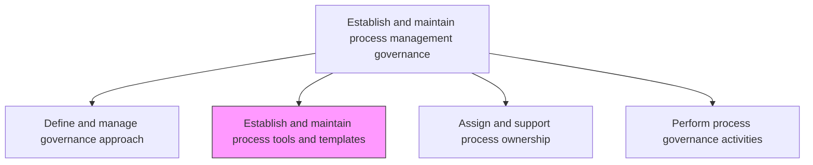
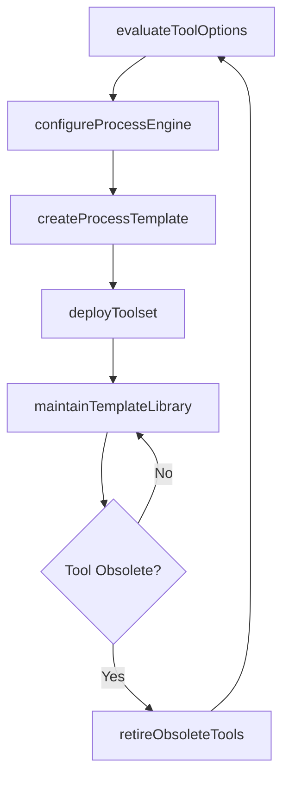

# Establish and maintain process tools and templates

> Business-as-Code definition for BPM tool and template lifecycle management. Models the complete process of selecting, configuring, deploying, and maintaining tools and reusable templates that support business process management.

## Overview

Instituting, organizing, and maintaining the upkeep of the techniques used for business process management (BPM). Create and maintain templates of BPM tools that can be readily implemented, including process engine, business analytics, content management, and collaboration tools.

## Process Hierarchy



## GraphDL

```yaml
establish:
  object: And Maintain Process Tools And Templates
  actor: BPMToolsAdministrator
  result: ProcessToolkit
```

## Actions

| Action | Description |
|--------|-------------|
| evaluateToolOptions | Assess available BPM tools against organizational requirements and standards |
| configureProcessEngine | Set up and configure the process execution engine for workflow automation |
| createProcessTemplate | Design reusable process modeling templates with standardized notations |
| deployToolset | Roll out approved BPM tools to process owners and analysts |
| maintainTemplateLibrary | Update and version-control the repository of process templates |
| retireObsoleteTools | Decommission outdated tools and migrate users to current platforms |

## Events

| Event | Description |
|-------|-------------|
| toolOptionsEvaluated | BPM tool assessment completed with recommendations |
| processEngineConfigured | Process execution engine set up and validated |
| processTemplateCreated | New reusable process template published to the library |
| toolsetDeployed | BPM toolset rolled out to target user groups |
| templateLibraryMaintained | Template repository updated with new versions |
| obsoleteToolRetired | Legacy BPM tool decommissioned and users migrated |

## Searches

| Search | Description |
|--------|-------------|
| findProcessTemplates | Retrieve templates by process type, domain, or modeling notation |
| getToolInventory | List all active BPM tools with license and deployment status |
| getTemplateUsageStats | Query adoption and usage statistics for process templates |
| listPendingRetirements | Retrieve tools scheduled for decommissioning |

## Process Flow



## RACI Matrix

| Activity | Responsible | Accountable | Consulted | Informed |
|----------|-------------|-------------|-----------|----------|
| evaluateToolOptions | BPMToolsAdministrator | ProcessGovernanceLead | ITArchitecture | ProcessOwners |
| createProcessTemplate | BPMArchitect | ProcessGovernanceLead | ProcessAnalysts | BusinessUnitLeads |
| deployToolset | ITOperations | BPMToolsAdministrator | ChangeManagement | EndUsers |
| maintainTemplateLibrary | BPMArchitect | BPMToolsAdministrator | ProcessOwners | GovernanceCouncil |

## Related Processes

| Process | Relationship |
|---------|-------------|
| 13.1.1.1 Define and manage governance approach | Upstream - governance approach dictates tool requirements |
| 13.1.2 Define and manage process frameworks | Downstream - tools enable framework implementation |
| 8.5.1 Develop service solution and integration strategy | Parallel - IT tool strategy alignment |

## Related Departments

| Department | Role |
|-----------|------|
| Operations | Primary consumer and requirements provider for BPM tools |
| IT | Deploys, integrates, and maintains the BPM tool infrastructure |
| Quality | Validates that tools support quality management standards |
| Procurement | Manages vendor contracts and licensing for BPM tools |

## Related Occupations

| Occupation | Involvement |
|-----------|-------------|
| BPM Tools Administrator | Primary executor managing tool lifecycle |
| BPM Architect | Designs templates and modeling standards |
| IT Solutions Architect | Ensures tool integration with enterprise systems |

## KPIs

| KPI | Description | Unit |
|-----|-------------|------|
| Template Reuse Rate | Percentage of new processes using standard templates | % |
| Tool Adoption Rate | Percentage of process owners actively using BPM tools | % |
| Template Library Size | Number of approved templates available for use | Count |
| Tool Uptime | Availability of BPM platform tools | % |

## Usage

```typescript
import { establishAndMaintainProcessToolsAndTemplates } from '@headlessly/establish-and-maintain-process-tools-and-templates'

const toolkit = establishAndMaintainProcessToolsAndTemplates()

// Evaluate tool options
const evaluation = await toolkit.evaluateToolOptions({
  category: 'processEngine',
  criteria: ['scalability', 'integration', 'usability'],
  budget: 150000
})

// Create a process template
const template = await toolkit.createProcessTemplate({
  name: 'Standard Order-to-Cash',
  notation: 'BPMN2.0',
  domain: 'finance'
})

// Maintain template library
const update = await toolkit.maintainTemplateLibrary({
  templateId: template.id,
  action: 'publish',
  version: '2.1'
})
```
