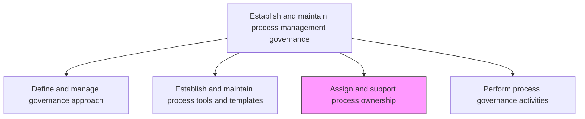
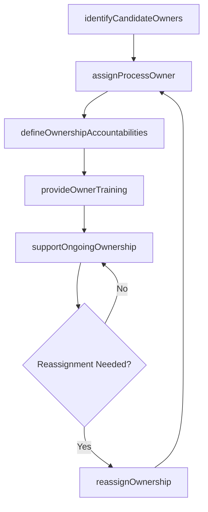

# Assign and support process ownership

> Business-as-Code definition for process ownership assignment and support. Models the complete process of nominating, assigning, training, and supporting designated process owners across the enterprise.

## Overview

Assigning resources (employees) ownership of tasks. These include the responsibility of identifying, analyzing, and improving business processes in order to meet the goals and objectives such as increasing profits and performance, reducing costs, and accelerating schedules.

## Process Hierarchy



## GraphDL

```yaml
assign:
  object: And Support Process Ownership
  actor: ProcessGovernanceLead
  result: OwnershipAssignment
```

## Actions

| Action | Description |
|--------|-------------|
| identifyCandidateOwners | Evaluate potential process owners based on domain expertise and leadership capability |
| assignProcessOwner | Formally assign ownership of a specific business process to a designated individual |
| defineOwnershipAccountabilities | Document the responsibilities, decision rights, and performance expectations for each process owner |
| provideOwnerTraining | Deliver training on BPM methodologies, tools, and governance expectations |
| supportOngoingOwnership | Provide coaching, resources, and escalation paths to active process owners |
| reassignOwnership | Transfer process ownership when organizational changes occur |

## Events

| Event | Description |
|-------|-------------|
| candidateOwnersIdentified | Shortlist of potential process owners created |
| processOwnerAssigned | Process ownership formally assigned and communicated |
| ownershipAccountabilitiesDefined | Ownership responsibilities and decision rights documented |
| ownerTrainingCompleted | Process owner completed required BPM training |
| ownershipSupportProvided | Ongoing coaching or resource support delivered to process owner |
| ownershipReassigned | Process ownership transferred to a new individual |

## Searches

| Search | Description |
|--------|-------------|
| findProcessOwners | Retrieve process owners filtered by business unit, domain, or process |
| getOwnershipGaps | Identify processes without assigned owners |
| getOwnerTrainingStatus | Query training completion status for process owners |
| listOwnershipChanges | Retrieve history of ownership assignments and transfers |

## Process Flow



## RACI Matrix

| Activity | Responsible | Accountable | Consulted | Informed |
|----------|-------------|-------------|-----------|----------|
| identifyCandidateOwners | ProcessGovernanceLead | ChiefOperatingOfficer | BusinessUnitHeads | HRBusinessPartner |
| assignProcessOwner | ProcessGovernanceLead | ChiefOperatingOfficer | CandidateOwner | GovernanceCouncil |
| provideOwnerTraining | BPMTrainingLead | ProcessGovernanceLead | LearningDevelopment | ProcessOwners |
| supportOngoingOwnership | BPMCoach | ProcessGovernanceLead | ProcessAnalysts | ExecutiveTeam |

## Related Processes

| Process | Relationship |
|---------|-------------|
| 13.1.1.1 Define and manage governance approach | Upstream - governance approach defines ownership criteria |
| 13.1.1.4 Perform process governance activities | Downstream - owners participate in governance activities |
| 7.3.3 Develop and manage employee orientation and training | Parallel - training coordination for process owners |

## Related Departments

| Department | Role |
|-----------|------|
| Operations | Primary source of process owner candidates |
| Human Resources | Supports competency assessment and role definition |
| Quality | Provides quality management expertise to process owners |
| Learning and Development | Delivers BPM training programs |

## Related Occupations

| Occupation | Involvement |
|-----------|-------------|
| Process Governance Lead | Assigns and supports process owners |
| Process Owner | Receives assignment and ongoing support |
| BPM Coach | Provides mentoring and guidance to process owners |

## KPIs

| KPI | Description | Unit |
|-----|-------------|------|
| Ownership Coverage | Percentage of enterprise processes with assigned owners | % |
| Owner Training Completion | Percentage of process owners who completed BPM training | % |
| Ownership Tenure | Average duration a process owner retains assignment | Months |
| Owner Satisfaction Score | Process owner satisfaction with governance support | Score (1-5) |

## Usage

```typescript
import { assignAndSupportProcessOwnership } from '@headlessly/assign-and-support-process-ownership'

const ownership = assignAndSupportProcessOwnership()

// Identify candidate owners for a process
const candidates = await ownership.identifyCandidateOwners({
  processId: 'order-to-cash',
  criteria: ['domainExpertise', 'leadershipLevel'],
  businessUnit: 'Finance'
})

// Assign a process owner
const assignment = await ownership.assignProcessOwner({
  processId: 'order-to-cash',
  ownerId: candidates[0].id,
  effectiveDate: '2025-01-15'
})

// Provide training to the new owner
await ownership.provideOwnerTraining({
  ownerId: assignment.ownerId,
  program: 'BPM Fundamentals',
  format: 'instructor-led'
})
```
