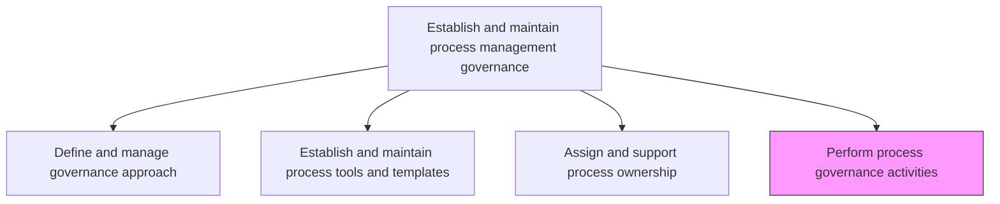
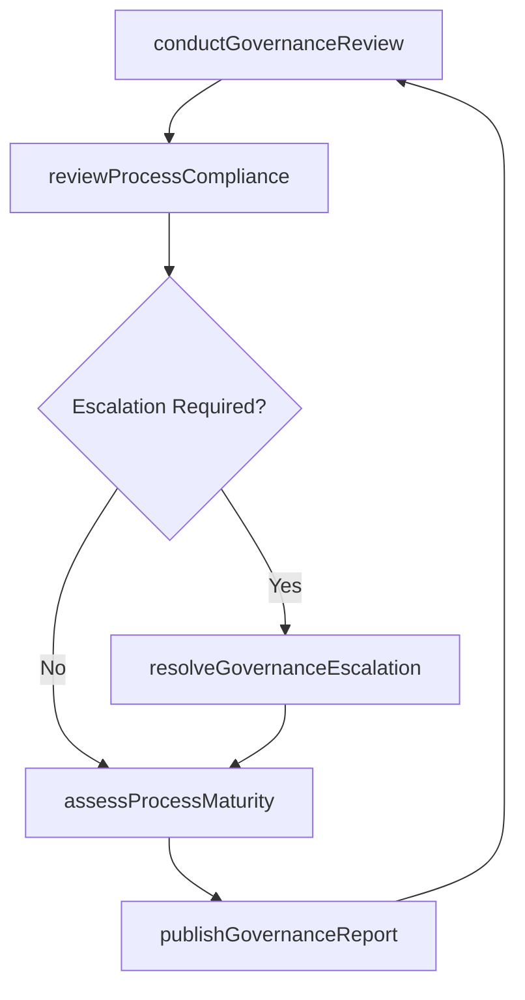

# Perform process governance activities

> Business-as-Code definition for executing BPM governance operations. Models the ongoing activities of governance councils, compliance reviews, escalation handling, and process maturity assessments.

## Overview

Implementing and executing activities for governing business processes. Execute activities that encourage participation, accountability, transparency, responsiveness, equity and inclusiveness, etc. within the business processes.

## Process Hierarchy



## GraphDL

```yaml
perform:
  object: Process Governance Activities
  actor: GovernanceCouncilChair
  result: GovernanceActivityRecord
```

## Actions

| Action | Description |
|--------|-------------|
| conductGovernanceReview | Facilitate periodic governance council meetings to review BPM performance |
| reviewProcessCompliance | Assess process documentation and execution against governance standards |
| resolveGovernanceEscalation | Address and resolve governance issues escalated by process owners |
| assessProcessMaturity | Evaluate the maturity level of business processes using a capability model |
| publishGovernanceReport | Generate and distribute governance performance reports to stakeholders |

## Events

| Event | Description |
|-------|-------------|
| governanceReviewConducted | Governance council meeting completed with documented decisions |
| processComplianceReviewed | Compliance assessment completed for a process or business unit |
| governanceEscalationResolved | Escalated governance issue resolved and closed |
| processMaturityAssessed | Process maturity evaluation completed with scoring |
| governanceReportPublished | Governance performance report distributed to stakeholders |

## Searches

| Search | Description |
|--------|-------------|
| findGovernanceReviews | Retrieve governance review records by date range or business unit |
| getComplianceFindings | List compliance findings filtered by severity or process area |
| getOpenEscalations | Query unresolved governance escalations |
| getMaturityScores | Retrieve process maturity scores across the enterprise |

## Process Flow



## RACI Matrix

| Activity | Responsible | Accountable | Consulted | Informed |
|----------|-------------|-------------|-----------|----------|
| conductGovernanceReview | GovernanceCouncilChair | ChiefOperatingOfficer | ProcessOwners | ExecutiveTeam |
| reviewProcessCompliance | ProcessGovernanceAnalyst | GovernanceCouncilChair | InternalAudit | ProcessOwners |
| resolveGovernanceEscalation | GovernanceCouncilChair | ChiefOperatingOfficer | LegalCompliance | AffectedStakeholders |
| assessProcessMaturity | BPMArchitect | GovernanceCouncilChair | QualityManagement | BusinessUnitLeads |

## Related Processes

| Process | Relationship |
|---------|-------------|
| 13.1.1.1 Define and manage governance approach | Upstream - governance approach defines activity scope |
| 13.1.1.3 Assign and support process ownership | Parallel - governance activities involve process owners |
| 13.6.3 Evaluate process performance | Downstream - governance findings feed performance evaluation |

## Related Departments

| Department | Role |
|-----------|------|
| Operations | Participates in governance reviews and implements decisions |
| Internal Audit | Provides independent compliance assessment |
| Quality | Contributes maturity assessment expertise |
| Executive Office | Receives governance reports and sponsors escalation resolution |

## Related Occupations

| Occupation | Involvement |
|-----------|-------------|
| Governance Council Chair | Leads governance meetings and escalation resolution |
| Process Governance Analyst | Conducts compliance reviews and maturity assessments |
| BPM Architect | Provides technical input on process maturity evaluation |

## KPIs

| KPI | Description | Unit |
|-----|-------------|------|
| Governance Meeting Cadence | Frequency of governance council meetings held on schedule | Per Quarter |
| Compliance Review Completion | Percentage of scheduled compliance reviews completed | % |
| Escalation Resolution Time | Average time to resolve governance escalations | Days |
| Average Process Maturity | Mean maturity score across all assessed processes | Score (1-5) |

## Usage

```typescript
import { performProcessGovernanceActivities } from '@headlessly/perform-process-governance-activities'

const governance = performProcessGovernanceActivities()

// Conduct a governance review
const review = await governance.conductGovernanceReview({
  councilId: 'bpm-steering-committee',
  period: 'Q4-2024',
  agenda: ['complianceFindings', 'maturityProgress', 'escalations']
})

// Review process compliance
const compliance = await governance.reviewProcessCompliance({
  processId: 'procure-to-pay',
  standards: ['BPMN2.0', 'ISO9001'],
  auditor: 'internal'
})

// Publish governance report
const report = await governance.publishGovernanceReport({
  reviewId: review.id,
  format: 'executive-summary',
  recipients: ['coo', 'governance-council']
})
```
