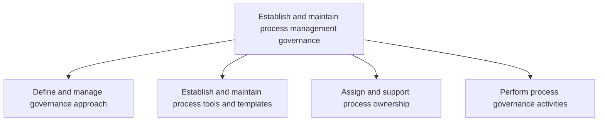
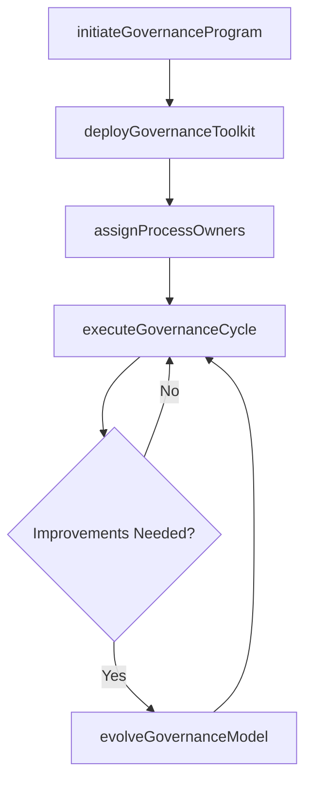

# Establish and maintain process management governance

> Business-as-Code definition for the end-to-end governance of business process management. Models the lifecycle of defining governance approaches, deploying tools, assigning process ownership, and executing ongoing governance activities.

## Overview

Defining and managing the organization's approach to governing business process management. Establish and manage tools to support the governance process. Assign ownership for all business processes. Perform activities to administer the governing process.

## Process Hierarchy



## GraphDL

```yaml
establish:
  object: And Maintain Process Management Governance
  actor: ProcessGovernanceLead
  result: GovernanceSystem
```

## Actions

| Action | Description |
|--------|-------------|
| initiateGovernanceProgram | Launch the enterprise BPM governance program with charter and scope |
| deployGovernanceToolkit | Provision and configure BPM tools, templates, and repositories |
| assignProcessOwners | Nominate and assign process owners across business units |
| executeGovernanceCycle | Run the periodic governance review, compliance check, and reporting cycle |
| evolveGovernanceModel | Refine governance structures based on maturity assessments and feedback |

## Events

| Event | Description |
|-------|-------------|
| governanceProgramInitiated | BPM governance program formally launched with approved charter |
| governanceToolkitDeployed | BPM tools and templates provisioned and available |
| processOwnersAssigned | Process ownership assignments completed across the enterprise |
| governanceCycleExecuted | Periodic governance cycle completed with published findings |
| governanceModelEvolved | Governance structures updated based on improvement recommendations |

## Searches

| Search | Description |
|--------|-------------|
| findGovernancePrograms | Retrieve governance program details by status or business unit |
| getOwnershipMatrix | Query the full process-to-owner assignment matrix |
| getGovernanceCycleResults | Retrieve results from completed governance cycles |

## Process Flow



## RACI Matrix

| Activity | Responsible | Accountable | Consulted | Informed |
|----------|-------------|-------------|-----------|----------|
| initiateGovernanceProgram | ProcessGovernanceLead | ChiefOperatingOfficer | SeniorLeadership | AllDepartments |
| deployGovernanceToolkit | BPMToolsAdministrator | ProcessGovernanceLead | ITArchitecture | ProcessOwners |
| assignProcessOwners | ProcessGovernanceLead | ChiefOperatingOfficer | BusinessUnitHeads | HRBusinessPartner |
| executeGovernanceCycle | GovernanceCouncilChair | ProcessGovernanceLead | InternalAudit | ExecutiveTeam |

## Sub-Processes

| ID | Name | Description |
|----|------|-------------|
| 13.1.1.1 | Define and manage governance approach | Outlining and managing the methodology for administering business process management (BPM). Define t |
| 13.1.1.2 | Establish and maintain process tools and templates | Instituting, organizing, and maintaining the upkeep of the techniques used for business process mana |
| 13.1.1.3 | Assign and support process ownership | Assigning resources (employees) ownership of tasks. These include the responsibility of identifying, |
| 13.1.1.4 | Perform process governance activities | Implementing and executing activities for governing business processes. Execute activities that enco |

## Related Processes

| Process | Relationship |
|---------|-------------|
| 13.1.2 Define and manage process frameworks | Downstream - governance drives framework design |
| 13.4.1 Plan for change | Parallel - governance changes require change planning |
| 13.6.3 Evaluate process performance | Consumer - uses governance data for performance evaluation |

## Related Departments

| Department | Role |
|-----------|------|
| Operations | Primary owner of BPM governance |
| IT | Provides governance tooling and platform support |
| Internal Audit | Validates governance compliance |
| Quality | Ensures governance aligns with quality management |

## Related Occupations

| Occupation | Involvement |
|-----------|-------------|
| Process Governance Lead | Primary executor of governance establishment |
| BPM Architect | Designs governance standards and tooling |
| Chief Operating Officer | Executive sponsor of BPM governance |

## KPIs

| KPI | Description | Unit |
|-----|-------------|------|
| Governance Maturity Level | Overall maturity of BPM governance program | Score (1-5) |
| Process Ownership Coverage | Percentage of processes with formally assigned owners | % |
| Governance Cycle Adherence | Percentage of governance cycles completed on schedule | % |
| Stakeholder Satisfaction | Satisfaction with BPM governance services | Score (1-5) |

## Usage

```typescript
import { establishAndMaintainProcessManagementGovernance } from '@headlessly/establish-and-maintain-process-management-governance'

const governance = establishAndMaintainProcessManagementGovernance()

// Initiate governance program
const program = await governance.initiateGovernanceProgram({
  scope: 'enterprise',
  charter: 'BPM Center of Excellence',
  sponsor: 'coo'
})

// Deploy governance toolkit
const toolkit = await governance.deployGovernanceToolkit({
  programId: program.id,
  tools: ['processModeler', 'templateRepository', 'complianceTracker']
})

// Execute governance cycle
const cycle = await governance.executeGovernanceCycle({
  programId: program.id,
  period: 'Q1-2025',
  activities: ['complianceReview', 'maturityAssessment', 'reporting']
})
```
