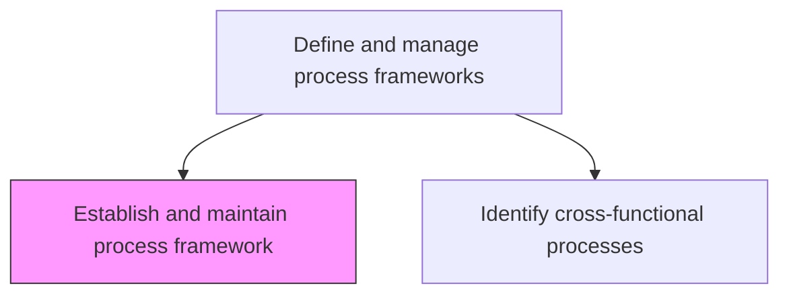
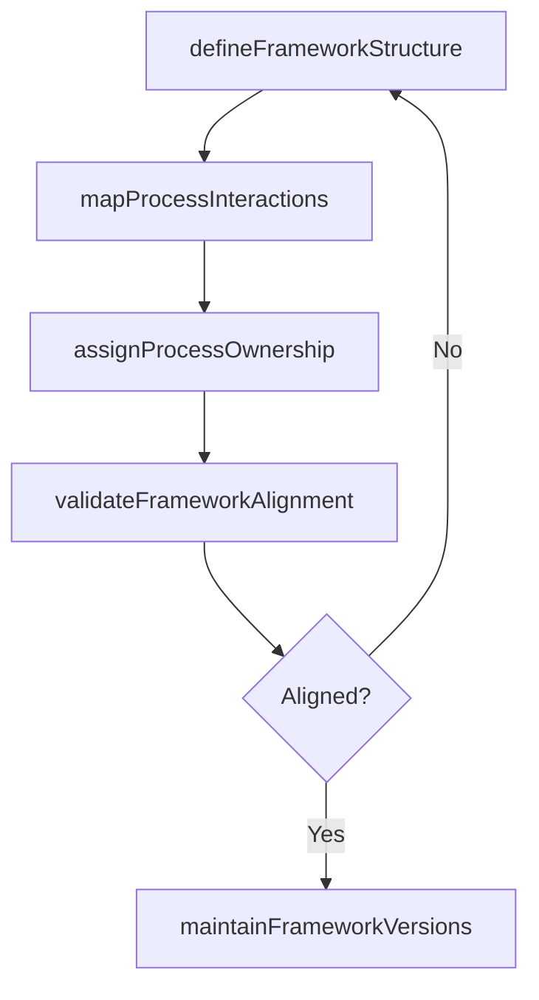

# Establish and maintain process framework

> Business-as-Code definition for process framework establishment. Models the creation and ongoing maintenance of the enterprise process architecture covering strategy, operations, and management layers.

## Overview

Defining and managing the framework that outlines the required business processes of the organization, key elements, and how they should interact. Institute strategy infrastructure and product, operations, and enterprise management.

## Process Hierarchy



## GraphDL

```yaml
establish:
  object: And Maintain Process Framework
  actor: ProcessArchitect
  result: ProcessFrameworkDocument
```

## Actions

| Action | Description |
|--------|-------------|
| defineFrameworkStructure | Create the hierarchical structure of process categories, groups, and levels |
| mapProcessInteractions | Document how processes interact across strategy, operations, and management layers |
| assignProcessOwnership | Designate accountable owners for each process area in the framework |
| validateFrameworkAlignment | Verify framework alignment with organizational strategy and operating model |
| maintainFrameworkVersions | Manage version control and change history for framework updates |

## Events

| Event | Description |
|-------|-------------|
| frameworkStructureDefined | Process framework hierarchy created and approved |
| processInteractionsMapped | Cross-process dependencies and handoffs documented |
| processOwnershipAssigned | Accountable owners designated for all framework processes |
| frameworkAlignmentValidated | Framework confirmed as aligned with organizational strategy |
| frameworkVersionUpdated | New framework version published with documented changes |

## Searches

| Search | Description |
|--------|-------------|
| getFrameworkVersion | Retrieve the current or historical version of the process framework |
| findProcessByCategory | List processes within a specific framework category or level |
| getProcessOwnership | Retrieve ownership assignments by process area |

## Process Flow



## RACI Matrix

| Activity | Responsible | Accountable | Consulted | Informed |
|----------|-------------|-------------|-----------|----------|
| defineFrameworkStructure | ProcessArchitect | VP Operations | DepartmentHeads | AllProcessOwners |
| assignProcessOwnership | ProcessArchitect | VP Operations | HR | ProcessOwners |
| validateFrameworkAlignment | ProcessArchitect | ChiefOperatingOfficer | StrategyTeam | Executive |

## Related Processes

| Process | Relationship |
|---------|-------------|
| 13.1.2.2 Identify cross-functional processes | Sibling - cross-functional processes are mapped within the framework |
| 13.1.3 Define processes | Downstream - framework guides individual process definition |

## Related Departments

| Department | Role |
|-----------|------|
| Business Process Management | Primary owner of framework design and maintenance |
| Strategy | Ensures framework aligns with strategic objectives |
| Operations | Validates operational process coverage in framework |

## Related Occupations

| Occupation | Involvement |
|-----------|-------------|
| Process Architect | Designs and maintains the enterprise process framework |
| Business Analyst | Contributes process knowledge during framework development |

## KPIs

| KPI | Description | Unit |
|-----|-------------|------|
| Framework Coverage | Percentage of organizational activities represented in the framework | % |
| Ownership Assignment Rate | Percentage of framework processes with designated owners | % |
| Framework Currency | Time since last framework review and update | Months |

## Usage

```typescript
import { establishAndMaintainProcessFramework } from '@headlessly/establish-and-maintain-process-framework'

const framework = establishAndMaintainProcessFramework()

// Define the framework structure
const structure = await framework.defineFrameworkStructure({
  categories: ['strategy', 'operations', 'management'],
  levels: ['category', 'process-group', 'process', 'activity'],
  standard: 'APQC-PCF-v7.4'
})

// Assign process ownership
const assignment = await framework.assignProcessOwnership({
  processId: 'PRC-order-to-cash',
  ownerId: 'EMP-VP-operations',
  effectiveDate: '2026-01-15'
})
```
